# Flights Billing Module Specification

## 1. Purpose

This document defines the target specification for the Flight Billing sub-module of the ERP.

It covers the complete lifecycle from importing validated flights from Planche through price calculation, pack-aware pricing resolution, accounting entry creation, and posting — including correction workflows, pack catalog management, member pack purchases/consumption, and per-machine financial aggregation.

---

## 2. Core Principles

1. **Billing is preview-first**: every flight billing starts as a side-effect-free preview. Apply is an explicit user action.
2. **Double-entry is mandatory**: each billing creates one balanced accounting entry in the flights journal.
3. **Pricing is asset-bound**: pricing versions are resolved per machine (glider and optionally launch) by matching `asset_type_uuid`. No global fallback.
4. **Two separate processes**: flight billing (gross) and discount application are **decoupled**. Flights are billed at gross/standard price. Discounts are computed in a dedicated operational table and applied via periodic adjustment entries.
5. **Fiscal year scoping**: packs and accounting entries belong to exactly one fiscal year. Pack validity expires at year-end.
6. **Deterministic billing hash**: every preview produces a SHA-256 hash covering selected pricing lines **and** discount consumption rows. Hash changes detect billing-impacting modifications.
7. **REM journal**: a dedicated journal (code `REM` or `DISC`) tracks discount adjustment entries — one Draft entry per pilot per period, updated as discounts accumulate.
8. **Alert trigger after final net**: automated balance checks (e.g., minimum balance alerts) must evaluate `sum(debit) - sum(credit)` on account 411 after both the gross flight entry **and** the REM discount adjustment are accounted for.
9. **Posted entries are immutable**: corrections use reversal + replacement, never direct editing.

---

## 3. Billing Lifecycle

```mermaid
flowchart LR
    A[Flight imported from Planche] --> B[Preview requested]
    B --> C{Pricing resolvable?}
    C -- No --> D[Blocking errors returned]
    C -- Yes --> E[Preview calculated<br/>applied_lines + accounting_lines + discount_lines]
    E --> F[User reviews preview]
    F --> G[Apply clicked]
    G --> H[Flight billed at GROSS price<br/>Draft entry in FL journal]
    H --> I[Discount computed in<br/>member_pack_consumptions]
    I --> J[REM adjustment entry upserted<br/>one Draft per pilot per period]
    J --> K[Member reviews via portal]
    K --> L[Accountant reviews & posts]
    L --> M[FL + REM entries posted]
    M --> N{Correction needed?}
    N -- Post-purchase pack --> O[Recalculate discounts]
    N -- Valid_from change --> O
    O --> P[Update REM adjustment entry<br/>or create reversal if posted]
    P --> J
```



### 3.1 Lifecycle States

| State | Meaning |
|---|---|
| `imported` | Flight received from Planche, no billing attempted |
| `previewed` | Billing preview calculated, not yet applied |
| `applied` | Draft accounting entry created (FL journal), not yet posted |
| `discount_applied` | Discount consumption recorded, REM adjustment entry exists (Draft) |
| `posted` | Both FL and REM entries are posted (immutable) |
| `correcting` | A correction is in progress (reversal created, replacement pending) |
| `corrected` | Replacement entries have been posted |


---

## 4. Pricing Resolution

### 4.1 Per-Machine Resolution

Each flight involves up to two billable machines:

- **Main machine** (glider/TMG): resolved from `flight.asset_code` or `flight.glider_erp_id` → `Asset.registration`
- **Launch machine** (tow plane / winch): resolved from `flight.launch_asset_code` or `flight.launch_machine_erp_id` → `Asset.registration`

For each machine:

1. Look up the resolved `Asset` → read `asset_type_uuid`
2. Find one active `PricingVersion` where:
   - `status = Active` (2)
   - `from_date <= flight.jour`
   - `to_date IS NULL OR to_date >= flight.jour`
   - `asset_type_uuid = machine.asset_type_uuid`
3. If no version found → blocking error (unless private aircraft with `ownership=2`, which produces a non-blocking warning)
4. If more than one version found → overlap blocking error
5. Select pricing items from the version where:
   - `flight_type_uuid IS NULL` (applies to all types) **OR**
   - `flight_type_uuid` matches the flight type resolved from the Planche data
6. Revenue account (`gl_account_credit_uuid`) must be configured on each item

### 4.2 Quantity Calculation by Unit

| Unit | Quantity |
|---|---|
| `FlightTime(h)` (1) | Duration between takeoff and landing, in decimal hours |
| `EngineTimeMinute` (2) | `engine_time × 100 × 60`, in minutes |
| `EngineTime1_100h` (3) | `engine_time × 100`, in 1/100h |
| `FlightDuration` (4) | Same as FlightTime(h) |
| `PerFlight` (5) | `1` |
| `Fixed` (6) | `1` |
| `FixedDurationTranche` (7) | Duration in minutes; tier selection sets total price |

### 4.3 Payer Resolution

Payer allocation depends on flight type:

| Flight type | Payer rule |
|---|---|
| `solo` | Pilot pays 100% |
| `supervise` / `lacher` / `essai` | Pilot pays 100% |
| `instruction` | Pilot 100%, unless `instruction_split` → pilot 50% + second 50% |
| `partage` | Pilot 50% + second pilot 50% |
| `passager` | `charge_to` 100%, or pilot 100% if not set |
| `initiation` | **Club-billed** via one of two detection modes (see §4.4) |

### 4.4 Club Billing Detection

Club billing is detected in two ways:

1. **Explicit club billing**: `flight.charge_to_erp_id` matches the club member's `account_id` (configured in `flight_billing_settings.club_member_uuid`). Applies to any flight type.
2. **Initiation fallback**: Flight type is `initiation` AND a charge account can be resolved (from `vi_type_catalog.charge_account_uuid` or `flight_billing_settings.default_initiation_charge_account_uuid`). Does NOT require the club member to be configured.

Charge account resolution order:
- **Initiation flights**: `vi_type_catalog.charge_account_uuid` (by `flight.vi_erp_id`) → `settings.default_initiation_charge_account_uuid`
- **Explicit club billing**: `settings.club_charge_account_uuid` → `settings.default_initiation_charge_account_uuid` (fallback)

Club-billed lines have no `member_uuid` dimension on any accounting line.

---

## 5. Pack Discount System

### 5.1 Principle

Pack discounts are **decoupled from flight billing**. Flights are always billed at the **gross/standard price** in the FL journal. Discounts are computed in a dedicated operational table (`member_pack_consumptions`) and applied via **periodic adjustment entries** in a dedicated REM journal.

| Concept | Meaning |
|---|---|
| **Pack definition** | Template that defines type, quantity allowance, and sales account |
| **Consumption tracking** | `member_pack_consumptions` table — one row per flight line consuming pack units |
| **Balance computation** | `vw_member_pack_balances` view — crosses GL pack purchases with consumptions |
| **Discount application** | Periodic REM adjustment entry — one Draft per pilot, updated as discounts accumulate |
| **Discount amount** | `discount_unit_price = base_price − pack_price`, `total_discount = qty × discount_unit_price` |

### 5.2 Pack Types

| `pack_type` | Scope | Quantity unit | Typical example |
|---|---|---|---|
| `flight_hours` | Flight-time pricing items (glider/TMG) | `hours` | 25h pack |
| `winch_launches` | Launch items where asset type = winch | `launches` | 20 launch pack |
| `tow_launches` | Launch items where asset type = tow plane | `launches` | 10 tow pack |
| `engine_time` | Engine time (centihours) | `centihours` | 10h engine pack |

A member can hold multiple purchases of the same pack type simultaneously.

### 5.3 Pack Purchase (Tracked Natively in the General Ledger)

Pack purchases are already tracked in the GL — no separate table needed.

```
Accounting entry for pack purchase (VT journal, posted):
  Debit   411 (member dimension)       purchase_amount
  Credit  pack_sales_account (7066)    purchase_amount
```

- The sales account is stored on `pack_definitions.pack_sales_account_uuid` (default: 7066 / class 7).
- The REM discount debit account is stored on `pack_definitions.pack_discount_expense_account_uuid` and should normally be a class 6 expense account. This separates pack revenue from the cost of granted discounts.
- The purchase is posted immediately (the member has paid).
- The GL entry is the source of truth for "how many units were bought".
- The purchase quantity is inferred from the accounting line quantity or from the pack definition's `quantity_allowance`.

### 5.4 `member_pack_consumptions` — Operational Discount Tracking

When a flight is eligible for a pack discount, the system records **one row** in `member_pack_consumptions`:

```sql
INSERT INTO member_pack_consumptions (
    member_uuid, flight_uuid, pack_type,
    quantity_consumed, discount_unit_price, total_discount_amount
) VALUES (
    'member_x', 'flight_uuid', 'flight_hours',
    1.5,                         -- 1h30 consumed from pack
    80.00,                       -- base€100 − pack€20
    120.00                       -- 1.5 × 80
);
```

**Key rule**: the discount amount is derived: `discount_unit_price = base_price − pack_price`. It is not stored on the pack definition as a percentage — it is computed at billing time from the pricing item's `base_price` and the pack-linked `discounted_unit_price` (from `pack_applicability`).

### 5.5 `vw_member_pack_balances` — Remaining Quantity View

Instead of a table that can desynchronise, remaining pack balances are computed by a **view** that crosses GL purchases with operational consumptions (using `valid_from` instead of the removed `is_frozen` flag):

```sql
CREATE VIEW vw_member_pack_balances AS
WITH pack_purchases AS (
    SELECT
        al.member_uuid,
        p_def.pack_type,
        SUM(p_def.quantity_allowance) as total_purchased_units
    FROM accounting_lines al
    JOIN accounting_entries ae ON al.entry_uuid = ae.uuid
    JOIN pack_definitions p_def ON al.account_uuid = p_def.pack_sales_account_uuid
    WHERE ae.state = 'posted'
    GROUP BY al.member_uuid, p_def.pack_type
),
pack_consumptions AS (
    SELECT
        member_uuid,
        pack_type,
        SUM(quantity_consumed) as total_consumed_units
    FROM member_pack_consumptions
    WHERE valid_from <= NOW()  -- only consumptions whose validity has started
    GROUP BY member_uuid, pack_type
)
SELECT
    p.member_uuid,
    p.pack_type,
    COALESCE(p.total_purchased_units, 0) as total_purchased,
    COALESCE(c.total_consumed_units, 0) as total_consumed,
    (COALESCE(p.total_purchased_units, 0) - COALESCE(c.total_consumed_units, 0)) as units_remaining
FROM pack_purchases p
LEFT JOIN pack_consumptions c ON p.member_uuid = c.member_uuid AND p.pack_type = c.pack_type;
```

### 5.6 Consumption Rules

1. A pack is eligible when `pack_type` matches the billed line's asset scope.
2. Members can buy several identical packs (e.g. three 25h packs in the same FY) — aggregate balance pools all purchases.
3. Consumption is FIFO by purchase date.
4. If remaining units are insufficient for a full flight line, the line is split: partial discount, remainder at full price.
### 5.7 Fiscal Year Boundary

- Pack definitions are scoped to one fiscal year.
- At fiscal year close, remaining quantities (from `vw_member_pack_balances`) reset to 0 — no carry-over.
- Members buy new packs for the new fiscal year.

---

## 6. Billing Apply — Accounting Entry Structure

Flight billing follows a **two-step decoupled process**:

1. **FL journal** — bill the flight at **gross/standard price** (one entry per flight)
2. **REM journal** — apply discounts via a **periodic adjustment entry** (one Draft per pilot per period)

### 6.1 Step 1 — Gross Flight Billing (FL Journal)

`FlightBillingApplyService.apply_preview()` creates one Draft entry in the FL journal at gross price:

```
Entry in journal FL (type=7):
  For each pricing line:
    Debit   411 (member dimension)    amount = quantity × base_price
    Credit  revenue_account (7062/…)  amount = quantity × base_price

  No discount adjustment here — flight is billed at full price.

  Net effect:
    Member receivable = Σ(gross amounts) — full price
    Revenue accounts = Σ(gross amounts)
    ✓ Entry is balanced: total_debit == total_credit
```

### 6.2 Step 2 — Discount Operational Tracking

After the FL entry is created, the system:
1. Checks each pricing line for eligible pack discounts (via `pack_type` + `pack_applicability`)
2. For each eligible line, inserts a row in `member_pack_consumptions`:
   - `discount_unit_price = base_price − discounted_unit_price`
   - `total_discount_amount = quantity_consumed × discount_unit_price`
3. The GL is **not modified** at this stage — only the operational table is updated

### 6.3 Step 3 — REM Adjustment Entry (Periodic, Per Pilot)

A dedicated **REM journal** (code `REM` or `DISC`, type = General) aggregates all discounts per pilot per period:

```
For each pilot in the period:
  total_discount = SUM(member_pack_consumptions.total_discount_amount)
                  WHERE valid_from <= flight.jour  -- consumption validity started
                  AND flight date IN current period

  One Draft entry in journal REM:
    Debit   6xx (Pack discount expense / Discounts granted)   total_discount
    Credit  411 (member dimension)                            total_discount

  If a Draft entry already exists for this pilot + period:
    → UPDATE its lines with the new total (overwrite, do not duplicate)
  Else:
    → CREATE a new Draft entry
```

**Net effect of the two entries combined**:

| Entry | Debit | Credit | Net on 411 |
|---|---|---|---|
| FL journal | 411 (gross flight) | 706x (revenue) | +gross |
| REM journal | 6xx (pack discount expense) | 411 (discount) | −discount |
| **Combined** | | | **gross − discount = net due** |

### 6.4 Concrete Example

**Scenario**: Member has a 25h flight-hours pack (pack price = €20/h, base = €100/h). Solo flight: 1h on glider, winch launch €11.

**Step 1 — FL journal entry (gross):**
```
  Debit  411/Member (analytical_asset=F-CABC)   100.00   Flight time F-CABC (gross)
  Credit 7062 (analytical_asset=F-CABC)         100.00   Flight time revenue
  Debit  411/Member (analytical_asset=TREUIL)    11.00   Winch launch
  Credit 7063 (analytical_asset=TREUIL)          11.00   Winch launch revenue
```

**Step 2 — `member_pack_consumptions` row:**
```
  member_uuid=..., flight_uuid=..., pack_type='flight_hours',
  quantity_consumed=1.0, discount_unit_price=80.00, total_discount_amount=80.00
```

**Step 3 — REM adjustment entry (for this pilot's period):**
```
  Debit  6xx                                    80.00   Pack discount expense
  Credit 411/Member                              80.00   Pack discount adjustment
```

**Combined net on 411:**
```
  Gross flight:   100.00 + 11.00 = 111.00  debit
  REM discount:                           80.00  credit
  Net due:                                31.00  ← what the member actually owes
```

### 6.5 Posting (Manual — After Member Review)

Posting is always a **separate, explicit step**. No entry is posted automatically.

1. The FL entry can be posted independently once the flight is accepted.
2. The REM entry remains Draft until period close (monthly/quarterly).
3. At period close, the accountant posts the REM entry — locking all discounts for that period.
4. A new Draft REM entry is created for the next period automatically.

### 6.6 Batch Apply

`batch_apply(flight_uuids, fiscal_year_uuid, user_id)`:
- Processes flights in a single transaction
- Each flight gets its own FL Draft entry + `member_pack_consumptions` rows
- The REM adjustment entry is **upserted** (created or updated) per pilot
- If any flight fails, the entire batch is rolled back

### 6.6 UI Display & Alert Trigger Guidance

**Member Portal / Flights Tab display**:
- Each flight billing is displayed as its gross FL entry.
- Pack effect is shown via a separate "Discounts" panel showing the current period's REM adjustment, with link to `member_pack_consumptions` detail.

**Alert trigger safety**:
- Automated balance/alert checks on account 411 must evaluate the **combined** net of the FL entry + the REM adjustment entry for the same period.
- **Implementation rule**: when computing a member's balance, always include both posted FL entries **and** the current Draft REM adjustment.

---

## 7. Recalculation & Correction

### 7.1 When Recalculation Occurs

| Trigger | Effect |
|---|---|
| Pack purchased after flight date | Recalculates billing for eligible flights of that member in the same FY |
| Valid_from change on a consumption | Recalculates the affected flight |
| Manual "Recalculate" button | Recalculates the selected flight |

### 7.2 Recalculation Logic

```
recalculate_billing(flight_uuid, fy_uuid, user_id):
  1. Check existing accounting_entry_uuid on the flight
  2. If entry exists and is Draft:
     - Delete the Draft entry and its consumption rows
     - Nullify accounting_entry_uuid on the flight
  3. If entry exists and is Posted:
     - Create reversal of the posted entry (new Draft)
  4. Run fresh preview with current pack quantities and valid_from dates
  5. Create new Draft entry + new consumption rows
  6. Link accounting_entry_uuid on the flight
  7. If original entry was Posted, post the new entry + post the reversal
```

### 7.3 Post-Purchase Flow

```
handle_post_purchase_pack(member_uuid, pack_uuid, fy_uuid):
  1. Identify all flights in the same FY for this member where:
    - Billing has been applied or posted
    - Pack consumption can still be applied (remaining quantity > 0)
    - Flight date ≤ pack purchase date (or configurable grace period)
  2. For each eligible flight:
    - Call recalculate_billing(flight_uuid, fy_uuid, user_id)
  3. Return list of (flight_uuid, old_status, new_status)
```

---

## 8. Valid_from Management (replaces Freeze/Exclude)

Each `member_pack_consumptions` row has a `valid_from` timestamp that determines REM inclusion.

- **Valid_from applicability**: a consumption is included in REM adjustment only when `valid_from <= flight.jour`. Changing `valid_from` to after the flight date effectively excludes it.
- **Editing**: `valid_from` can be modified via `PATCH /api/v1/packs/consumptions/{consumption_uuid}/valid-from`.
- **Auto-calculation**: when a consumption is first recorded, `valid_from` defaults to `NOW()`. An admin can later adjust it if needed.
- Changing `valid_from` triggers `recalculate_billing()` for the affected flight and updates the REM Draft entry.
- This replaces the old `is_frozen` / `frozen_at` / `frozen_reason` mechanism which has been removed from the model.

---

## 9. Data Model

### 9.1 `pack_definitions`

| Column | Type | Notes |
|---|---|---|
| `uuid` | UUID | PK |
| `fiscal_year_uuid` | UUID | FK → accounting_fiscal_years |
| `code` | varchar(32) | Unique business key (e.g. PACK_25H_GLIDER) |
| `name` | varchar(100) | Display name |
| `pack_type` | varchar(32) | `flight_hours` / `winch_launches` / `tow_launches` / `engine_time` |
| `quantity_allowance` | Numeric(10,2) | Base quantity included in one pack purchase |
| `quantity_unit` | varchar(32) | `hours` / `launches` |
| `eligible_asset_type_uuid` | UUID? | FK → asset_types (restricts eligible asset types) |
| `pack_sales_account_uuid` | UUID? | FK → accounting_accounts (overrides FY default, class 7) |
| `pack_discount_expense_account_uuid` | UUID? | FK → accounting_accounts (debit side for REM, normally class 6) |
| `flights_journal_uuid` | UUID? | FK → accounting_journals (overrides FY default, unused) |
| `priority` | int | Default 0, tie-breaker when multiple pack definitions match |
| `created_at` | timestamptz | |
| `updated_at` | timestamptz | |

### 9.2 `pack_applicability`

| Column | Type | Notes |
|---|---|---|
| `uuid` | UUID | PK |
| `pack_definition_uuid` | UUID | FK → pack_definitions |
| `pricing_item_uuid` | UUID | FK → pricing_items |
| `discounted_unit_price` | Numeric(10,4) | Unit price when billed under this pack (e.g. €20 instead of €100) |
| `created_at` | timestamptz | |

Unique: (`pack_definition_uuid`, `pricing_item_uuid`)

Business rules:
- One pack can cover multiple pricing_items (e.g. 25h pack valid on ASK21 and LS8)
- One pricing_item can be covered by multiple packs (e.g. standard rate → 25h pack, 50h pack)

### 9.3 `member_pack_consumptions`

| Column | Type | Notes |
|---|---|---|
| `uuid` | UUID | PK |
| `member_uuid` | UUID | FK → members |
| `flight_uuid` | UUID | FK → validated_flights |
| `pack_type` | varchar | `flight_hours` / `winch_launches` / `tow_launches` / `engine_time` |
| `valid_from` | timestamptz | **Replaces is_frozen**. Pack applicable only to flights on/after this date |
| `quantity_consumed` | Numeric(10,2) | Quantity consumed from pack for this flight (e.g. 1.5 for 1h30) |
| `discount_unit_price` | Numeric(10,2) | `base_price − pack_price` |
| `total_discount_amount` | Numeric(10,2) | `quantity_consumed × discount_unit_price` |
| `accounting_entry_uuid` | UUID? | Link to REM entry (app-level integrity, no FK) |
| `created_at` | timestamptz | |
| `updated_at` | timestamptz | |

Index: `(member_uuid, pack_type)` for fast balance computation.

### 9.4 `vw_member_pack_balances` (View)

Not a table — a live SQL view crossing GL pack purchases with operational consumptions (see §5.5 for full definition). Returns: `member_uuid, pack_type, total_purchased, total_consumed, units_remaining`.

### 9.5 `flight_billing_settings`

| Column | Type | Notes |
|---|---|---|
| `id` | SERIAL | PK |
| `fiscal_year_uuid` | UUID | FK → accounting_fiscal_years, unique |
| `fl_journal_uuid` | UUID | FK → accounting_journals (FL journal for flight billing) |
| `receivable_account_uuid` | UUID | FK → accounting_accounts (411) |
| `vt_journal_uuid` | UUID | FK → accounting_journals (VT journal for pack purchases) |
| `default_pack_sales_account_uuid` | UUID? | FK → accounting_accounts (class 7) |
| `rem_journal_uuid` | UUID | FK → accounting_journals (REM journal for discounts) |
| `default_pack_discount_expense_account_uuid` | UUID? | FK → accounting_accounts (class 6) |
| `default_initiation_charge_account_uuid` | UUID? | FK → accounting_accounts (class 6, fallback for initiations) |
| `club_charge_account_uuid` | UUID? | FK → accounting_accounts (class 6, for explicit club billing) |
| `club_member_uuid` | UUID? | FK → members (club entity sentinel) |
| `rem_period_days` | int | Default 30 |
| `allow_post_purchase_recalculation` | boolean | Default true |
| `max_days_for_post_purchase_discount` | int? | Default 30 |
| `require_approval_for_late_discount` | boolean | Default true |
| `created_at` | timestamptz | |
| `updated_at` | timestamptz | |
| `updated_by` | int? | FK → users |

### 9.6 `vi_type_catalog` (charge_account_uuid)

| Column | Type | Notes |
|---|---|---|
| `charge_account_uuid` | UUID? | FK → accounting_accounts. Each VI type (VI, JD, STAGE) can define its own charge account for club billing, overriding the settings default |

### 9.7 Tolerance Parameters

Stored in `system_settings` (module `flight_billing`):

```json
{
  "max_days_for_post_purchase_discount": 7,
  "require_approval_for_late_discount": true
}
```

---

## 10. API Surface

### 10.1 Flight Billing

| Method | Path | Query Params | Purpose |
|---|---|---|---|
| `POST` | `/api/v1/flights/{flight_uuid}/billing-preview` | `?fiscal_year_uuid=` | Preview single flight (club billing detection) |
| `POST` | `/api/v1/flights/billing-preview` | `?fiscal_year_uuid=` | Preview batch by date range |
| `POST` | `/api/v1/flights/{flight_uuid}/billing-apply` | | Apply preview → create Draft entry in FL journal |
| `POST` | `/api/v1/flights/{flight_uuid}/billing-post` | | Apply + Post in one step |
| `POST` | `/api/v1/flights/billing-batch-apply` | | Batch apply |
| `GET` | `/api/v1/flights/billable` | `?date_from=&date_to=` | List flights ready for billing |
| `GET` | `/api/v1/flights/billing-summary` | `?date_from=&date_to=` | Aggregate stats |

### 10.2 Pack Management

| Method | Path | Purpose |
|---|---|---|
| `POST` | `/api/v1/packs/purchase/{member_uuid}` | Buy a pack (creates posted VT entry) |
| `GET` | `/api/v1/packs/balances/{member_uuid}` | List pack balances from `vw_member_pack_balances` |
| `GET` | `/api/v1/packs/consumptions/by-member/{member_uuid}` | List consumption detail |
| `GET` | `/api/v1/packs/consumptions/by-flight/{flight_uuid}` | List consumptions for a flight |
| `PATCH` | `/api/v1/packs/consumptions/{consumption_uuid}/valid-from` | **Update valid_from** (replaces freeze/unfreeze) |
| `GET` | `/api/v1/packs/definitions` | List pack definitions |
| `POST` | `/api/v1/packs/definitions` | Create pack definition |

### 10.3 Recalculation

| Method | Path | Purpose |
|---|---|---|
| `POST` | `/api/v1/flights/{flight_uuid}/recalculate` | Recalculate single flight billing |
| `POST` | `/api/v1/flights/recalculate-batch` | Batch recalculate |
| `POST` | `/api/v1/members/{member_uuid}/packs/{pack_uuid}/apply-to-flights` | Apply newly purchased pack to eligible flights |

### 10.4 Billing Configuration

| Method | Path | Purpose |
|---|---|---|
| `GET` | `/api/v1/accounting/settings/flight-billing` | Get billing config for a FY |
| `PUT` | `/api/v1/accounting/settings/flight-billing` | Create or update billing config |
| `DELETE` | `/api/v1/accounting/settings/flight-billing` | Reset to defaults |
| `GET` | `/api/v1/accounting/settings/flight-billing/defaults` | Get sensible defaults for UI pre-fill |

### 10.5 REM Discount Adjustment

| Method | Path | Purpose |
|---|---|---|
| `POST` | `/api/v1/accounting/rem-adjustments/preview` | Preview the REM adjustment for a pilot/period without saving |
| `POST` | `/api/v1/accounting/rem-adjustments/apply` | Create or update the REM Draft entry for a pilot/period |
| `POST` | `/api/v1/accounting/rem-adjustments/close-period` | Post all REM Draft entries for a given period and open new ones |

### 10.6 VI Type Management

| Method | Path | Purpose |
|---|---|---|
| `GET` | `/api/v1/vi/types` | List VI types |
| `POST` | `/api/v1/vi/types` | Create VI type (with `charge_account_uuid`) |
| `PATCH` | `/api/v1/vi/types/{uuid}` | Update VI type (`charge_account_uuid`, etc.) |

---

## 11. Accounting Impact Summary

| Transaction | Debit | Credit | Amount | Journal |
|---|---|---|---|---|
| Flight charge (gross) | 411 (member) | 706x (revenue) | base_price × qty | FL |
| Pack purchase | 411 (member) | pack_sales_account | purchase_amount | VT |
| Discount adjustment (periodic) | 6xx (pack discount expense account) | 411 (member) | total_discount_amount | REM |

### Accounting Dimensions

| Line | Account | `member_uuid` | `analytical_asset_uuid` |
|---|---|---|---|
| Debit | 411 (receivable) | ✅ **Member who owes** (NULL for club-billed) | ✅ Machine UUID |
| Credit | 7xx (revenue) | ❌ NULL | ✅ Machine UUID (enables per-machine financial reporting) |

- Club-billed flights: `member_uuid` is NULL on **both** lines.
- The 411 line carries both the member dimension (who owes) and the analytical asset (which machine).
- The 7xx line carries only the analytical asset (which machine generated the revenue).
- `analytical_asset_uuid` enables per-machine financial reporting (see Phase 9).

The pack discount debit account is normally a **class 6 expense account** and is configured as `pack_discount_expense_account_uuid` on the pack definition or billing config. Pack sales remain credited to class 7, so class 7 pack revenue minus class 6 pack discount expense gives the operating result of pack activity.

---

## 12. Member Expense Reimbursement Control

Costs advanced by members must be reimbursed through the expense-report (`note de frais`) workflow. Direct bank reimbursement is not allowed for supplier invoices that are not issued to the club, and should not be used as a bypass when the invoice is not clearly issued to either the club or the reimbursed member.

## 13. Permissions & Capabilities

| Capability | Operations |
|---|---|
| `VIEW_FINANCIALS` | View previews, billing config, REM adjustments, machine dashboard |
| `POST_ACCOUNTING_ENTRIES` | Apply, post, recalculate, batch operations |
| `MANAGE_PRICES` | Configure billing config (pack sales account, REM journal, discount account, period), manage pack definitions, manage VI types |
| `MANAGE_USERS` | Enable expense access tokens for members |
| `MANAGE_VI` | Manage VI type catalog (including `charge_account_uuid`) |

The member portal uses **token-based auth** (not capabilities) — a valid expense access token grants read-only access to the member's own data.
