# Flights Billing Module Specification

## 1. Purpose

This document defines the target specification for the Flight Billing sub-module of the ERP.

It covers the complete lifecycle from importing validated flights from Planche through price calculation, pack discount application, accounting entry creation, and posting — including correction workflows, member pack management, and per-machine financial aggregation.

---

## 2. Core Principles

1. **Billing is preview-first**: every flight billing starts as a side-effect-free preview. Apply is an explicit user action.
2. **Double-entry is mandatory**: each billing creates one balanced accounting entry in the flights journal.
3. **Pricing is asset-bound**: pricing versions are resolved per machine (glider and optionally launch) by matching `asset_type_uuid`. No global fallback.
4. **Pack discounts are contra entries**: discounts are a single contra pair within the same flight journal entry — not a separate entry, not a price reduction on revenue lines.
5. **Fiscal year scoping**: packs, billing quotes, and accounting entries belong to exactly one fiscal year. Pack validity expires at year-end.
6. **Deterministic billing hash**: every preview produces a SHA-256 hash covering **both** the gross flight charge lines **and** the pack discount contra lines. Hash changes detect billing-impacting modifications.
7. **Billing hash covers gross + discount**: The hash must include the full set of accounting-relevant data — both the gross debit/credit pairs and the discount contra pair — so any change to either triggers a new hash.
8. **Alert trigger after net balance**: Automated balance checks (e.g., minimum balance alerts) must evaluate `sum(debit) - sum(credit)` on account 411 **after** both the gross charge and the discount contra are processed — never on the gross line alone.
9. **Posted entries are immutable**: corrections use reversal + replacement, never direct editing.

---

## 3. Billing Lifecycle

```mermaid
flowchart LR
    A[Flight imported from Planche] --> B[Preview requested]
    B --> C{Pricing resolvable?}
    C -- No --> D[Blocking errors returned]
    C -- Yes --> E[Preview calculated<br/>applied_lines + accounting_lines + discount_lines]
    E --> F[User reviews preview]
    F --> G[Apply clicked]
    G --> H[Draft accounting entry created<br/>FL journal]
    H --> I[Member reviews via portal]
    I --> J[Accountant reviews & posts]
    J --> L[Entry posted]
    L --> M{Correction needed?}
    M -- Post-purchase pack --> N[Recalculate billing]
    M -- Freeze discount --> N
    N --> O[Supersede old quote<br/>Create reversal if posted<br/>Create new quote + entry]
    O --> L
```



### 3.1 Lifecycle States

| State | Meaning |
|---|---|
| `imported` | Flight received from Planche, no billing attempted |
| `previewed` | Billing preview calculated, not yet applied |
| `applied` | Draft accounting entry created, not yet posted |
| `posted` | Accounting entry is posted (immutable) |
| `correcting` | A correction is in progress (reversal created, replacement pending) |
| `corrected` | Replacement entry has been posted |

---

## 4. Pricing Resolution

### 4.1 Per-Machine Resolution

Each flight involves up to two billable machines:

- **Main machine** (glider/TMG): resolved from `flight.asset_code` or `flight.glider_erp_id` → `Asset.registration`
- **Launch machine** (tow plane / winch): resolved from `flight.launch_asset_code` or `flight.launch_machine_erp_id` → `Asset.registration`

For each machine:

1. Look up the resolved `Asset` → read `asset_type_uuid`
2. Find one active `PricingVersion` where:
   - `status = Active` (2)
   - `from_date <= flight.jour`
   - `to_date IS NULL OR to_date >= flight.jour`
   - `asset_type_uuid = machine.asset_type_uuid`
3. If no version found → blocking error (unless private aircraft with `ownership=2`, which produces a non-blocking warning)
4. If more than one version found → overlap blocking error
5. Select pricing items from the version where:
   - `flight_type_uuid IS NULL` (applies to all types) **OR**
   - `flight_type_uuid` matches the flight type resolved from the Planche data
6. Revenue account (`gl_account_credit_uuid`) must be configured on each item

### 4.2 Quantity Calculation by Unit

| Unit | Quantity |
|---|---|
| `FlightTime(h)` (1) | Duration between takeoff and landing, in decimal hours |
| `EngineTimeMinute` (2) | `engine_time × 100 × 60`, in minutes |
| `EngineTime1_100h` (3) | `engine_time × 100`, in 1/100h |
| `FlightDuration` (4) | Same as FlightTime(h) |
| `PerFlight` (5) | `1` |
| `Fixed` (6) | `1` |
| `FixedDurationTranche` (7) | Duration in minutes; tier selection sets total price |

### 4.3 Payer Resolution

Payer allocation depends on flight type:

| Flight type | Payer rule |
|---|---|
| `solo` | Pilot pays 100% |
| `supervise` / `lacher` / `essai` | Pilot pays 100% |
| `instruction` | Pilot 100%, unless `instruction_split` → pilot 50% + second 50% |
| `partage` | Pilot 50% + second pilot 50% |
| `passager` | `charge_to` 100%, or pilot 100% if not set |
| `initiation` | Blocking error — no club billing target configured |

---

## 5. Pack Discount System (Subscription / Access-Right Model)

### 5.1 Principle

A pack is a **subscription pass** that the member buys for a fixed price. It grants the right to a discounted rate on all qualifying flights within the fiscal year — without consuming a per-flight allowance. The discount is a fixed **percentage off** the base price of each eligible pricing item.

| Concept | Meaning |
|---|---|
| **Pack price** | One-time fee (e.g. €200) paid upfront |
| **Discount** | Fixed percentage off base price (e.g. 80% → member pays 20% of base) |
| **Validity** | The fiscal year — no carry-over |
| **Scope** | `pack_type` determines which pricing lines the discount applies to |

### 5.2 Pack Types

| `pack_type` | Scope | Example discount |
|---|---|---|
| `flight_hours` | Flight-time pricing items (glider hours) | 80% off glider rate |
| `winch_launches` | Launch items where asset type = winch | 50% off winch launch |
| `tow_launches` | Launch items where asset type = tow plane | 20% off tow launch |

A member can hold multiple packs of different types simultaneously.

### 5.3 Pack Purchase

```
Accounting entry for pack purchase (Draft):
  Debit   411 (member dimension)    €200
  Credit  7066 (discount_account)   €200
```

- The discount account is configured per fiscal year in `flight_billing_configs.discount_account_uuid`, with optional per-pack override via `member_packs.pack_account_uuid`.
- The purchase entry is linked via `member_packs.purchase_entry_uuid`.

### 5.4 Discount Calculation Per Flight

When a flight is billed and the member has an active pack for the relevant `pack_type`:

```
discount_amount = Σ(base_price × quantity) × (discount_percent / 100)
```

**Example**: Member has an 80%-off flight-hours pack.
- Flight: 1h glider at €100/h base, €11 winch launch (no pack)
- Flight-hours discount = €100 × 1 × 80% = **€80**
- Launch discount = €0 (no launch pack)
- **Member net cost for flight** = €100 + €11 − €80 = **€31**

**Important**: The discount applies to **all** eligible flight lines for that member while the pack is active — there is no hourly allowance to consume. The only limiting factor is fiscal year validity.

### 5.5 Discount Eligibility Rules

1. A pack applies if `pack_type` matches the pricing item's category:
   - `flight_hours` → flight-time items (unit = FlightTime, FlightDuration)
   - `winch_launches` → launch items where `source='launch'` and asset type = winch
   - `tow_launches` → launch items where `source='launch'` and asset type = tow plane
2. If multiple packs of the same type exist, the **highest discount percent** applies.
3. Pack validity = the fiscal year (`fiscal_year_uuid`). Packs do not carry over.
4. The discount is always calculated on the **gross base price** (before any other adjustment).

### 5.6 Fiscal Year Boundary

- Packs are scoped to one fiscal year via `member_packs.fiscal_year_uuid`.
- At fiscal year close, all packs for that year expire. Any packs with remaining validity are **not** carried over.
- Members must purchase new packs for the new fiscal year.

---

## 6. Billing Apply — Accounting Entry Structure

### 6.1 Preview Phase

`FlightBillingPreviewService._preview_one()` returns:

- `applied_lines`: each line = one pricing item × one payer (quantity, unit prices, amount, revenue account, pack data)
- `accounting_lines`: debit/credit pair for each applied line
- `warnings`: non-blocking (e.g. pricing fallback, missing items)
- `errors`: blocking (e.g. missing member, unresolvable asset)
- `billing_hash`: SHA-256 of canonical billing data
- `can_apply`: true iff no blocking errors

### 6.2 Apply Phase

`FlightBillingApplyService.apply_preview()` creates one Draft entry in the flights journal:

```
Entry in journal FL (type=7):
  Lines generated from applied_lines:
    For each applied line:
      Debit   411 (member dimension)    amount = quantity × base_price
      Credit  revenue_account (7062/…)  amount = quantity × base_price

  If pack discount was applied (total discount > 0):
    Add a single contra pair for the total discount:
      Credit  411 (member dimension)    amount = total_discount
      Debit   discount_account (7066)   amount = total_discount

  Net effect:
    Member receivable = Σ(base_amounts) - total_discount
    Revenue accounts = Σ(base_amounts)
    Discount account 7066 = total_discount (debit balance)
    ✓ Entry is balanced: total_debit == total_credit
```

### 6.3 Concrete Example

**Scenario**: Member bought an 80%-off flight-hours pack for €200. Solo flight: 1h on glider (€100/h base, no pack discount on launch), winch launch (€11).

The single journal entry in journal FL:

```
Pricing lines (The Gross Flight Charge):
  Debit  411/Member   100.00   Flight time F-CABC (Gross Flight Line)
  Credit 7062         100.00   Flight time F-CABC (Gross Revenue)

Pricing lines (Launch):
  Debit  411/Member    11.00   Winch launch TREUIL
  Credit 7063          11.00   Winch launch TREUIL

Pack discount contra (The Reduction Line):
  Credit 411/Member    80.00   Pack discount F-CABC (Visible Pilot Credit)
  Debit  7066          80.00   Pack discount F-CABC (Discount Absorption)

─── Check ──────────────────────────────────────────────
  Total debit  = 100 + 11 + 80      = 191.00
  Total credit = 100 + 11 + 80      = 191.00 ✓
  Member balance impact = -100 - 11 + 80 = -31.00  ← net due
```

**Member Portal display** of this entry:

| Description | Debit | Credit |
|---|---|---|
| Flight F-CABC (gross) | €100.00 | |
| Winch TREUIL | €11.00 | |
| Pack discount (80%) | | €80.00 |
| **Net due** | **€31.00** | |

### 6.4 Posting (Manual — After Member Review)

Posting is a **separate, explicit step** that happens **after** members have reviewed their charges via the member portal. No entry is posted automatically at apply time.

`post_flight_billing()` calls the existing `post_accounting_entry()`:
- Validates balance still holds
- Assigns sequence number (`FY2026-042`)
- Sets `state = Posted` (2), records `posted_at` and `entry_hash`
- After posting, the entry is immutable

**Posting prerequisites**:
1. The flight billing must be in `applied` state (Draft entry exists)
2. Members must have had reasonable time to review (no hard deadline — at the accountant's discretion)
3. Any dispute flagged by a member must be resolved before posting

### 6.5 Batch Apply

`batch_apply(flight_uuids, fiscal_year_uuid, user_id)`:
- Processes flights in a single transaction
- Each flight gets its own quote and accounting entry
- If any flight fails, the entire batch is rolled back
- Returns per-flight status (success + entry UUID, or error detail)

### 6.6 UI Display & Alert Trigger Guidance

**Member Portal / Flights Tab display**:
- Each flight billing is displayed as a **single journal entry** containing **three line groups**:
  1. Gross asset charges (debit 411) — one row per asset
  2. Gross revenue credits (credit 706x) — one row per revenue account
  3. Pack discount contra (credit 411 + debit 7066) — **one consolidated row** regardless of how many pricing items were discounted
- The UI should **never** show the gross line in isolation from the discount contra. Always present the net effect.

**Alert trigger safety**:
- Automated balance/alert checks on account 411 (e.g., "member below minimum balance") must evaluate the **net** of all lines for a flight batch, not individual lines.
- The system must process the gross debit **and** the discount credit within the **same atomic unit** (same journal entry) before triggering any alert.
- **Implementation rule**: alert daemons must read the `entry_hash` of an entire entry and evaluate `sum(amount)` across all lines of that entry for the 411 account — never parse individual lines in isolation.

---

## 7. Recalculation & Correction

### 7.1 When Recalculation Occurs

| Trigger | Effect |
|---|---|
| Pack purchased after flight date | Recalculates billing for eligible flights of that member in the same FY |
| Freeze/unfreeze a consumption | Recalculates the affected flight |
| Manual "Recalculate" button | Recalculates the selected flight |

### 7.2 Recalculation Logic

```
recalculate_billing(flight_uuid, fy_uuid, user_id):
  1. Load existing quote for this flight
  2. If quote state = 'applied' and entry is Draft:
     - Delete the Draft entry
     - Supersede the old quote
  3. If quote state = 'applied' and entry is Posted:
     - Create reversal of the posted entry (new Draft)
     - Supersede the old quote
  4. Run fresh preview with current pack balances
  5. Create new quote + new Draft entry
  6. If original entry was Posted, post the new entry + post the reversal
```

### 7.3 Post-Purchase Flow

```
handle_post_purchase_pack(member_uuid, pack_uuid, fy_uuid):
  1. Identify all flights in the same FY for this member where:
     - Billing has been applied or posted
     - Pack consumption can still be applied (remaining balance > 0)
     - Flight date ≤ pack purchase date (or configurable grace period)
  2. For each eligible flight:
     - Call recalculate_billing(flight_uuid, fy_uuid, user_id)
  3. Return list of (flight_uuid, old_status, new_status)
```

---

## 8. Freeze / Exclude

Each `flight_pack_consumptions` row has an `is_frozen` boolean.

- **Frozen** = the consumption is excluded from pack balance calculations. The discount amount is reversed in accounting, and the member is billed full price.
- **Unfrozen** = the consumption is re-included, discount reapplied.
- Changing freeze state triggers `recalculate_billing()` for the affected flight.
- The freeze reason is stored for audit.

---

## 9. Data Model

### 9.1 `member_packs`

| Column | Type | Notes |
|---|---|---|
| `uuid` | UUID | PK |
| `member_uuid` | UUID | FK → members |
| `fiscal_year_uuid` | UUID | FK → accounting_fiscal_years |
| `pack_type` | varchar | `flight_hours` / `winch_launches` / `tow_launches` |
| `price` | Numeric(10,4) | Fixed price paid for the pass |
| `discount_percent` | Numeric(5,2) | Discount percentage (e.g. 80.00 = 80% off) |
| `purchase_entry_uuid` | UUID? | FK → accounting_entries |
| `pack_account_uuid` | UUID? | FK → accounting_accounts (overrides FY discount account) |
| `created_at` | timestamptz | |

### 9.2 `flight_pack_consumptions`

| Column | Type | Notes |
|---|---|---|
| `uuid` | UUID | PK |
| `flight_uuid` | UUID | FK → validated_flights |
| `member_uuid` | UUID | FK → members |
| `member_pack_uuid` | UUID | FK → member_packs |
| `source` | varchar | `flight` or `launch` |
| `pack_discount_amount` | Numeric(10,4) | Discount value for this flight |
| `is_frozen` | boolean | Default false |
| `frozen_at` | timestamptz? | |
| `frozen_reason` | text? | |
| `created_at` | timestamptz | |

### 9.3 `flight_billing_quotes`

| Column | Type | Notes |
|---|---|---|
| `uuid` | UUID | PK |
| `flight_uuid` | UUID | FK → validated_flights |
| `fiscal_year_uuid` | UUID | FK → accounting_fiscal_years |
| `billing_hash` | varchar(64) | SHA-256 |
| `total_amount` | Numeric(10,4) | |
| `state` | varchar | `quoted` / `applied` / `superseded` / `corrected` |
| `applied_lines_json` | JSONB | Snapshot of applied lines |
| `accounting_lines_json` | JSONB | Snapshot of accounting lines |
| `discount_lines_json` | JSONB | Snapshot of discount lines |
| `accounting_entry_uuid` | UUID? | FK → accounting_entries |
| `created_at` | timestamptz | |

### 9.4 `flight_billing_configs`

| Column | Type | Notes |
|---|---|---|
| `uuid` | UUID | PK |
| `fiscal_year_uuid` | UUID | FK → accounting_fiscal_years, unique |
| `discount_account_uuid` | UUID | FK → accounting_accounts (e.g. 7066) |
| `flights_journal_uuid` | UUID | FK → accounting_journals (default = FL) |
| `post_automatically` | boolean | **Removed** — posting is always manual, after member review |
| `updated_at` | timestamptz | |
| `updated_by` | int? | FK → users |

---

## 10. API Surface

### 10.1 Flight Billing

| Method | Path | Purpose |
|---|---|---|
| `POST` | `/api/v1/flights/{flight_uuid}/billing-preview` | Preview single flight |
| `POST` | `/api/v1/flights/billing-preview` | Preview batch by date range |
| `POST` | `/api/v1/flights/{flight_uuid}/billing-apply` | Apply preview → create Draft entry |
| `POST` | `/api/v1/flights/{flight_uuid}/billing-post` | Apply + Post in one step |
| `POST` | `/api/v1/flights/billing-batch-apply` | Batch apply + post |
| `GET` | `/api/v1/flights/billable-flights` | List flights ready for billing |
| `GET` | `/api/v1/flights/pending-billing-summary` | Aggregate stats |

### 10.2 Pack Management

| Method | Path | Purpose |
|---|---|---|
| `POST` | `/api/v1/members/{member_uuid}/packs` | Buy a pack (creates pack + Draft entry) |
| `GET` | `/api/v1/members/{member_uuid}/packs` | List packs with balances |
| `POST` | `/api/v1/flight-pack-consumptions/{consumption_uuid}/freeze` | Freeze a consumption |
| `POST` | `/api/v1/flight-pack-consumptions/{consumption_uuid}/unfreeze` | Unfreeze a consumption |

### 10.3 Recalculation

| Method | Path | Purpose |
|---|---|---|
| `POST` | `/api/v1/flights/{flight_uuid}/recalculate` | Recalculate single flight billing |
| `POST` | `/api/v1/flights/recalculate-batch` | Batch recalculate |
| `POST` | `/api/v1/members/{member_uuid}/packs/{pack_uuid}/apply-to-flights` | Apply newly purchased pack to eligible flights |

### 10.4 Billing Configuration

| Method | Path | Purpose |
|---|---|---|
| `GET` | `/api/v1/accounting/fiscal-years/{fy_uuid}/flight-billing-config` | Get billing config |
| `PUT` | `/api/v1/accounting/fiscal-years/{fy_uuid}/flight-billing-config` | Update billing config |

---

## 11. Accounting Impact Summary

| Transaction | Debit | Credit | Amount |
|---|---|---|---|
| Flight charge (glider time) | 411 (member) | 7062 (flight revenue) | base_price × qty |
| Flight charge (launch) | 411 (member) | 7063 (launch revenue) | base_price × qty |
| Pack discount contra | 7066 (discount account) | 411 (member) | discount_amount |
| Pack purchase | 411 (member) | 7066 (discount account) | fixed_pass_price |

The **411 account** always carries the member dimension (`member_uuid`, `member_account_id_snapshot`).

The **analytical dimension** (`analytical_asset_uuid`) is set to the machine UUID on every line, enabling per-machine financial reporting.

---

## 12. Permissions & Capabilities

| Capability | Operations |
|---|---|
| `VIEW_FINANCIALS` | View previews, quotes, billing config, machine dashboard |
| `POST_ACCOUNTING_ENTRIES` | Apply, post, recalculate, freeze/unfreeze |
| `MANAGE_PRICES` | Configure billing config (discount account, journals) |
| `MANAGE_USERS` | Enable expense access tokens for members |

The member portal uses **token-based auth** (not capabilities) — a valid expense access token grants read-only access to the member's own data.
