# Flights Billing Module Specification

## 1. Purpose

This document defines the target specification for the Flight Billing sub-module of the ERP.

It covers the complete lifecycle from importing validated flights from Planche through price calculation, pack-aware pricing resolution, accounting entry creation, and posting — including correction workflows, pack catalog management, member pack purchases/consumption, and per-machine financial aggregation.

---

## 2. Core Principles

1. **Billing is preview-first**: every flight billing starts as a side-effect-free preview. Apply is an explicit user action.
2. **Double-entry is mandatory**: each billing creates one balanced accounting entry in the flights journal.
3. **Pricing is asset-bound**: pricing versions are resolved per machine (glider and optionally launch) by matching `asset_type_uuid`. No global fallback.
4. **Pack pricing is item-driven**: discount behavior is represented by pricing items selected through pack eligibility; no `discount_percent` is stored on member-owned packs.
5. **Fiscal year scoping**: packs, billing quotes, and accounting entries belong to exactly one fiscal year. Pack validity expires at year-end.
6. **Deterministic billing hash**: every preview produces a SHA-256 hash covering selected pricing lines **and** pack-consumption rows. Hash changes detect billing-impacting modifications.
7. **Billing hash covers pricing + consumption**: the hash must include all accounting-relevant pricing outputs and the resolved pack-consumption allocation, so any change to either triggers a new hash.
8. **Alert trigger after final net**: automated balance checks (e.g., minimum balance alerts) must evaluate `sum(debit) - sum(credit)` on account 411 from the final resolved entry, never from a partial intermediate calculation.
9. **Posted entries are immutable**: corrections use reversal + replacement, never direct editing.

---

## 3. Billing Lifecycle

```mermaid
flowchart LR
    A[Flight imported from Planche] --> B[Preview requested]
    B --> C{Pricing resolvable?}
    C -- No --> D[Blocking errors returned]
    C -- Yes --> E[Preview calculated<br/>applied_lines + accounting_lines + pack_consumptions]
    E --> F[User reviews preview]
    F --> G[Apply clicked]
    G --> H[Draft accounting entry created<br/>FL journal]
    H --> I[Member reviews via portal]
    I --> J[Accountant reviews & posts]
    J --> L[Entry posted]
    L --> M{Correction needed?}
    M -- Post-purchase pack --> N[Recalculate billing]
    M -- Freeze pack consumption --> N
    N --> O[Delete old Draft entry or<br/>create reversal if posted<br/>Run fresh preview → new Draft entry]
    O --> L
```



### 3.1 Lifecycle States

| State | Meaning |
|---|---|
| `imported` | Flight received from Planche, no billing attempted |
| `previewed` | Billing preview calculated, not yet applied |
| `applied` | Draft accounting entry created, not yet posted |
| `posted` | Accounting entry is posted (immutable) |
| `correcting` | A correction is in progress (reversal created, replacement pending) |
| `corrected` | Replacement entry has been posted |

---

## 4. Pricing Resolution

### 4.1 Per-Machine Resolution

Each flight involves up to two billable machines:

- **Main machine** (glider/TMG): resolved from `flight.asset_code` or `flight.glider_erp_id` → `Asset.registration`
- **Launch machine** (tow plane / winch): resolved from `flight.launch_asset_code` or `flight.launch_machine_erp_id` → `Asset.registration`

For each machine:

1. Look up the resolved `Asset` → read `asset_type_uuid`
2. Find one active `PricingVersion` where:
   - `status = Active` (2)
   - `from_date <= flight.jour`
   - `to_date IS NULL OR to_date >= flight.jour`
   - `asset_type_uuid = machine.asset_type_uuid`
3. If no version found → blocking error (unless private aircraft with `ownership=2`, which produces a non-blocking warning)
4. If more than one version found → overlap blocking error
5. Select pricing items from the version where:
   - `flight_type_uuid IS NULL` (applies to all types) **OR**
   - `flight_type_uuid` matches the flight type resolved from the Planche data
6. Revenue account (`gl_account_credit_uuid`) must be configured on each item

### 4.2 Quantity Calculation by Unit

| Unit | Quantity |
|---|---|
| `FlightTime(h)` (1) | Duration between takeoff and landing, in decimal hours |
| `EngineTimeMinute` (2) | `engine_time × 100 × 60`, in minutes |
| `EngineTime1_100h` (3) | `engine_time × 100`, in 1/100h |
| `FlightDuration` (4) | Same as FlightTime(h) |
| `PerFlight` (5) | `1` |
| `Fixed` (6) | `1` |
| `FixedDurationTranche` (7) | Duration in minutes; tier selection sets total price |

### 4.3 Payer Resolution

Payer allocation depends on flight type:

| Flight type | Payer rule |
|---|---|
| `solo` | Pilot pays 100% |
| `supervise` / `lacher` / `essai` | Pilot pays 100% |
| `instruction` | Pilot 100%, unless `instruction_split` → pilot 50% + second 50% |
| `partage` | Pilot 50% + second pilot 50% |
| `passager` | `charge_to` 100%, or pilot 100% if not set |
| `initiation` | Blocking error — no club billing target configured |

---

## 5. Pack Catalog & Consumable Member Packs

### 5.1 Principle

A pack is a reusable **catalog definition** (for example a 25h pack) that a member can buy multiple times. Billing does not compute a `%` discount from pack rows; instead it resolves a pack-eligible pricing item and consumes quantity from member pack balances derived from the event ledger.

| Concept | Meaning |
|---|---|
| **Pack definition** | Template that defines type, quantity allowance, and eligible asset scope |
| **Pack definition prices** | List of (`asset_type_uuid`, `unit_price`) couples owned by the pack definition |
| **Member event ledger** | Unified log of pack purchase and consumption events |
| **Consumption** | Quantity consumed by a specific billed flight line |
| **Discount realization** | Through selected pricing item (pack item vs standard item), not through `discount_percent` fields |

### 5.2 Pack Types

| `pack_type` | Scope | Quantity unit | Typical example |
|---|---|---|---|
| `flight_hours` | Flight-time pricing items (glider/TMG) | `hours` | 25h pack |
| `winch_launches` | Launch items where asset type = winch | `launches` | 20 launch pack |
| `tow_launches` | Launch items where asset type = tow plane | `launches` | 10 tow pack |

A member can hold multiple purchases of the same pack type simultaneously.

### 5.3 Pack Applicability (Link to Pricing Items)

Each pack definition links to existing `pricing_items` via `pack_applicability` with a `discounted_unit_price`.

| Concept | Detail |
|---|---|
| Link target | `pricing_items` (existing pricing catalog) |
| Resolution key | `pricing_item_uuid` |
| Resolved price | `discounted_unit_price` (e.g. €20 instead of €100) |
| Scope | One pack can cover multiple pricing items; one pricing item can be covered by multiple packs |

Resolution rule:

- Match billed line's `pricing_item_uuid` to `pack_applicability.pricing_item_uuid`
- If the member has an eligible pack with remaining quantity, use `discounted_unit_price`
- If multiple packs apply, use FIFO order (by purchase date)
- If no match or no remaining quantity, use standard `base_price` from the pricing item

### 5.4 Pack Purchase

```
Accounting entry for pack purchase (Draft):
  Debit   411 (member dimension)       purchase_amount
  Credit  pack_sales_account (config)  purchase_amount
```

- Sales account comes from pack definition override when present, otherwise from `flight_billing_configs.pack_sales_account_uuid`.
- The purchase entry is linked to the `purchase` event in the member pack ledger.

### 5.5 Consumption and Pricing Resolution Per Flight

When a flight is billed:

1. Resolve standard pricing items per existing pricing rules.
2. Check eligible member pack balances (derived from events) for matching `pack_type` and asset scope.
3. If quantity is available, select the pack-eligible pricing item and consume quantity.
4. Record one `consume` event per consumed flight line for audit.

```
consumed_quantity = min(eligible_line_quantity, remaining_pack_quantity)
remaining_pack_quantity = purchased_quantity - consumed_quantity_total
```

### 5.6 Consumption Rules

1. A pack is eligible when `pack_type` and asset scope match the billed line.
2. Members can buy several identical packs (example: several 25h packs in the same fiscal year).
3. Consumption order is determined by billing configuration (`fifo` default).
4. Pack definition may override fiscal-year defaults for journal/account/strategy.

### 5.7 Fiscal Year Boundary

- Pack definitions and member purchases are scoped to one fiscal year.
- At fiscal year close, remaining quantities do not carry over.
- Members buy new pack purchases for the new fiscal year.

### 5.8 Member Pack Events (Single Ledger)

Purchases and consumptions are tracked in a **single ledger table** `member_pack_events` with `event_type`:

| Event type | `quantity_delta` | When |
|---|---|---|
| `purchase` | Positive (e.g. +25.0000) | Member buys a pack |
| `consume` | Negative (e.g. −1.0000) | Flight line billed under pack pricing |
| `freeze` / `unfreeze` | 0 | Control flag on existing consume rows |
| `adjust` | Any | Manual correction by accountant |

**Why a single table?**

- A `purchase` row is the **first-class object**: it carries the member, pack definition, fiscal year, and accounting link
- Remaining quantity is derived as `SUM(quantity_delta)` grouped by `(member, pack_definition, fiscal_year)` — always consistent because every consumption is a negative delta
- Each `consume` row links to a specific flight/line via `flight_uuid`, `source`, and `applied_pricing_item_uuid`
- A member can buy **multiple packs** of the same type — each `purchase` row is a separate lot, consumed in FIFO order

---

## 6. Billing Apply — Accounting Entry Structure

### 6.1 Preview Phase

`FlightBillingPreviewService._preview_one()` returns:

- `applied_lines`: each line = one pricing item × one payer (quantity, unit prices, amount, revenue account, pack context)
- `accounting_lines`: debit/credit pair for each applied line
- `pack_consumptions`: quantity allocation rows linking lines to member pack events (`consume`)
- `warnings`: non-blocking (e.g. pricing fallback, missing items)
- `errors`: blocking (e.g. missing member, unresolvable asset)
- `billing_hash`: SHA-256 of canonical billing data
- `can_apply`: true iff no blocking errors

### 6.2 Apply Phase

`FlightBillingApplyService.apply_preview()` creates one Draft entry in the flights journal:

```
Entry in journal FL (type=7):
  Lines generated from applied_lines:
    For each applied line:
      Debit   411 (member dimension)    amount = quantity × resolved_unit_price
      Credit  revenue_account (7062/…)  amount = quantity × resolved_unit_price

  Pack impact:
    - No dedicated contra lines for discount
    - Pack effect is reflected in selected pricing items + `consume` event rows

  Net effect:
    Member receivable = Σ(resolved billed amounts)
    Revenue accounts = Σ(resolved billed amounts)
    ✓ Entry is balanced: total_debit == total_credit
```

### 6.3 Concrete Example

**Scenario**: Member bought one 25h flight-hours pack. Solo flight: 1h on glider with pack-priced item at €20/h, winch launch at €11.

The single journal entry in journal FL:

```
Pricing lines (Pack-resolved flight charge):
  Debit  411/Member    20.00   Flight time F-CABC (Pack item)
  Credit 7062          20.00   Flight time F-CABC (Revenue)

Pricing lines (Launch):
  Debit  411/Member    11.00   Winch launch TREUIL
  Credit 7063          11.00   Winch launch TREUIL

Consumption audit (not an accounting line):
  member_pack_event_uuid=... event_type=consume consumed_quantity=1.0000h source=flight

─── Check ──────────────────────────────────────────────
  Total debit  = 20 + 11      = 31.00
  Total credit = 20 + 11      = 31.00 ✓
  Member balance impact = -31.00  ← net due
```

**Member Portal display** of this entry:

| Description | Debit | Credit |
|---|---|---|
| Flight F-CABC (pack item) | €20.00 | |
| Winch TREUIL | €11.00 | |
| Pack consumption | 1.0h | |
| **Net due** | **€31.00** | |

### 6.4 Posting (Manual — After Member Review)

Posting is a **separate, explicit step** that happens **after** members have reviewed their charges via the member portal. No entry is posted automatically at apply time.

`post_flight_billing()` calls the existing `post_accounting_entry()`:
- Validates balance still holds
- Assigns sequence number (`FY2026-042`)
- Sets `state = Posted` (2), records `posted_at` and `entry_hash`
- After posting, the entry is immutable

**Posting prerequisites**:
1. The flight billing must be in `applied` state (Draft entry exists)
2. Members must have had reasonable time to review (no hard deadline — at the accountant's discretion)
3. Any dispute flagged by a member must be resolved before posting

### 6.5 Batch Apply

`batch_apply(flight_uuids, fiscal_year_uuid, user_id)`:
- Processes flights in a single transaction
- Each flight gets its own quote and accounting entry
- If any flight fails, the entire batch is rolled back
- Returns per-flight status (success + entry UUID, or error detail)

### 6.6 UI Display & Alert Trigger Guidance

**Member Portal / Flights Tab display**:
- Each flight billing is displayed as a **single journal entry** from resolved pricing items.
- Pack effect is shown through a consumption panel (pack used, quantity consumed, remaining quantity), not a synthetic contra line.

**Alert trigger safety**:
- Automated balance/alert checks on account 411 (e.g., "member below minimum balance") must evaluate the final entry total for the member after pack-aware item selection.
- **Implementation rule**: alert daemons must evaluate the entire posted entry (or transaction-equivalent draft unit), never a partial line-by-line intermediate state.

---

## 7. Recalculation & Correction

### 7.1 When Recalculation Occurs

| Trigger | Effect |
|---|---|
| Pack purchased after flight date | Recalculates billing for eligible flights of that member in the same FY |
| Freeze/unfreeze a consumption | Recalculates the affected flight |
| Manual "Recalculate" button | Recalculates the selected flight |

### 7.2 Recalculation Logic

```
recalculate_billing(flight_uuid, fy_uuid, user_id):
  1. Check existing accounting_entry_uuid on the flight
  2. If entry exists and is Draft:
     - Delete the Draft entry and its consumption rows
     - Nullify accounting_entry_uuid on the flight
  3. If entry exists and is Posted:
     - Create reversal of the posted entry (new Draft)
  4. Run fresh preview with current pack quantities and freeze state
  5. Create new Draft entry + new consumption rows
  6. Link accounting_entry_uuid on the flight
  7. If original entry was Posted, post the new entry + post the reversal
```

### 7.3 Post-Purchase Flow

```
handle_post_purchase_pack(member_uuid, pack_uuid, fy_uuid):
  1. Identify all flights in the same FY for this member where:
    - Billing has been applied or posted
    - Pack consumption can still be applied (remaining quantity > 0)
    - Flight date ≤ pack purchase date (or configurable grace period)
  2. For each eligible flight:
    - Call recalculate_billing(flight_uuid, fy_uuid, user_id)
  3. Return list of (flight_uuid, old_status, new_status)
```

---

## 8. Freeze / Exclude

Each `member_pack_events` `consume` row has an `is_frozen` boolean.

- **Frozen** = the consumption is excluded from pack quantity calculations for future recalculation.
- **Unfrozen** = the consumption is re-included in eligibility.
- Changing freeze state triggers `recalculate_billing()` for the affected flight.
- The freeze reason is stored for audit.

---

## 9. Data Model

### 9.1 `pack_definitions`

| Column | Type | Notes |
|---|---|---|
| `uuid` | UUID | PK |
| `fiscal_year_uuid` | UUID | FK → accounting_fiscal_years |
| `code` | varchar | Unique business key (e.g. PACK_25H_GLIDER) |
| `name` | varchar | Display name |
| `pack_type` | varchar | `flight_hours` / `winch_launches` / `tow_launches` |
| `quantity_allowance` | Numeric(10,4) | Base quantity included in one pack purchase |
| `quantity_unit` | varchar | `hours` / `launches` |
| `eligible_asset_type_uuid` | UUID? | Optional FK → asset_types (restricts eligible asset types) |
| `pack_sales_account_uuid` | UUID? | Optional FK → accounting_accounts (overrides FY default) |
| `flights_journal_uuid` | UUID? | Optional FK → accounting_journals (overrides FY default) |
| `priority` | int? | Optional tie-breaker when multiple pack definitions match |
| `created_at` | timestamptz | |

### 9.2 `pack_applicability`

| Column | Type | Notes |
|---|---|---|
| `uuid` | UUID | PK |
| `pack_definition_uuid` | UUID | FK → pack_definitions |
| `pricing_item_uuid` | UUID | FK → pricing_items |
| `discounted_unit_price` | Numeric(10,4) | Unit price when billed under this pack (e.g. €20 instead of €100) |
| `created_at` | timestamptz | |

Unique: (`pack_definition_uuid`, `pricing_item_uuid`)

Business rules:
- One pack can cover multiple pricing_items (e.g. 25h pack valid on ASK21 and LS8)
- One pricing_item can be covered by multiple packs (e.g. standard rate → 25h pack, 50h pack)

### 9.3 `member_pack_events`

| Column | Type | Notes |
|---|---|---|
| `uuid` | UUID | PK |
| `member_uuid` | UUID | FK → members |
| `fiscal_year_uuid` | UUID | FK → accounting_fiscal_years |
| `pack_definition_uuid` | UUID | FK → pack_definitions |
| `event_type` | varchar | `purchase` / `consume` / `freeze` / `unfreeze` / `adjust` |
| `quantity_delta` | Numeric(10,4) | Positive purchase, negative consumption |
| `flight_uuid` | UUID? | FK → validated_flights, required for `consume` |
| `source` | varchar? | `flight` / `launch` (for consume events) |
| `applied_pricing_item_uuid` | UUID? | FK → pricing_items |
| `billed_amount` | Numeric(10,4)? | Amount billed with the selected pricing item |
| `purchase_entry_uuid` | UUID? | FK → accounting_entries (for purchase events) |
| `is_frozen` | boolean | Default false (for consume events) |
| `frozen_at` | timestamptz? | |
| `frozen_reason` | text? | |
| `created_at` | timestamptz | |

### 9.4 `flight_billing_quotes`

| Column | Type | Notes |
|---|---|---|
| `uuid` | UUID | PK |
| `flight_uuid` | UUID | FK → validated_flights |
| `fiscal_year_uuid` | UUID | FK → accounting_fiscal_years |
| `billing_hash` | varchar(64) | SHA-256 |
| `total_amount` | Numeric(10,4) | |
| `state` | varchar | `quoted` / `applied` / `superseded` / `corrected` |
| `applied_lines_json` | JSONB | Snapshot of applied lines |
| `accounting_lines_json` | JSONB | Snapshot of accounting lines |
| `pack_consumptions_json` | JSONB | Snapshot of pack consumptions |
| `accounting_entry_uuid` | UUID? | FK → accounting_entries |
| `created_at` | timestamptz | |

### 9.5 `flight_billing_configs`

| Column | Type | Notes |
|---|---|---|
| `uuid` | UUID | PK |
| `fiscal_year_uuid` | UUID | FK → accounting_fiscal_years, unique |
| `flights_journal_uuid` | UUID | FK → accounting_journals (default = FL) |
| `pack_sales_account_uuid` | UUID | FK → accounting_accounts |
| `pack_consumption_strategy` | varchar | `fifo` by default |
| `allow_post_purchase_recalculation` | boolean | Default true |
| `updated_at` | timestamptz | |
| `updated_by` | int? | FK → users |

### 9.6 Tolerance Parameters

Stored in `system_settings` (module `flight_billing`):

```json
{
  "max_days_for_post_purchase_discount": 7,
  "require_approval_for_late_discount": true
}
```

---

## 10. API Surface

### 10.1 Flight Billing

| Method | Path | Purpose |
|---|---|---|
| `POST` | `/api/v1/flights/{flight_uuid}/billing-preview` | Preview single flight |
| `POST` | `/api/v1/flights/billing-preview` | Preview batch by date range |
| `POST` | `/api/v1/flights/{flight_uuid}/billing-apply` | Apply preview → create Draft entry |
| `POST` | `/api/v1/flights/{flight_uuid}/billing-post` | Apply + Post in one step |
| `POST` | `/api/v1/flights/billing-batch-apply` | Batch apply + post |
| `GET` | `/api/v1/flights/billable-flights` | List flights ready for billing |
| `GET` | `/api/v1/flights/pending-billing-summary` | Aggregate stats |

### 10.2 Pack Management

| Method | Path | Purpose |
|---|---|---|
| `POST` | `/api/v1/members/{member_uuid}/packs` | Buy a pack (creates pack + Draft entry) |
| `GET` | `/api/v1/members/{member_uuid}/packs` | List packs with purchased/consumed/remaining quantities |
| `POST` | `/api/v1/pack-events/{event_uuid}/freeze` | Freeze a consume event |
| `POST` | `/api/v1/pack-events/{event_uuid}/unfreeze` | Unfreeze a consume event |

### 10.3 Recalculation

| Method | Path | Purpose |
|---|---|---|
| `POST` | `/api/v1/flights/{flight_uuid}/recalculate` | Recalculate single flight billing |
| `POST` | `/api/v1/flights/recalculate-batch` | Batch recalculate |
| `POST` | `/api/v1/members/{member_uuid}/packs/{pack_uuid}/apply-to-flights` | Apply newly purchased pack to eligible flights |

### 10.4 Billing Configuration

| Method | Path | Purpose |
|---|---|---|
| `GET` | `/api/v1/accounting/fiscal-years/{fy_uuid}/flight-billing-config` | Get billing config |
| `PUT` | `/api/v1/accounting/fiscal-years/{fy_uuid}/flight-billing-config` | Update billing config |

---

## 11. Accounting Impact Summary

| Transaction | Debit | Credit | Amount |
|---|---|---|---|
| Flight charge (standard or pack-priced item) | 411 (member) | 706x (revenue) | resolved_price × qty |
| Pack purchase | 411 (member) | pack_sales_account (config) | purchase_amount |

The **411 account** always carries the member dimension (`member_uuid`, `member_account_id_snapshot`).

The **analytical dimension** (`analytical_asset_uuid`) is set to the machine UUID on every line, enabling per-machine financial reporting.

---

## 12. Permissions & Capabilities

| Capability | Operations |
|---|---|
| `VIEW_FINANCIALS` | View previews, quotes, billing config, machine dashboard |
| `POST_ACCOUNTING_ENTRIES` | Apply, post, recalculate, freeze/unfreeze |
| `MANAGE_PRICES` | Configure billing config (pack sales account, journals, strategy) |
| `MANAGE_USERS` | Enable expense access tokens for members |

The member portal uses **token-based auth** (not capabilities) — a valid expense access token grants read-only access to the member's own data.
