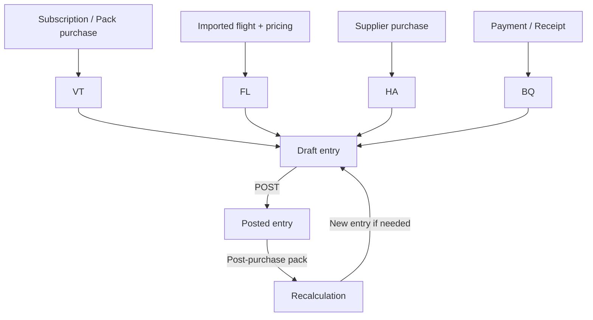
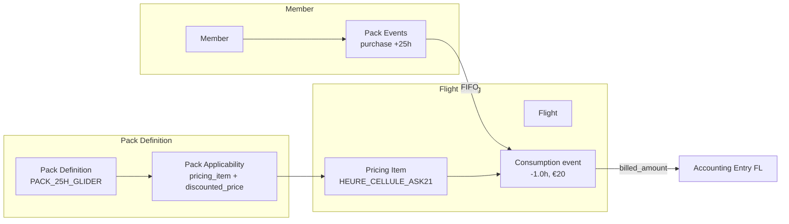

# Accounting Flows Specification – Gliding Club ERP

## Version 3.0 – Packs with Link Table (Hybrid Approach)

---

## 1. System Overview

The ERP manages double-entry accounting for a French non-profit association (law 1901). The scope covers: member subscriptions, flight billing, shop/bar sales, supplier purchases, payments, reimbursements, payroll, technical provisions, depreciation, subsidies, and pack-based discounts.

### 1.1 Cross-cutting Principles

| Rule | Application |
|------|-------------|
| Double-entry | Sum of debits = sum of credits per entry |
| Post-validation immutability | A `state = posted` entry cannot be modified |
| Correction = reversal | A posted entry is corrected by a reversal entry + a new entry |
| Draft → Posted | Explicit manual sequence (except parameterized imports) |
| Fiscal anchoring | Each entry belongs to a `fiscal_year` |
| Member traceability | Account 411 lines carry `member_uuid` and `member_account_id_snapshot` |
| Analytical traceability | Flight lines carry `analytical_asset_uuid` (aircraft / machine) |

### 1.2 Journals Used

| Code | Usage | Type |
|------|-------|------|
| VT | Member billing (subscriptions, deferred shop sales, packs) | Sale |
| HA | Supplier invoices | Purchase |
| BQ | Bank (transfers, checks, refunds) | Bank |
| CS | Cash (cash, immediate card) | Cash |
| OD | Miscellaneous operations (adjustments, provisions, payroll, subsidies) | General |
| FL | Flight billing (automatically generated) | Flights |
| AN | Opening carry-forward | Opening |

---

## 2. High-Level Accounting Cycle



---

## 3. Detailed Flows – Income

### 3.1 Subscription and Registration

Principle: A VT invoice is created at registration (multiple lines possible).

Line	Debit	Credit	Condition
Membership fee	411 (member)	7561	
Operating fee	411 (member)	7065	
FFVP insurance (optional)	411 (member)	706x	configurable
⚠️ Youth discount (<25 years): applied within the price (no separate discount entry).

Business validation:

A member cannot be registered without at least one product line.

Account 411 must be reconcilable and dimensioned with member_uuid.

Example: Flying member, membership €180 + operating fee €40

Label	Debit	Credit	Journal
Annual membership	411	7561	VT
Operating fee	411	7065	VT

### 3.2 Shop / Bar / Map Sales
Case	Debit	Credit	Journal
Immediate cash payment	530	7071 (shop) / 7072 (bar)	CS
Deferred payment (member account)	411	7071	VT
Purchase charged to pilot account	411	7071	VT
Business validation:

Immediate sales do not go through account 411.

A deferred purchase is reconcilable upon subsequent payment.

Example shop sale (cash): SIA map + equipment €45

Label	Debit	Credit	Journal
Cash receipt	530	707	CS

### 3.3 Pilot Account Top-up (411 credit balance)
The member makes a prepayment (cash advance to the club).

Method	Debit	Credit
Bank transfer	512	411 (credit)
Cash	530	411 (credit)
Check deposited	512	411 (credit)
⚠️ Account 411 becomes credit (club's debt to the member).
A "Credit available" UI badge is displayed on the member profile.

Example bank transfer: Pilot tops up €500

Label	Debit	Credit	Journal
Bank transfer receipt	512	411 (credit)	BQ

### 3.4 Flight Billing (FL journal) – Without discount
⚠️ Key change: the flight is billed at the full (gross) rate.
Any discount will be applied later via a separate OD entry or pack consumption.

Component	Debit	Credit
Cell hours (gross)	411	7062
Winch launch (gross)	411	7063
Tow launch (gross)	411	7063
TMG engine time (gross)	411	7064
Account 411 balance after flight = total gross amount.

Business validation:

Minimum balance alerts on account 411 must not be triggered before discount application.

Each flight line carries analytical_asset_uuid (concerned aircraft or machine).

The entry is automatically generated by the ERP in the FL journal.

Example glider winch flight: 1h10, standard rate

Label	Debit	Credit	Journal
Cell hours	411	7062	FL
Winch launch	411	7063	FL
Example TMG flight: 0h45 cell + 0.52 engine hours

Label	Debit	Credit	Journal
TMG cell hours	411	7062	FL
Engine time	411	7064	FL

### 3.5 Pack Purchase (subscription)
The member buys a discount entitlement for the year.

Step	Debit	Credit	Journal
Pack purchase	411	7066	VT
7066 – Packs and reductions is a revenue account.
The pack is attached to a fiscal year and a pack_type (flight_hours / winch_launches / tow_launches / engine_time).

Example: Purchase of season winch pack at €200

Label	Debit	Credit	Journal
Pack purchase	411	7066	VT

### 3.6 Discovery Flight (VI) – Non-member third party
Case	Debit	Credit	Journal
Immediate payment (cash)	530	706	CS
HelloAsso (net fees)	512	706	BQ
HelloAsso platform fees	627		BQ
Recognition upon realization (entitlement consumed)	467	706	VT
⚠️ Do not use account 411 for third parties (use 467).
Policy choice: recognition upon receipt (HelloAsso) or upon realization (flight completed).

Example direct VI (cash): €80

Label	Debit	Credit	Journal
VI cash receipt	530	706	CS
Example HelloAsso VI: €80, platform fees €3

Label	Debit	Credit	Journal
HelloAsso funds receipt	512	706	BQ
Platform fees	627		BQ

## 4. Pack Catalog & Consumable Member Packs

### 4.1 General Principle

A pack is a catalog definition (e.g., PACK_25H_GLIDER) that a member can purchase one or more times.
The discount is applied via a link table between a pack and an existing pricing_item.

Concept	Meaning
Pack definition	Template defining type, quantity allowance, and eligible pricing_items
Pack applicability	Link between a pack and a pricing_item with a discounted price
Member pack events	Ledger of member purchases and consumptions
Consumption	Quantity deducted from pack stock for a given flight

### 4.2 Pack Types
pack_type	Scope	Unit	Example
flight_hours	Flight hours (glider or TMG)	hours	25h glider pack
winch_launches	Winch launches	launches	20 winch pack
tow_launches	Tow launches	launches	10 tow pack
engine_time	Engine time (centihours)	hours	10h engine pack

### 4.3 Link Table: pack_applicability
This is the core of the system. It links a pack to an existing pricing_item and defines the discounted unit price.

Column	Type	Notes
uuid	UUID	PK
pack_definition_uuid	UUID	FK → pack_definitions
pricing_item_uuid	UUID	FK → pricing_items
discounted_unit_price	Numeric(10,4)	Unit price with discount (e.g., €20 instead of €100)
created_at	timestamptz	
Constraint: (pack_definition_uuid, pricing_item_uuid) is unique.

Business rules:

One pack can cover multiple pricing_items (e.g., 25h pack valid on ASK21 and LS8)

One pricing_item can be covered by multiple packs (e.g., standard rate → 25h pack, 50h pack, season pack)

The table stores only the discounted price. The standard price is in pricing_items.base_price.

### 4.4 Concrete Example
Existing pricing item: HEURE_CELLULE_ASK21 → base_price = €100

Pack definition: PACK_25H_GLIDER → quantity_allowance = 25, pack_type = flight_hours

Link in pack_applicability:

pack_definition_uuid	pricing_item_uuid	discounted_unit_price
PACK_25H_GLIDER	HEURE_CELLULE_ASK21	20.00
Result: A member with this pack pays €20/h instead of €100/h.

### 4.5 Member Pack Purchase

```sql
INSERT INTO member_pack_events (member_uuid, fiscal_year_uuid, pack_definition_uuid, event_type, quantity_delta, purchase_entry_uuid)
VALUES (member_x, fiscal_year_2026, PACK_25H_GLIDER, 'purchase', +25, accounting_entry_uuid);
```

Associated accounting entry (VT journal):

Debit	Credit	Amount
411 (member)	Pack sales account (config)	Pack purchase price

### 4.6 Consumption During Flight Billing
When a flight is billed:

Identify the applicable standard pricing_item (e.g., HEURE_CELLULE_ASK21)

Query pack_applicability to see if the member has an active pack (same fiscal_year, matching pack_type, remaining quantity > 0)

If yes, use discounted_unit_price and consume the quantity

Record a consume event in member_pack_events

```sql
INSERT INTO member_pack_events (member_uuid, fiscal_year_uuid, pack_definition_uuid, event_type, quantity_delta, flight_uuid, source, applied_pricing_item_uuid, billed_amount)
VALUES (member_x, fiscal_year_2026, PACK_25H_GLIDER, 'consume', -1.0, flight_uuid, 'flight', HEURE_CELLULE_ASK21, 20.00);
```

### 4.7 Consumption Rules
Rule	Application
FIFO by default	Consume packs in purchase order
Multiple packs of same type	Consume sequentially (FIFO)
Insufficient pack quantity	Consume remaining, rest billed at standard rate
Fiscal year expiration	No carry-over of unused quantities

### 4.8 Corresponding UI
Pack edition screen (admin):

"Applicable rates" tab

List of pricing_items (filtered by corresponding asset_type_uuid)

For each line, a field "Unit price with pack" (empty = not applicable)

Billing resolution:

Automatic, invisible to the user

The invoice line displays the actually applied unit price

## 5. Detailed Flows – Expenses and Third Parties

### 5.1 Supplier Purchases
Step	Debit	Credit	Journal
Invoice (maintenance, fuel, rental, insurance)	615 / 6063 / 613 / 616	401	HA
Supplier payment	401	512	BQ
Non-VAT registered association → VAT included in expense (no account 44566).

Example maintenance invoice: Glider overhaul €2,400

Label	Debit	Credit	Journal
Aircraft maintenance	615	401	HA
Example supplier payment: Transfer €2,400

Label	Debit	Credit	Journal
Supplier debt clearance	401	512	BQ
Example fuel: Invoice €850

Label	Debit	Credit	Journal
Aircraft fuel	6063	401	HA
Example insurance: Annual fleet premium €4,200

Label	Debit	Credit	Journal
Insurance premium	616	401	HA
If the premium covers two fiscal years, the N+1 portion is recorded in 487 (Deferred income).

### 5.2 Member Expense Reimbursement
Step 1 – Debt recognition (HA, as third-party supplier invoice)

Debit	Credit
Expense (6063 fuel, 625 travel, …)	411 (credit)
Step 2 – Treasurer arbitration

Decision	Entry
Bank refund (large amount)	Debit 411 / Credit 512 (BQ)
Provision on pilot account (small amount)	No entry, credit balance on 411 consumed by future flights
Configurable threshold (e.g., < €50 → provision, ≥ €50 → refund).

Example: Pilot advances €340 for fuel

Step	Label	Debit	Credit	Journal
1	Debt recognition	6063	411	HA
2	Bank refund	411	512	BQ

### 5.3 Member Receipts (411 clearing)
Method	Debit	Credit	Journal
Bank transfer / card	512	411	BQ
Cash	530	411	CS
Reconciliation required between payment and original invoice (or multiple invoices).

Example: Pilot pays €220 invoice by transfer

Label	Debit	Credit	Journal
Bank transfer receipt	512	411	BQ

## 6. Adjustment and Provision Flows

### 6.1 Maintenance Provisions (actual cost)
Automatically generated by rule (CostProvisionRule): metric_name (engine_hours, winch_launches…), unit cost, method (RealTime / BatchDaily).

Provision entry	Debit	Credit
Provision (engine / winch maintenance)	681 (or 605)	281 / 288
When actual maintenance invoice is received:

Step	Debit	Credit
Actual invoice	615	401
Provision reversal	281/288	781
The reversal clears the provision. Any excess remains as provision.

Example provision: 10 engine hours at €10/h = €100 provisioned

Label	Debit	Credit	Journal
Maintenance provision	681	281	OD
Example reversal on actual invoice: Repair €3,000

Label	Debit	Credit	Journal
Actual invoice	615	401	HA
Provision reversal	281	781	OD

### 6.2 Asset Depreciation (Aircraft)
Entry	Debit	Credit	Frequency
Depreciation allocation	681	281	annual
Example: Glider acquired for €60,000, straight-line 15 years = €4,000/year

Label	Debit	Credit	Journal
Depreciation allocation	681	281	OD

### 6.3 Subsidies
Subsidy	Debit	Credit
Equipment received	512	131
Annual portion transferred to income	139	777
Operating	512	742
Example equipment subsidy: Regional grant €20,000 for glider purchase

Step	Label	Debit	Credit	Journal
1	Subsidy receipt	512	131	BQ
2	Annual portion (€1,333)	139	777	OD
Example operating subsidy: Municipal aid €5,000

Label	Debit	Credit	Journal
Subsidy receipt	512	742	BQ

## 7. Payroll and Social Charges
Step	Debit	Credit	Journal
Gross recognition	641 (gross)	428 (net payable) + 431 (employee social charges)	OD
Employer charges	645	431	OD
Net salary payment	428	512	BQ
URSSAF payment	431	512	BQ
Example: Employee, gross €2,000, employee charges €400, net payable €1,600, employer charges €800

Step	Label	Debit	Credit	Journal
1	Gross recognition	641	428 + 431	OD
2	Employer charges	645	431	OD
3	Net payment	428	512	BQ
4	URSSAF payment	431	512	BQ

## 8. Version Differences and Corrections

### 8.1 Flight Modification After Billing
Case	Action
Entry still in Draft state	Update lines (no reversal)
Entry Posted	Create reversal + new corrected entry

### 8.2 Pack Purchase After Flight Date
Automatic recalculation within tolerance window.

If flight already posted → reversal + new entry.

If flight already discounted → no action.

Outside tolerance window → blocking (unless exception).

### 8.3 Reversal
A reversal is an entry that cancels a posted entry. It is created in the same journal as the original entry, with inverted amounts (debit ↔ credit).

Example: Flight mistakenly billed €111 instead of €100

Original entry	Debit	Credit
Cell hours	411	7062
Reversal entry	Debit	Credit
Cell hours cancellation	7062	411

## 9. Key Reports and Controls
9.1 Mandatory Reports
Report	Purpose
General ledger by account	Audit
Aged trial balance of account 411 (members)	Collection
Supplier aging (401)	Cash flow
Analytical detail by aircraft (analytical_asset_uuid)	Machine cost
Account 7066 balance (debit/credit)	Discount tracking
OD discount entries	Post-flight discount traceability
List of discounted flights	Double-discount prevention
Depreciation journal	Allocation tracking
Subsidy statement	Annual portion tracking

### 9.2 Blocking Rules
Condition	Block
Unbalanced entry	Prevent posting
Entry date outside fiscal year	Refuse creation
Closed fiscal year (state = closed)	Refuse posting (unless explicit reopening)
Use of account without is_posting_allowed	Refuse
Post-flight discount outside tolerance window	Refuse (unless explicit exception)
Second discount on same flight	Refuse

## 10. Complete Data Models
10.1 pack_definitions
Column	Type	Notes
uuid	UUID	PK
fiscal_year_uuid	UUID	FK → accounting_fiscal_years
code	varchar	Unique business key (e.g., PACK_25H_GLIDER)
name	varchar	Display name
pack_type	varchar	flight_hours / winch_launches / tow_launches / engine_time
quantity_allowance	Numeric(10,4)	Included quantity (e.g., 25.0000 hours)
quantity_unit	varchar	hours / launches / centihours
eligible_asset_type_uuid	UUID	FK → asset_types (nullable, restricts eligible items)
pack_sales_account_uuid	UUID	FK → accounting_accounts (override, nullable)
flights_journal_uuid	UUID	FK → accounting_journals (override, nullable)
priority	int	Tie-breaker when multiple packs apply (default 0)
created_at	timestamptz	

### 10.2 pack_applicability (link table)
Column	Type	Notes
uuid	UUID	PK
pack_definition_uuid	UUID	FK → pack_definitions
pricing_item_uuid	UUID	FK → pricing_items
discounted_unit_price	Numeric(10,4)	Unit price with discount
created_at	timestamptz	
Unique constraint: (pack_definition_uuid, pricing_item_uuid)

### 10.3 member_pack_events
Column	Type	Notes
uuid	UUID	PK
member_uuid	UUID	FK → members
fiscal_year_uuid	UUID	FK → accounting_fiscal_years
pack_definition_uuid	UUID	FK → pack_definitions
event_type	varchar	purchase / consume / freeze / unfreeze / adjust
quantity_delta	Numeric(10,4)	Positive for purchase, negative for consumption
flight_uuid	UUID	FK → validated_flights (required for consume)
source	varchar	flight / launch
applied_pricing_item_uuid	UUID	FK → pricing_items (the item used)
billed_amount	Numeric(10,4)	Amount billed with this pricing item
purchase_entry_uuid	UUID	FK → accounting_entries (for purchase)
is_frozen	boolean	If true, this consumption is ignored
frozen_at	timestamptz	
frozen_reason	text	
created_at	timestamptz	

### 10.4 flight_billing_configs
Column	Type	Notes
uuid	UUID	PK
fiscal_year_uuid	UUID	FK → accounting_fiscal_years, unique
flights_journal_uuid	UUID	FK → accounting_journals
pack_sales_account_uuid	UUID	FK → accounting_accounts (default pack sales account)
pack_consumption_strategy	varchar	fifo (default)
allow_post_purchase_recalculation	boolean	true by default
updated_at	timestamptz	
updated_by	int	FK → users

### 10.5 flight_billing_quotes
Column	Type	Notes
uuid	UUID	PK
flight_uuid	UUID	FK → validated_flights
fiscal_year_uuid	UUID	FK → accounting_fiscal_years
billing_hash	varchar(64)	SHA-256
total_amount	Numeric(10,4)	
state	varchar	quoted / applied / superseded / corrected
applied_lines_json	JSONB	Snapshot of applied lines
accounting_lines_json	JSONB	Snapshot of accounting lines
pack_consumptions_json	JSONB	Snapshot of pack consumptions
accounting_entry_uuid	UUID	FK → accounting_entries, nullable
created_at	timestamptz	

### 10.6 Tolerance Parameters
Stored in system_settings (module flight_billing):

```json
{
  "max_days_for_post_purchase_discount": 7,
  "require_approval_for_late_discount": true
}
```

## 11. API Surface

### 11.1 Flight Billing
Method	Path	Purpose
POST	/api/v1/flights/{flight_uuid}/billing-preview	Preview single flight
POST	/api/v1/flights/billing-preview	Preview batch by date range
POST	/api/v1/flights/{flight_uuid}/billing-apply	Apply preview → create Draft entry
POST	/api/v1/flights/{flight_uuid}/billing-post	Apply + Post in one step
POST	/api/v1/flights/billing-batch-apply	Batch apply + post
GET	/api/v1/flights/billable-flights	List flights ready for billing
GET	/api/v1/flights/pending-billing-summary	Aggregate stats
POST	/api/v1/flights/{flight_uuid}/recalculate	Recalculate single flight billing
POST	/api/v1/flights/recalculate-batch	Batch recalculate

### 11.2 Pack Definitions
Method	Path	Purpose
GET	/api/v1/pack-definitions	List pack definitions
POST	/api/v1/pack-definitions	Create pack definition
GET	/api/v1/pack-definitions/{uuid}	Get pack definition details
PUT	/api/v1/pack-definitions/{uuid}	Update pack definition
DELETE	/api/v1/pack-definitions/{uuid}	Delete (soft delete)

### 11.3 Pack Applicability (Link to Pricing Items)
Method	Path	Purpose
GET	/api/v1/pack-definitions/{uuid}/applicable-items	List linked pricing items with discounted price
POST	/api/v1/pack-definitions/{uuid}/applicable-items	Add link (pricing_item + discounted_price)
PUT	/api/v1/pack-applicability/{uuid}	Update discounted_unit_price
DELETE	/api/v1/pack-applicability/{uuid}	Remove link

### 11.4 Member Pack Purchases
Method	Path	Purpose
POST	/api/v1/members/{member_uuid}/packs	Buy a pack (creates pack + Draft entry)
GET	/api/v1/members/{member_uuid}/packs	List member packs with balances
GET	/api/v1/members/{member_uuid}/packs/{pack_uuid}/balance	Remaining balance
POST	/api/v1/members/{member_uuid}/packs/{pack_uuid}/apply-to-flights	Apply newly purchased pack to eligible flights

### 11.5 Pack Event Management (Freeze)
Method	Path	Purpose
POST	/api/v1/pack-events/{event_uuid}/freeze	Freeze a consumption event
POST	/api/v1/pack-events/{event_uuid}/unfreeze	Unfreeze a consumption event

### 11.6 Billing Configuration
Method	Path	Purpose
GET	/api/v1/accounting/fiscal-years/{fy_uuid}/flight-billing-config	Get billing config
PUT	/api/v1/accounting/fiscal-years/{fy_uuid}/flight-billing-config	Update billing config
GET	/api/v1/settings/flight-billing/delay	Get tolerance delay
PUT	/api/v1/settings/flight-billing/delay	Update tolerance delay

## 12. Accounting Impact Summary
Transaction	Debit	Credit	Amount
Flight charge (standard or pack-priced item)	411 (member)	706x (revenue)	resolved_price × qty
Pack purchase	411 (member)	pack_sales_account (config)	purchase_amount
The 411 account always carries the member dimension (member_uuid, member_account_id_snapshot).

The analytical dimension (analytical_asset_uuid) is set to the machine UUID on every line, enabling per-machine financial reporting.

## 13. Permissions & Capabilities
Capability	Operations
VIEW_FINANCIALS	View previews, quotes, billing config, machine dashboard
POST_ACCOUNTING_ENTRIES	Apply, post, recalculate, freeze/unfreeze
MANAGE_PRICES	Configure billing config (pack sales account, journals, strategy), manage pack definitions
MANAGE_USERS	Enable expense access tokens for members
The member portal uses token-based auth (not capabilities) — a valid expense access token grants read-only access to the member's own data.

## 14. Summary of PCG Accounts Used (extract)
Account	Name	Type	Postable
411	Members – Receivables	Asset	Yes
512	Bank	Asset	Yes
530	Cash	Asset	Yes
401	Suppliers	Liability	Yes
467	Other debtors/creditors	Asset	Yes
706	Services provided	Revenue	Yes
7061	Memberships and subscriptions	Revenue	Yes
7062	Flight activity (cell hours)	Revenue	Yes
7063	Launch revenue	Revenue	Yes
7064	Engine revenue	Revenue	Yes
7065	Operating fees	Revenue	Yes
7066	Packs and reductions	Revenue	Yes
707	Merchandise sales	Revenue	Yes
7071	Shop sales	Revenue	Yes
7072	Bar and meal sales	Revenue	Yes
7561	Member subscriptions	Revenue	Yes

---

## 15. Workflow Validation Matrix
6063	Fuel	Expense	Yes
615	Maintenance and repairs	Expense	Yes
616	Insurance premiums	Expense	Yes
613	Rentals	Expense	Yes
625	Travel	Expense	Yes
627	Banking services	Expense	Yes
641	Personnel remuneration	Expense	Yes
645	Social security charges	Expense	Yes
681	Depreciation allocations	Expense	Yes
781	Reversals of provisions	Revenue	Yes
131	Equipment subsidies	Liability	Yes
139	Subsidies recognized in income	Liability	Yes
742	Operating subsidies	Revenue	Yes
777	Portion of equipment subsidies transferred to income	Revenue	Yes
428	Personnel – accrued charges	Liability	Yes
431	Social security	Liability	Yes
281	Depreciation of tangible assets	Liability	Yes
288	Depreciation of other tangible assets	Liability	Yes

## 15. Workflow Validation Matrix
Workflow	Control points
Subscription	✅ VT generation, ✅ youth discount integrated, ✅ member_uuid dimension
Flights (FL)	✅ Gross billing only, ✅ analytical_asset_uuid, ✅ automatic generation
Pack purchase (VT)	✅ 411/7066 entry, ✅ pack_type, ✅ fiscal_year
Pack consumption (link table)	✅ pricing_item link, ✅ discounted_unit_price, ✅ FIFO consumption
Post-purchase recalculation	✅ eligible flights identified, ✅ consume events created, ✅ traceability
Member reimbursement	✅ HA entry, ✅ threshold arbitration, ✅ 411 reconciliation
Maintenance provision	✅ metric rule, ✅ reversal on actual invoice, ✅ RealTime/BatchDaily method
Depreciation	✅ annual allocation, ✅ asset link
Subsidies	✅ receipt, ✅ annual portion transfer
Payroll	✅ OD recognition, ✅ BQ payments
Posted flight correction	✅ reversal + rewrite
Bank reconciliation	✅ semi-automatic reconciliation
Legend: ✅ clear / to implement

## 16. Architecture Decision Summary
Decision	Choice
Where is the discount defined?	In pack_applicability (link between pack and pricing item)
Automatic pricing item creation?	No – pricing items exist independently
Multiple packs per pricing item?	Yes
Multiple pricing items per pack?	Yes
Discount management UI	From the pack screen ("Applicable rates" tab)
Billing resolution	Query pack_applicability + pack balances
Consumption strategy	FIFO by default
Fiscal year boundary	No carry-over of unused quantities
Posting policy	Always manual, after member review

## 17. Functional Questions to Validate with the Club
Point	Proposed decision	To validate
Tolerance window for post-flight pack purchase	7 days	☐
Can a discount be applied multiple times to the same flight?	No	☐
Multiple packs of same type behavior	FIFO consumption	☐
Can a post-flight discount be manually refused?	Yes (requires explicit approval)	☐
Is explicit exception required for late discounts?	Yes, with traceability	☐
VI treatment: receipt or realization?	To be defined	☐
Bank reconciliation: semi-automatic or fully manual?	To be defined	☐
Youth discount: only on subscription or also on flight hours?	To be defined	☐

<!-- Mermaid diagram for Pack → Applicability → Consumption flow -->

