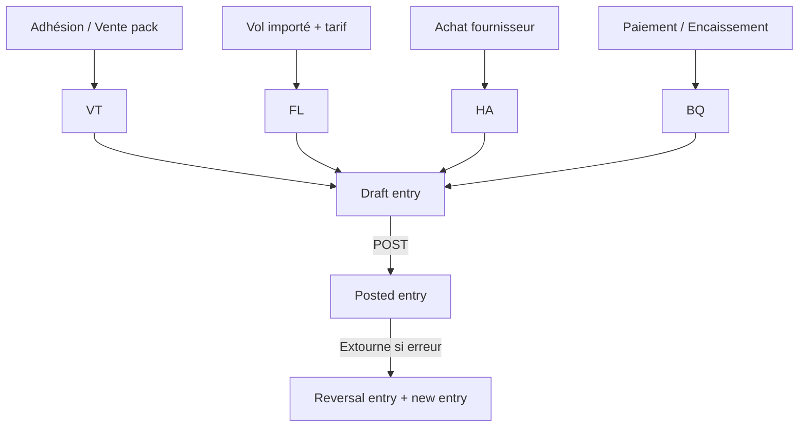

Voici une spécification de synthèse qui organise les flux comptables découverts dans les documents en un modèle cohérent, orienté développement et validation métier.

Spécification des Flux Comptables – Club de Vol à Voile

# 1. Vue d’ensemble du système

L’ERP gère la comptabilité en partie double pour une association loi 1901. Le périmètre couvre : l’adhésion des membres, la facturation des vols, les ventes boutique/bar, les achats fournisseurs, les encaissements, les remboursements, la paie, les provisions techniques, les amortissements, les subventions et les droits à remise (packs).

## 1.1 Principes transverses

Règle Application

Partie double Somme des débits = somme des crédits par écriture
Immutabilité post-validation Une écriture state = posted ne peut plus être modifiée
Correction = extourne Une écriture postée est corrigée par une écriture d’extourne + une nouvelle écriture
Brouillon → Posté Séquence manuelle explicite (sauf imports paramétrés)
Ancrage fiscal Chaque écriture appartient à un exercice comptable (fiscal_year)
Traçabilité membre Les lignes 411 (membres) portent member_uuid et member_account_id_snapshot
Traçabilité analytique Les lignes de vol portent analytical_asset_uuid (aéronef / machine)

## 1.2 Journaux utilisés

Code Usage Type

VT Facturation membres (cotisations, ventes boutique différées, packs) Vente
HA Factures fournisseurs Achat
BQ Banque (virements, chèques, remboursements) Banque
CS Caisse (espèces, CB immédiate) Caisse
OD Opérations diverses (régularisations, provisions, paie, subventions) Général
FL Facturation des vols (généré automatiquement) Vols
AN À-nouveaux (ouverture d’exercice) Ouverture

---

# 2. Macro-cycle comptable

---

# 3. Flux détaillés – Entrées

## 3.1 Adhésion et inscription

Principe : Une facture VT est créée à l’inscription (plusieurs lignes possibles).

Ligne Débit Crédit Condition
Cotisation 411 (membre) 7561
Frais de fonctionnement 411 (membre) 7065
Assurance FFVP (option) 411 (membre) 706x configurable
⚠️ Remise jeune (-25 ans) : appliquée dans le prix (pas d’écriture de remise séparée).

Validation métier :

· Un membre ne peut être enregistré sans au moins une ligne de produit.
· Le compte 411 doit être lettrable et dimensionné member_uuid.

## 3.2 Vente boutique / bar / cartes

Cas Débit Crédit Journal
Paiement immédiat espèces 530 7071 (boutique) / 7072 (bar) CS
Paiement différé (compte membre) 411 7071 VT
Achat porté au compte pilote 411 7071 VT

Validation métier :

· La vente immédiate ne passe pas par le compte 411.
· Un achat différé est lettrable lors du paiement ultérieur.

## 3.3 Recharge compte pilote (411 créditeur)

Le membre verse un acompte (avance de trésorerie).

Mode Débit Crédit
Virement 512 411 (créditeur)
Espèces 530 411 (créditeur)
Chèque remis en banque 512 411 (créditeur)

⚠️ Le compte 411 passe créditeur (dette du club envers le membre).

Un badge UI “Crédit disponible” est affiché sur le profil du membre.

## 3.4 Facturation des vols (journal FL)

Chaque vol produit une écriture FL qui peut contenir :

Composant Débit Crédit
Heures cellule (brut) 411 7062
Lancement treuil (brut) 411 7063
Remorquage (brut) 411 7063
Temps moteur TMG (brut) 411 7064
Remise pack (contre-écriture) 7066 411

⚠️ La remise pack est une contre-écriture dans la même écriture FL (pas d’écriture séparée).

Solde net 411 = brut − remise.

Règle métier :

Les alertes de seuil minimum sur compte 411 doivent porter sur le net (brut − remise).

## 3.5 Achat d’un pack de remise (abonnement)

Le membre achète un droit à remise pour l’année (ex: 200 € → 80% de remise sur les heures cellule).
Étape Débit Crédit Journal
Achat du pack 411 7066 VT

7066 – Packs et réductions est un compte de produit qui peut avoir un solde débiteur après application des remises (contre-écritures FL).

Le pack est attaché à un exercice fiscal et un pack_type (flight_hours / winch_launches / tow_launches).

## 3.6 VI (Vol d’Initiation) – Tiers non-membre

Cas Débit Crédit Journal

Paiement immédiat (espèces) 530 706 CS
HelloAsso (net frais) 512 706 BQ
Frais de plateforme HelloAsso 627  BQ
Constatation à la réalisation (entitlement consommé) 467 706 VT

⚠️ Ne pas utiliser le compte 411 pour les tiers (utiliser 467).

Choix de politique : constatation à l’encaissement (HelloAsso) ou à la réalisation (vol effectué).

---

# 4. Flux détaillés – Sorties et tiers

## 4.1 Achats fournisseurs

Étape Débit Crédit Journal
Facture (entretien, carburant, location, assurance) 615 / 6063 / 613 / 616 401 HA
Paiement fournisseur 401 512 BQ
Association non assujettie à TVA → TVA incluse dans la charge (pas de compte 44566).

## 4.2 Remboursement de frais avancés par un membre

### Étape 1 – Constatation de la dette (HA, car facture fournisseur tiers)

Débit Crédit
Charge (6063 carburant, 625 déplacement, …) 411 (créditeur)

### Étape 2 – Arbitrage trésorier

Décision Écriture

Remboursement bancaire (grosse somme) Débit 411 / Crédit 512 (BQ)
Provision sur compte pilote (petite somme) Pas d’écriture, solde créditeur 411 consommé par vols futurs
Seuil de basculement paramétrable (ex: < 50 € → provision, ≥ 50 € → remboursement).

## 4.3 Encaissements membres (apurement 411)

Mode Débit Crédit Journal
Virement / CB 512 411 BQ
Espèces 530 411 CS
Lettrage obligatoire entre le paiement et la facture d’origine (ou multiple factures).

---

# 5. Flux de régularisation et provisions

5.1 Provisions pour maintenance (coût au réel)

Générées automatiquement par règle (CostProvisionRule) : metric_name (engine_hours, winch_launches…), coût unitaire, méthode (RealTime / BatchDaily).
Écriture de dotation Débit Crédit
Provision (entretien moteur / treuil) 681 (ou 605) 281 / 288
Lors de la facture réelle de maintenance :
Étape Débit Crédit
Facture réelle 615 401
Reprise de provision 281/288 781
La reprise solde la provision constituée. L’excédent reste en provision.

## 5.2 Amortissements des immobilisations (aéronefs)

Écriture Débit Crédit Fréquence
Dotation aux amortissements 681 281 annuelle

## 5.3 Subventions

Subvention Débit Crédit
Équipement reçue 512 131
Quote-part virée au résultat (annuelle) 139 777
Exploitation 512 742

---

# 6. Flux de paie et charges sociales

Étape Débit Crédit Journal
Constatation brute 641 (brut) 428 (net à payer) + 431 (charges salariales) OD
Charges patronales 645 431 OD
Paiement net salarié 428 512 BQ
Paiement URSSAF 431 512 BQ

---

# 7. Écarts de version et corrections

## 7.1 Modification d’un vol après facturation

Cas Action

Écriture toujours à l’état Draft Mise à jour des lignes (pas d’extourne)
Écriture Posted Création d’une extourne (réversal) + nouvelle écriture corrigée

## 7.2 Achat de pack après la date d’un vol

· Recalcul automatique de la facturation des vols éligibles (même exercice).
· Si vol déjà posté → extourne + nouvelle écriture.

---

# 8. États et contrôles clés

## 8.1 États obligatoires

État Utilité
Grand livre par compte Audit
Balance âgée des comptes 411 (membres) Recouvrement
Échéances fournisseurs (401) Trésorerie
Détail analytique par aéronef (analytical_asset_uuid) Coût machine
Solde des packs et réductions (7066) Suivi des remises

## 8.2 Règles de blocage

Condition Blocage
Écriture non équilibrée Empêcher le postage
Date d’écriture hors exercice Refus de création
Exercice clos (state = closed) Refus de postage (sauf réouverture explicite)
Utilisation d’un compte sans is_posting_allowed Refus

---

# 9. Vérifications fonctionnelles (à valider avec le club)

10. Choix politique : seuil de remboursement vs provision (ex: 50 €).
11. Traitement VI : constatation à l’encaissement ou à la réalisation ?
12. Provision maintenance : méthode RealTime ou BatchDaily ?
13. Packs : application de la remise sur quelle assiette (brut) ?
14. Remise jeune : appliquée uniquement sur cotisation ou aussi sur heure de vol ?
15. Rapprochement bancaire : lettrage semi-automatique ou entièrement manuel ?

---

# 10. Synthèse des comptes PCG utilisés (extrait)

Compte Intitulé Type Postable

411 Membres – Créances Actif Oui
512 Banque Actif Oui
530 Caisse Actif Oui
401 Fournisseurs Passif Oui
467 Autres comptes débiteurs/créditeurs Actif Oui
7061 Cotisations et adhésions Produit Oui
7062 Activité vol (heures cellule) Produit Oui
7063 Produit des lancements Produit Oui
7064 Produit des moteurs Produit Oui
7065 Frais de fonctionnement Produit Oui
7066 Packs et réductions Produit Oui
7071 Ventes boutique Produit Oui
7072 Ventes bar et repas Produit Oui
7561 Cotisations membres Produit Oui
6063 Carburants Charge Oui
615 Entretien et réparations Charge Oui
681 Dotations aux amortissements Charge Oui
781 Reprises sur provisions Produit Oui

---

# 11. Matrice de validation des workflows

Workflow Points de contrôle à valider
Adhésion ✅ génération VT, ✅ remise jeune intégrée, ❌ reprise sur erreur
Vols ✅ calcul brut + remise, ✅ analytical_asset_uuid, ❌ post-achat pack
Packs ✅ écriture VT à l’achat, ✅ contre-écriture FL, ✅ scope fiscal
Remboursement membre ✅ écriture HA, ✅ arbitrage seuil, ✅ lettrage 411
Provision maintenance ✅ règle metric, ✅ reprise sur facture
Correction vol posté ✅ extourne + ré-écriture
Légende : ✅ clair / à implémenter / ❌ à arbitrer
