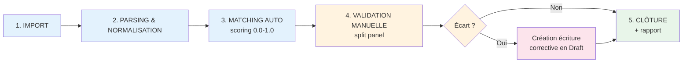

# Plan : Rapprochements Bancaires

## TL;DR

Système complet d'import et de rapprochement bancaire : import de relevés (CSV, **OFX**, QIF, MT940), parsing et normalisation, matching automatique avec les écritures comptables avec scoring de confiance, validation manuelle en workspace visuel, détection des écarts, génération d'écritures correctives, clôture de période et rapport de réconciliation.

---

## Workflow Global



| Phase | Action | Composant |
|---|---|---|
| **1** | Télécharger le fichier CSV/OFX/QIF/MT940 | Drag & drop + détection auto du format |
| **2** | Parser → normaliser → lignes brutes | Parsers spécialisés par format (OFX avec `ofxparse`) |
| **3** | Faire correspondre avec écritures comptables | Moteur de matching par score (montant, date, réf.) |
| **4** | Valider/rejeter/associer manuellement | Workspace split-panel : banque ↔ GL |
| **5** | Clôturer la période, générer l'écart si besoin | Rapport structuré + verrouillage période |

---

## Formats Supportés

| Format | Extension | Usage | Parser |
|---|---|---|---|
| **OFX/QFX** | `.ofx`, `.qfx` | **Standard export banque française** (SG, CA, BNP, Crédit Mutuel, etc.) | `ofxparse` (lib Python) |
| **CSV** | `.csv` | Format générique avec mapping colonnes configurable | Parseur interne + mapping wizard |
| **QIF** | `.qif` | Hérité Quicken/Microsoft Money | Parseur interne (format texte structuré) |
| **MT940** | `.940`, `.sta` | Standard SWIFT bancaire européen | Parseur interne (champs :61, :86, :62F) |

**L'OFX est le format prioritaire** — c'est le standard d'export de la plupart des banques françaises. La lib `ofxparse` gère à la fois l'OFX 1.x (format SG/SBIF) et l'OFX 2.x (XML).

---

## Modèle de Données

### Nouvelle table : `bank_statements`

```sql
CREATE TABLE bank_statements (
    uuid UUID PRIMARY KEY DEFAULT gen_random_uuid(),
    fiscal_year_uuid UUID NOT NULL REFERENCES accounting_fiscal_years(uuid) ON DELETE CASCADE,
    account_uuid UUID NOT NULL REFERENCES accounting_accounts(uuid),
    -- Identifiant du relevé
    import_date TIMESTAMPTZ NOT NULL DEFAULT now(),
    statement_date DATE NOT NULL,
    statement_period_start DATE,
    statement_period_end DATE,
    -- Métadonnées
    source_format VARCHAR(8) NOT NULL,            -- 'ofx', 'csv', 'qif', 'mt940'
    raw_filename VARCHAR(255),
    raw_content_hash VARCHAR(64),                  -- SHA-256 (déduplication)
    -- Totaux de contrôle
    opening_balance NUMERIC(10,4) DEFAULT 0,
    closing_balance NUMERIC(10,4) DEFAULT 0,
    total_debits NUMERIC(10,4) DEFAULT 0,
    total_credits NUMERIC(10,4) DEFAULT 0,
    line_count INTEGER DEFAULT 0,
    -- Statut
    status VARCHAR(16) NOT NULL DEFAULT 'imported',
    -- imported / matched / reconciled / flagged
    -- Correspondance avec écritures comptables
    reconciled_balance NUMERIC(10,4),
    balance_difference NUMERIC(10,4),
    reconciled_at TIMESTAMPTZ,
    reconciled_by INTEGER REFERENCES users(id) ON DELETE SET NULL,
    -- Audit
    created_by INTEGER NOT NULL REFERENCES users(id),
    created_at TIMESTAMPTZ NOT NULL DEFAULT now(),
    updated_at TIMESTAMPTZ NOT NULL DEFAULT now()
);

CREATE INDEX idx_bank_statements_fy ON bank_statements(fiscal_year_uuid);
CREATE INDEX idx_bank_statements_account ON bank_statements(account_uuid);
CREATE INDEX idx_bank_statements_status ON bank_statements(status);
CREATE INDEX idx_bank_statements_hash ON bank_statements(raw_content_hash)
    WHERE raw_content_hash IS NOT NULL;
```

### Nouvelle table : `bank_statement_lines`

```sql
CREATE TABLE bank_statement_lines (
    uuid UUID PRIMARY KEY DEFAULT gen_random_uuid(),
    statement_uuid UUID NOT NULL REFERENCES bank_statements(uuid) ON DELETE CASCADE,
    -- Données de la ligne bancaire
    line_date DATE NOT NULL,
    description TEXT,
    amount NUMERIC(10,4) NOT NULL,           -- Positif = crédit, Négatif = débit
    reference VARCHAR(255),
    counterparty VARCHAR(255),
    bank_raw_data JSONB,                      -- Données brutes (FITID OFX...)
    line_index INTEGER NOT NULL DEFAULT 0,
    -- Statut de matching
    match_status VARCHAR(20) NOT NULL DEFAULT 'unmatched',
    -- unmatched / auto_matched / manually_matched / excluded / discrepancy
    matched_entry_uuid UUID REFERENCES accounting_entries(uuid) ON DELETE SET NULL,
    matched_line_uuid UUID REFERENCES accounting_lines(uuid) ON DELETE SET NULL,
    match_confidence NUMERIC(4,3),
    -- Écarts
    discrepancy_type VARCHAR(32),
    discrepancy_notes TEXT,
    -- Résolution
    resolved_at TIMESTAMPTZ,
    resolved_by INTEGER REFERENCES users(id) ON DELETE SET NULL,
    created_at TIMESTAMPTZ NOT NULL DEFAULT now()
);

CREATE INDEX idx_bank_lines_statement ON bank_statement_lines(statement_uuid);
CREATE INDEX idx_bank_lines_status ON bank_statement_lines(match_status);
CREATE INDEX idx_bank_lines_matched_entry ON bank_statement_lines(matched_entry_uuid)
    WHERE matched_entry_uuid IS NOT NULL;
CREATE INDEX idx_bank_lines_date_amount ON bank_statement_lines(line_date, amount);
```

### Modification de `accounting_lines`

```sql
ALTER TABLE accounting_lines
  ADD COLUMN reconciled BOOLEAN NOT NULL DEFAULT false,
  ADD COLUMN reconciled_at TIMESTAMPTZ,
  ADD COLUMN reconciled_statement_line_uuid UUID
      REFERENCES bank_statement_lines(uuid) ON DELETE SET NULL;
```

---

## Architecture Backend

### Parsers — `backend/services/bank_parsers.py`

```
bank_parsers/
├── detect_format(filename, content) → 'ofx'|'csv'|'qif'|'mt940'
├── OfxParser        → ofxparse → ParsedStatement
├── CsvParser        → mapping colonnes → ParsedStatement
├── QifParser        → !Type:Bank + D/T/M/P → ParsedStatement
└── Mt940Parser      → champs SWIFT :61/:86 → ParsedStatement
```

#### Détection du format

```python
def detect_format(filename: str, content: bytes) -> str:
    """Détecte le format du fichier bancaire.
    - Extension .ofx/.qfx → 'ofx'
    - Extension .qif → 'qif'
    - Extension .940/.sta → vérifier en-tête SWIFT
    - Extension .csv → 'csv'
    - Sinon → analyse du contenu (OFX: OFXHEADER ou <?xml, QIF: !Type:Bank)
    """
```

#### Format normalisé (ParsedStatement)

```python
@dataclass
class ParsedStatement:
    account_id: str | None
    period_start: date | None
    period_end: date | None
    opening_balance: Decimal | None
    closing_balance: Decimal | None
    currency: str = 'EUR'
    lines: list[ParsedLine] = field(default_factory=list)
    raw_format: str = ''
    warnings: list[str] = field(default_factory=list)

@dataclass
class ParsedLine:
    line_date: date
    description: str
    amount: Decimal            # Positif = crédit, Négatif = débit
    reference: str = ''
    counterparty: str = ''
    fit_id: str | None = None  # OFX FITID unique
    check_number: str | None = None
    raw_data: dict | None = None
```

#### Parser OFX (prioritaire)

```python
import ofxparse

def parse_ofx(filepath: str, content: bytes) -> ParsedStatement:
    """Parse un fichier OFX/QFX via ofxparse.

    Extrait :
    - Compte : account_id, account_type
    - Période : start_date, end_date
    - Transactions : date, amount, description, fit_id, memo, check_number
    - Soldes : opening_balance, closing_balance

    Erreurs gérées :
    - Fichier mal formé → InvalidFormatError
    - Transaction sans montant → skip avec warning
    - FITID dupliqué → déduplication
    """
```

#### Parser CSV

```python
def parse_csv(content: bytes, column_mapping: ColumnMapping) -> ParsedStatement:
    """Parse un fichier CSV.

    Supporte :
    - Séparateurs : virgule, point-virgule, tab (détection auto)
    - Encodages : UTF-8, Latin-1, CP1252 (chardet)
    - Formats de date : DD/MM/YYYY, MM/DD/YYYY, YYYY-MM-DD (détection auto)
    - Nombres : français (1.234,56) et anglais (1,234.56)
    """
```

### Service de Rapprochement — `backend/services/bank_reconciliation.py`

#### Fonctions principales

```python
async def import_statement(
    db, fiscal_year_uuid, account_uuid, file_content, filename, user_id
) -> BankStatement:
    """
    1. detect_format()
    2. parse(content) → ParsedStatement
    3. Vérifier déduplication (SHA-256 du contenu)
    4. Créer BankStatement
    5. Créer les BankStatementLines
    6. Vérifier l'équilibre : opening + credits - debits ≈ closing
    7. Audit log
    """

async def run_auto_match(db, statement_uuid) -> MatchResult:
    """
    MOTEUR DE SCORING (4 stratégies) :

    1. MATCH EXACT (score = 1.0) → auto_accept
       - Montant == debit/credit
       - ET référence == entry.reference
       - ET date ± 1 jour

    2. MONTANT + DATE (score = 0.85-0.95) → auto_accept si > 0.90
       - Montant identique
       - ET date ± 3 jours
       - date exacte = 0.95, ±3j = 0.85

    3. MONTANT SEUL (score = 0.40-0.60) → flag review
       - Montant identique, pas de référence concordante
       - Pénalité si plusieurs écritures avec même montant

    4. MATCH NÉGATIF (score = 0.0) → missing_entry
       - Aucune écriture correspondante

    RÈGLES :
    - Ligne déjà réconciliée → exclue
    - FITID déjà matché → exclu
    - Écriture REVERSAL → exclue
    - reversal_of_entry_uuid NOT NULL → exclue
    """

async def manual_match(db, line_uuid, entry_uuid, entry_line_uuid, user_id) -> BankStatementLine:
    """Association manuelle d'une ligne bancaire à une écriture."""

async def unmatch(db, line_uuid, reason) -> BankStatementLine:
    """Casser une correspondance."""

async def create_correcting_entry(
    db, line_uuid, account_uuid, fiscal_year_uuid, user_id
) -> AccountingEntry:
    """
    Créer une écriture corrective pour une ligne bancaire non matchée.
    - Crée une écriture Draft (state=1) dans le journal OD
    - Débit/crédit sur le compte GL passé en paramètre
    - Contrepartie : compte d'attente (via settings)
    - Description : "Correction rapprochement - {description}"
    - Référence : "RAPPRO-{statement.code}-{line_index}"
    """

async def detect_discrepancies(db, statement_uuid) -> list[Discrepancy]:
    """
    4 types d'écarts :
    - missing_entry : ligne sans match → suggérer création
    - amount_variance : matché mais montant diffère → proposer correction
    - timing : date banque - date écriture > 7j → flag
    - duplicate : 2 lignes banque matchées sur 1 écriture → flag
    """

async def close_reconciliation(db, statement_uuid, user_id) -> BankStatement:
    """
    1. Vérifier aucune ligne 'unmatched' ou en 'manual_review'
       → Si oui, refuser + lister
    2. Vérifier équilibre : closing ≈ sum(matched)
       → Si non, proposer écriture d'écart
    3. Marquer BankStatement status = 'reconciled'
    4. Marquer accounting_lines.reconciled = true
    5. Audit log
    """

async def get_reconciliation_report(db, statement_uuid) -> dict:
    """
    Rapport structuré :
    - Période, soldes (ouverture, clôture, comptable, écart)
    - Stats matching (total, auto, manuel, à vérifier, non trouvé)
    - Liste des écritures correctives créées
    - Lignes non matchées avec explications
    """
```

---

## API Endpoints

**Fichier** : nouveau `backend/api/routes/reconciliation.py`

```
# ── Import ──────────────────────────────────────────────────
POST   /api/v1/reconciliation/import
    Body: multipart/form-data { file, fiscal_year_uuid, account_uuid, column_mapping? }
    → 201 BankStatementResponse

# ── Statements ──────────────────────────────────────────────
GET    /api/v1/reconciliation/statements
    Query: fiscal_year_uuid, account_uuid, status, period_start, period_end
    → list[BankStatementResponse]

GET    /api/v1/reconciliation/statements/{uuid}
    → BankStatementDetailResponse (avec lignes)

DELETE /api/v1/reconciliation/statements/{uuid}
    → 204

# ── Matching ────────────────────────────────────────────────
POST   /api/v1/reconciliation/statements/{uuid}/match
    → MatchResultResponse

POST   /api/v1/reconciliation/manual-match
    Body: { line_uuid, entry_uuid, entry_line_uuid }
    → BankStatementLineResponse

POST   /api/v1/reconciliation/unmatch
    Body: { line_uuid, reason }
    → BankStatementLineResponse

# ── Discrepancies ───────────────────────────────────────────
GET    /api/v1/reconciliation/statements/{uuid}/discrepancies
    → list[DiscrepancyResponse]

POST   /api/v1/reconciliation/resolve-discrepancy
    Body: { line_uuid, resolution_type, account_uuid, notes }
    → ResolutionResponse

# ── Close / Report ──────────────────────────────────────────
POST   /api/v1/reconciliation/statements/{uuid}/close
    → BankStatementResponse

GET    /api/v1/reconciliation/statements/{uuid}/report
    Query: format (json / pdf)
    → ReportResponse

# ── CSV Mappings ────────────────────────────────────────────
GET    /api/v1/reconciliation/csv-mappings       → list
POST   /api/v1/reconciliation/csv-mappings       → CsvMappingResponse
DELETE /api/v1/reconciliation/csv-mappings/{uuid} → 204
```

**Permissions :**
- `view_guard` = `CAP_VIEW_FINANCIALS` (lecture statements, report)
- `post_guard` = `CAP_POST_ACCOUNTING_ENTRIES` (import, match, unmatch, resolve, close)
- `settings_guard` = `CAP_MANAGE_SYSTEM_SETTINGS` (delete, csv mappings)

---

## Architecture Frontend

### Module : `frontend/src/modules/reconciliation/`

```  
components/
├── ReconciliationImportPage.tsx       # Drag & drop + sélection compte/FY
├── ReconciliationStatementList.tsx    # Liste des relevés avec progression
├── ReconciliationWorkspace.tsx        # Split panel banque ↔ GL
├── ReconciliationDiscrepancies.tsx    # Panneau des écarts
├── ReconciliationReport.tsx           # Rapport de réconciliation
└── CsvMappingWizard.tsx              # Assistant mapping colonnes CSV
api/
└── index.ts                          # Hooks API (query + mutations)
types/
└── index.ts                          # Types TypeScript
i18n/
├── fr.ts
└── en.ts
```

### Page Import — Drag & Drop avec détection de format

```
┌─────────────────────────────────────────────────────────────┐
│  Rapprochement bancaire — Import du relevé                  │
│                                                             │
│  Compte : [512100 - Crédit Mutuel ▼]                        │
│  Exercice : [2025/2026 ▼]                                   │
│                                                             │
│  ┌─────────────────────────────────────────────────────┐    │
│  │              📁 Glissez votre relevé ici             │    │
│  │        Formats : .ofx .qfx .csv .qif .940 .sta      │    │
│  └─────────────────────────────────────────────────────┘    │
│                                                             │
│  Fichier : relevé_juin_2026.ofx (12.4 KB)                   │
│  ├── Détecté : OFX ✅                                       │
│  ├── Période : 01/06 → 30/06/2026                          │
│  ├── Lignes : 42                                            │
│  ├── Solde d'ouverture : 3 250,00 €                        │
│  └── Solde de clôture : 7 500,00 €                         │
│                                                             │
│              [⬇️ Importer]  [✕ Annuler]                     │
└─────────────────────────────────────────────────────────────┘
```

### Workspace de Matching — Split Panel

```
┌──────────────────────────────────────────────────────────────┐
│  📊 Progression : ████████████████░░░░░  72%                │
│  ✅ 30 auto  │  🔵 2 manuel  │  🟡 6 à vérifier  │  ❌ 4   │
│                                                              │
│  🔍 [Tous ▼]  📅 [01/06 → 30/06]  💰 [   ]                 │
│                                                              │
│  ┌── Relevé Bancaire ───────────┬── GL Comptable ─────────┐ │
│  │ 🟢 01/06  +1 000,00         │ 🟢 756-001  Cotisation  │ │
│  │ 🟢 01/06  -200,00           │ 🟢 401-001  Fournisseur │ │
│  │ 🔵 02/06  +500,00           │ 🔵 Client Z  (manuel)   │ │
│  │ 🟡 03/06  -52,30            │ 🔶 Aucune écriture      │ │
│  │ ❌ 05/06  +2 000,00         │ ❓ Aucune écriture      │ │
│  │ 🟢 ...                      │ 🟢 ...                   │ │
│  └──────────────────────────────┴─────────────────────────┘ │
│                                                              │
│  Légende : 🟢 Auto  🔵 Manuel  🟡 Faible confiance  ❌ Non trouvé│
│                                                              │
│  [🔄 Re-matching]  [📋 Rapport]  [🔒 Clôturer]              │
└──────────────────────────────────────────────────────────────┘
```

### Modale de Détail d'une Ligne

```
┌── Détail Ligne Bancaire ─────────────────────────────────┐
│  Date        : 03/06/2026                                 │
│  Description : Carte CB CARREFOUR                         │
│  Montant     : -52,30 €                                   │
│  Réf.        : FITID=2026060312345                        │
│                                                           │
│  🔶 Aucune correspondance automatique                     │
│                                                           │
│  Propositions :                                           │
│  ○ 03/06  658  Frais bancaires  52,30 €  score 0.45     │
│  ○ 02/06  471  Attente           52,30 €  score 0.40     │
│                                                           │
│  [➕ Associer]  [➕ Créer écriture]  [🚫 Exclure]        │
│                                                           │
│  ┌── Résolution ─────────────────────────────────────┐   │
│  │  Type : Écriture manquante en compta               │   │
│  │  Action : Créer sur compte [658 ▼]                  │   │
│  │  [✅ Confirmer]                                     │   │
│  └────────────────────────────────────────────────────┘   │
└──────────────────────────────────────────────────────────┘
```

### Panneau des Écarts

```
┌── Écarts ────────────────────────────────────────────────┐
│                                                           │
│ 🔴 Écritures manquantes (3)                               │
│    03/06  -52,30 €  →  Créer sur [658 ▼]  [Créer]       │
│    05/06  +2 000 €  →  Créer sur [411 ▼]  [Créer]       │
│                                                           │
│ 🟠 Variations de montant (1)                              │
│    10/06  -150,00€ vs -148,50€ → écart 1,50€             │
│    [Créer correction]  [Exclure]                          │
│                                                           │
│ 🟡 Doublon suspect (1)                                    │
│    15/06  +200€ × 2 matchés sur 1 écriture               │
│    [Exclure ligne A]  [Exclure ligne B]                   │
│                                                           │
└───────────────────────────────────────────────────────────┘
```

### Rapport de Réconciliation

```
┌── Rapport de Réconciliation ──────────────────────────────┐
│  Période : 01/06 → 30/06/2026                             │
│  Compte : 512100 - Crédit Mutuel                          │
│                                                           │
│  Solde d'ouverture    :  3 250,00 €                       │
│  Total crédits        : 12 450,00 €                       │
│  Total débits         : -8 200,00 €                       │
│  Solde de clôture     :  7 500,00 €                       │
│  Solde comptable      :  7 498,50 €                       │
│  Écart                :      1,50 €                       │
│                                                           │
│  Matching : 42 lignes → 72% (30 auto + 2 manuel)         │
│  Écritures correctives créées : 2                         │
│                                                           │
│  [📄 PDF]  [🔒 Valider et clôturer]                      │
└───────────────────────────────────────────────────────────┘
```

---

## Phases d'Implémentation

### Phase 1 — Modèles & Migration

**Fichiers** : `docs/migrations/046_bank_reconciliation.sql` + `backend/models.py`

| Étape | Description |
|---|---|
| 1.1 | Créer les tables `bank_statements` et `bank_statement_lines` |
| 1.2 | Ajouter `reconciled` à `accounting_lines` |
| 1.3 | Classes Python `BankStatement`, `BankStatementLine` |
| 1.4 | Schémas Pydantic `backend/schemas/reconciliation.py` |

### Phase 2 — Parsers de fichiers

**Fichier** : `backend/services/bank_parsers.py`

| Étape | Description |
|---|---|
| 2.1 | `detect_format()` — par extension puis contenu |
| 2.2 | `OfxParser` — OFX/QFX avec ofxparse (FITID déduplication) |
| 2.3 | `CsvParser` — mapping colonnes, détection séparateur & encodage |
| 2.4 | `QifParser` — format texte structuré |
| 2.5 | `Mt940Parser` — champs SWIFT |
| 2.6 | `import_statement()` — point d'entrée unifié |

### Phase 3 — Moteur de Matching

**Fichier** : `backend/services/bank_reconciliation.py`

| Étape | Description |
|---|---|
| 3.1 | `run_auto_match()` — 4 stratégies de scoring |
| 3.2 | `manual_match()` + `unmatch()` |
| 3.3 | Filtres : exclusion déjà réconcilié, reversal, FITID déjà matché |

### Phase 4 — Écarts et Résolution

| Étape | Description |
|---|---|
| 4.1 | `detect_discrepancies()` — 4 types d'écarts |
| 4.2 | `create_correcting_entry()` → écriture Draft journal OD |
| 4.3 | `resolve_discrepancy()` — 3 modes de résolution |

### Phase 5 — Clôture et Rapport

| Étape | Description |
|---|---|
| 5.1 | `close_reconciliation()` — vérifications, verrouillage |
| 5.2 | `get_reconciliation_report()` — rapport structuré |

### Phase 6 — API Routes

**Fichier** : nouveau `backend/api/routes/reconciliation.py`

| Étape | Endpoints |
|---|---|
| 6.1 | Import + statements CRUD |
| 6.2 | Matching (auto, manual, unmatch) |
| 6.3 | Discrepancies, correction, close |
| 6.4 | Report, CSV mappings |

### Phase 7 — Frontend : Import & Liste

**Fichiers** : `frontend/src/modules/reconciliation/`

| Étape | Composant |
|---|---|
| 7.1 | Hooks API (import, statements, matching mutations) |
| 7.2 | `ReconciliationImportPage` — drag & drop + détection format |
| 7.3 | `CsvMappingWizard` — assistant mapping colonnes |
| 7.4 | `ReconciliationStatementList` — liste des relevés |

### Phase 8 — Frontend : Workspace

| Étape | Composant |
|---|---|
| 8.1 | `ReconciliationWorkspace` — split panel banque/GL |
| 8.2 | Colorimétrie : 🟢 🔵 🟡 ❌ selon statut |
| 8.3 | Modale de détail : propositions, association, création |
| 8.4 | `ReconciliationDiscrepancies` — panneau des écarts |
| 8.5 | `ReconciliationReport` — rapport |

### Phase 9 — Intégration

| Étape | Description |
|---|---|
| 9.1 | Ajouter l'onglet `'reconciliation'` dans `BanqueDailyOpsPage.tsx` |
| 9.2 | Badge de notification sur l'onglet (relevés en attente) |
| 9.3 | i18n complète (fr + en) |

---

## Dépendances Backend

```txt
# backend/requirements.txt
ofxparse==0.21       # OFX/QFX parser
chardet==5.2.0       # Détection d'encodage (CSV)
python-multipart     # File upload (déjà présent)
```

---

## Fichiers Modifiés / Créés

| Fichier | Action |
|---|---|
| `docs/migrations/046_bank_reconciliation.sql` | **Créer** |
| `backend/models.py` | **Modifier** — ajouter `BankStatement`, `BankStatementLine`, modif `AccountingLine` |
| `backend/schemas/reconciliation.py` | **Créer** |
| `backend/services/bank_parsers.py` | **Créer** |
| `backend/services/bank_reconciliation.py` | **Créer** |
| `backend/api/routes/reconciliation.py` | **Créer** |
| `backend/main.py` | **Modifier** — enregistrer le router |
| `backend/requirements.txt` | **Modifier** — ofxparse, chardet |
| `frontend/src/modules/reconciliation/` | **Créer** (6 composants + api + types + i18n) |
| `frontend/src/modules/banque/components/BanqueDailyOpsPage.tsx` | **Modifier** — ajouter onglet |
| `packages/i18n/src/resources/fr.ts` | **Modifier** |
| `packages/i18n/src/resources/en.ts` | **Modifier** |

---

## Vérification

### Tests unitaires Backend

1. **Parser OFX** → fichier réel → 42 lignes normalisées correctement, FITID extraits
2. **Parser CSV** → mapping colonnes → lignes correctes, détection auto séparateur
3. **Matching exact** → montant + référence + date = score 1.0 → auto-accept ✅
4. **Matching fuzzy** → montant ±3j = score 0.85 → revue manuelle 🟡
5. **Déduplication** → même SHA-256 → rejet avec message "déjà importé le..."
6. **FITID déjà matché** → ignoré silencieusement
7. **Création corrective** → écriture Draft équilibrée dans journal OD
8. **Clôture avec lignes en attente** → refus + liste des lignes à résoudre
9. **Rapport** → soldes corrects, stats matching, liste écarts

### Tests UI manuels

10. **Import OFX** → glisser fichier → détection auto → aperçu → importer → statut 'imported'
11. **Matching auto** → lancer → 30 matchés, 6 à vérifier, 4 non trouvés
12. **Association manuelle** → cliquer ligne → propositions → associer → 🔵
13. **Création corrective** → "Créer écriture" → sélectionner compte → écriture Draft créée
14. **Clôture** → refus si lignes non résolues → résoudre → OK → statut 'reconciled'
15. **Mapping CSV** → créer mapping → réutiliser au prochain import

### Cas limites

16. **OFX mal formé** → message d'erreur clair
17. **Encodage CSV non UTF-8** → détection auto par chardet
18. **Fichier vide** → message explicite
19. **Même fichier importé 2×** → hash identique → message "déjà importé"
20. **Période déjà clôturée** → refus d'import

---

## Décisions Architecturales

| Décision | Choix |
|---|---|
| **Parser OFX** | Librairie `ofxparse` — mature, OFX 1.x (SG/SBIF) et 2.x (XML) |
| **Stockage fichier** | Hash SHA-256 seulement, pas le contenu brut |
| **Marquage réconciliation** | Booléen `reconciled` sur `accounting_lines` |
| **Seuil auto-accept** | ≥ 0.90 ; revue 0.40–0.89 ; non trouvé < 0.40 |
| **Écritures correctives** | Créées en Draft (state=1) journal OD — revue avant posting |
| **Module frontend** | `reconciliation/` séparé de `banque/` — réutilisable |
| **Mapping CSV** | Sauvegardé par utilisateur avec nom — réutilisation rapide |
