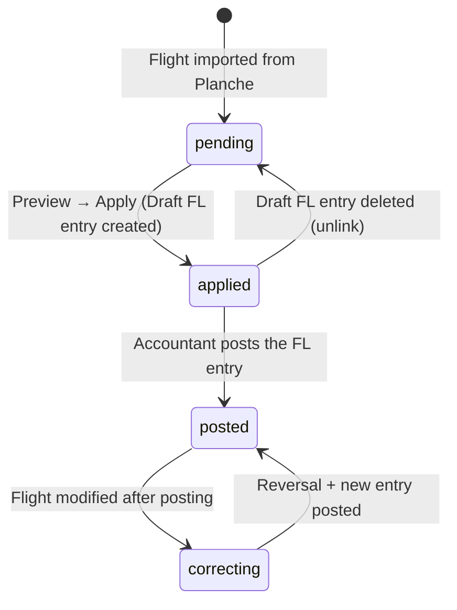

# Plan: Finalize Flights Accounting — Billing, Pack Consumption & Daily Ops Integration

## TL;DR

Add the billing **apply** step that turns previews into **Draft** accounting entries (with explicit manual posting after review), introduce a proper **pack catalog + member-owned consumable packs** system (including multiple 25h packs per pilot), and build the **flights tab** in Daily Operations as the central UI cockpit.

---

## Design Decisions

| Decision | Choice |
|---|---|
| **Discount realization** | Discounts are **decoupled from flight billing**. Flights are billed at gross price in FL journal. Discounts are tracked in `member_pack_consumptions` and applied via periodic REM adjustment entries |
| **Pack model** | **Catalog + consumable packs** — define reusable pack templates (ex: `PACK_25H`) linked to pricing items via `pack_applicability` with `discounted_unit_price`. Pack purchases tracked natively in GL |
| **Pack pricing** | `pack_applicability` links a pack definition to a `pricing_item` with a `discounted_unit_price`. Discount = `base_price − discounted_unit_price` |
| **Pack tracking** | `member_pack_consumptions` operational table — one row per flight line consuming pack units. Balance computed via `vw_member_pack_balances` view crossing GL purchases with consumptions |
| **Pack scope** | Packs scoped by `pack_type` (`flight_hours` / `winch_launches` / `tow_launches` / `engine_time`); each scope discounts matching pricing items |
| **Fiscal year boundary** | Packs scoped to one fiscal year. Remaining quantities reset to 0 at year-end — no carry-over |
| **REM journal** | Dedicated journal (code `REM` / `DISC`, type = General) for discount adjustments. One Draft entry per pilot per period, updated as discounts accumulate |
| **Pack discount accounting** | Pack sale revenue stays in class 7 via `pack_sales_account_uuid`; REM discounts debit a class 6 expense account via `pack_discount_expense_account_uuid`. The pack operating result is read as class 7 pack sales minus class 6 pack discount expenses |
| **Billing configurability** | Each pack definition carries its own sales account (`pack_sales_account_uuid`) and discount expense account (`pack_discount_expense_account_uuid`, normally class 6). Operational settings (period, tolerance, journals, default accounts) live in a **dedicated `flight_billing_settings` table** with typed columns and FK constraints — one row per fiscal year. A user-friendly form UI replaces raw JSON editing |
| **Post-purchase** | Allowed — system recalculates `member_pack_consumptions` and updates the REM Draft entry |
| **Valid_from dates** | `member_pack_consumptions` rows have a `valid_from` date determining REM inclusion. Instead of freeze, the `valid_from` can be adjusted via UI to retroactively include/exclude consumptions |
| **Posting policy** | FL entries can be posted independently. REM entries remain Draft until period close (monthly/quarterly) |

| **Club billing — Detection** | Two detection modes: (1) `charge_to_erp_id` matches the club member's `account_id`, (2) Flight type is `initiation` and a charge account can be resolved (from `vi_type_catalog.charge_account_uuid` or settings). Detection 2 allows initiation flights to be billed without requiring the club member to be configured |
| **Club billing — Dual accounts** | `default_initiation_charge_account_uuid` = charge account for initiation flights (fallback when VI type has none); `club_charge_account_uuid` = charge account for flights explicitly billed to club (member match). Each uses a different class-6 account if desired |
| **Accounting dimensions** | 411 debit line carries `member_uuid` (who owes) + `analytical_asset_uuid` (which machine); 7xx credit line carries `analytical_asset_uuid` only (revenue by machine). No member dimension on club-billed lines |
| **VI type charge account** | Configurable via UI at VI → Types. When `vi_erp_id` is NULL on a flight, the system falls back to `settings.default_initiation_charge_account_uuid` |
| **Alerts** | Evaluate combined net of gross FL entry + REM adjustment — never gross alone |

---

## Flight Billing Lifecycle & State Management

### 1. Flight Billing Status Tracking

Each `validated_flights` row carries two billing-related fields:

| Field | Type | Purpose |
|---|---|---|
| `accounting_entry_uuid` | UUID, unique, nullable | FK → `accounting_entries.uuid`. Set when a Draft FL entry is created. The `UNIQUE` constraint **prevents double billing**: once set, no second entry can reference this flight |
| `billing_quote_state` | VARCHAR(16), default `'pending'` | Lifecycle state: `pending` → `applied` → `posted` |
| `erp_status` | SMALLINT, default 0 | 0=validated (draft), 1=transferred (locked), 2=modified_after_transfer |

### 2. Lifecycle States & Transitions



| State | `billing_quote_state` | `accounting_entry_uuid` | Meaning |
|---|---|---|---|
| `pending` | `'pending'` | NULL | Flight not billed yet. Shown in billable list |
| `applied` | `'applied'` | Set (Draft) | Draft FL entry exists but not yet posted |
| `posted` | `'posted'` | Set (Posted) | FL entry is posted (immutable) |
| `correcting` | `'posted'` | Set (Posted + reversal) | Posted entry has a reversal + replacement |

### 3. Duplicate Billing Prevention

**Database level:** `accounting_entry_uuid` has a `UNIQUE` constraint on `validated_flights`. Once set, any attempt to create a second entry for the same flight violates the constraint.

**Application level:**
- `GET /api/v1/flights/billable` filters `WHERE accounting_entry_uuid IS NULL` — only shows unbilled flights
- `FlightBillingApplyService.apply_flight_billing()` checks `preview.can_apply` before creating the entry
- The batch-preview endpoint also checks `include_already_billed=false` by default

**Frontend level:**
- `OpsFlightsTab` queries `/api/v1/flights/billable` which only returns unbilled flights
- Once applied, the flight disappears from the list (query auto-refreshes on success)

### 4. Draft Entry Deletion (Unlink)

If a Draft FL entry is deleted (manually via accounting or system cleanup), the flight must be returned to `pending` state:

```
DELETE /api/v1/accounting/entries/{entry_uuid}
  → Also NULLify validated_flights.accounting_entry_uuid
  → Reset billing_quote_state to 'pending'
  → Delete associated member_pack_consumptions rows
  → If REM Draft entry now has zero consumptions, delete or zero it
```

This operation is **allowed only for Draft entries** (state=1). Posted entries cannot be deleted — they require reversal.

**If a Draft entry is deleted outside this flow** (e.g. direct DB manipulation):
- The flight's `accounting_entry_uuid` still points to a non-existent entry
- Recovery: Admin can manually NULLify the field via the flight detail UI
- Future: Add a cleanup job that detects orphaned `accounting_entry_uuid` values (WHERE entry deleted but flight still linked)

### 5. Flight Modification After Billing

When a flight is re-imported from Planche after being billed:

1. **Flight is Draft** (state=1): The Draft entry is replaced. New preview → new Draft → old Draft discarded
2. **Flight is Posted** (state=2): The flight's `erp_status` is set to 2 (`modified_after_transfer`). The accountant must:
   - Create a reversal of the original posted entry
   - Run a new preview with current data
   - Create a new Draft → post it
   - The reversal and new entry are linked to the flight

The frontend shows a **warning badge** on flights with `erp_status=2` or flights where the current Planche revision is higher than when billed.

### 6. Billing Status Filters

The billable endpoint supports filtering by multiple criteria:

| Parameter | Values | Purpose |
|---|---|---|
| `date_from`, `date_to` | ISO dates | Date range filter |
| `type_of_flight` | 0-7 | Instruction, Solo, Initiation, etc. |
| `launch_method` | 0-3 | Winch, tow, self-launch, etc. |
| `status` | `pending`, `applied`, `posted`, `all` | **NEW** — filter by billing state. Default = `pending` |

When `status=all`, the endpoint returns flights regardless of `accounting_entry_uuid`, allowing the user to see ALL flights with their current billing state.

### 7. UX/UI: Billing & Discount Application Flow

```
┌────────────────────────────────────────────────────────────────────────┐
│  OpsFlightsTab — Daily Operations > Flights                            │
│                                                                        │
│  ┌─────────────────────────────────────────────────────────────────┐   │
│  │  [Date from] → [Date to]  [Type▼] [Launch▼]  [Status▼]  🔄    │   │
│  │                              [🔍 Preview] [📤 Apply All]         │   │
│  └─────────────────────────────────────────────────────────────────┘   │
│                                                                        │
│  ┌─────┬────────┬────────┬────────┬────────┬────────┬────────┬──────┐  │
│  │  ▸  │ Date   │ Pilot  │ Machine│ Type   │ Gross  │ Status │  ⋮   │  │
│  ├─────┼────────┼────────┼────────┼────────┼────────┼────────┼──────┤  │
│  │  ▸  │ 25/04  │ Dupont │ F-CABC │ Init   │ 111.00 │ ▶ View │ 📄📤 │  │
│  │     │        │        │        │        │        │        │      │  │
│  │  ── expanded ────────────────────────────────────────────────── │  │
│  │  │ 💬 Observations...                                         │ │  │
│  │  │ ┌── Preview Panel ──────────────────────────────────────┐ │ │  │
│  │  │ │ Payer: J.Dupont (100%)                                │ │ │  │
│  │  │ │                                                        │ │ │  │
│  │  │ │ Line          │ Qty │ Unit price │ Amount │ Pack ?    │ │ │  │
│  │  │ │───────────────┼─────┼────────────┼────────┼───────────│ │ │  │
│  │  │ │Vol F-CABC     │ 1h  │ 100.00     │ 100.00 │ 20h left  │ │ │  │
│  │  │ │Treuillage     │ 1   │  11.00     │  11.00 │   —       │ │ │  │
│  │  │ │                                                        │ │ │  │
│  │  │ │ Total: 111.00 EUR  │  [📄 Apply Draft]  [📤 Post]     │ │ │  │
│  │  │ └────────────────────────────────────────────────────────┘ │ │  │
│  │  └─────────────────────────────────────────────────────────────┘ │  │
│  └─────┴────────┴────────┴────────┴────────┴────────┴────────┴──────┘  │
│                                                                        │
│  ┌── Pack Discount Panel (when a pack is active) ──────────────────┐   │
│  │  J.Dupont — 25h pack (20h remaining)                            │   │
│  │  Activation: 01/04/2026                                         │   │
│  │  ┌──────────────────────────────────────────────────────────┐   │   │
│  │  │ Flight date │ Consumed │ Discount │ Valid from │         │   │   │
│  │  │─────────────┼──────────┼──────────┼────────────┼─────────│   │   │
│  │  │ 25/04       │ 1.0h     │ 80.00    │ 01/04/26   │ 📝 edit│   │   │
│  │  └──────────────────────────────────────────────────────────┘   │   │
│  │  Total REM discount this FY: 80.00 EUR                          │   │
│  └─────────────────────────────────────────────────────────────────┘   │
└────────────────────────────────────────────────────────────────────────┘
```

**Step-by-step flow:**

1. **Filter flights**: Date range + type + launch + status (`pending`)
2. **Preview**: Click ▶ on a flight → side-effect-free preview shows:
   - Payer(s) with their share
   - Pricing lines (machine, qty, unit price, amount)
   - Available pack balance (if member has active packs)
   - Club billing indicator (if applicable)
3. **Apply**: Click 📄 (Apply Draft) → creates Draft FL entry at gross price:
   - Sets `accounting_entry_uuid` on the flight
   - Sets `billing_quote_state = 'applied'`
   - Records `member_pack_consumptions` rows
   - Updates/creates REM Draft entry for the pilot
   - Flight disappears from billable list
4. **Post**: Click 📤 (Apply+Post) → same as Apply + immediately posts the FL entry:
   - FL entry becomes immutable
   - Flight disappears from billable list
5. **Batch operations**: Select multiple flights → 🔍 Preview batch → 📤 Apply All
6. **Pack consumption review**: In the packs tab or expanded flight view:
   - Shows each consumption line (flight, qty, discount, valid_from)
   - Admin can edit `valid_from` (📝) to retroactively include/exclude
   - REM entry updates automatically

**Error states & resolution:**

| Error | UI Indicator | Resolution |
|---|---|---|
| Pricing missing (no active version) | 🔴 Blocking badge | Configure pricing for the asset type |
| Member not found | 🔴 Blocking badge | Link the pilot ERP ID in Planche |
| Club billing target missing | 🔴 Blocking badge | Configure charge account on VI type or settings |
| Already billed (duplicate) | 🟡 Warning | Flight removed from billable list |
| Flight modified after posting | 🟠 Warning badge on flight row | Reversal + rebill |
| Pack discount applied successfully | 🔵 Info badge | Shown in preview line |

---

## Phases

### Phase 1 — Data Models & Migration

**Steps** (all parallel — schema only, no logic):
1. Create `pack_definitions` table (catalog model)
   - `uuid`, `code` (unique), `name`
   - `fiscal_year_uuid` (FK)
   - `pack_type` (varchar: `flight_hours`|`winch_launches`|`tow_launches`)
   - `quantity_allowance` (Numeric(10,2)) — ex: `25.0000` hours for a 25h pack
   - `quantity_unit` (varchar: `hours`|`launches`)
   - `eligible_asset_type_uuid` (FK → asset_types, nullable — restricts which asset types this pack applies to)
   - `pack_sales_account_uuid` (FK → accounting_accounts, nullable — override of default; credit side for pack purchase revenue)
   - `pack_discount_expense_account_uuid` (FK → accounting_accounts, nullable — override of default; debit side for REM pack discount expense, normally class 6)
   - `eligible_asset_type_uuid` (FK → asset_types, nullable)
   - `flights_journal_uuid` (FK → accounting_journals, nullable override)
   - `priority` (int, optional tie-breaker when multiple pack definitions match)
   - `created_at`, `updated_at`
2. Create `pack_applicability` table (link pack → pricing_item with discounted price)
   - `uuid`, `pack_definition_uuid` (FK)
   - `pricing_item_uuid` (FK → pricing_items)
   - `discounted_unit_price` (Numeric(10,4)) — the unit price with discount (e.g. €20 instead of €100)
   - unique constraint (`pack_definition_uuid`, `pricing_item_uuid`)
   - `created_at`
3. Create `member_pack_consumptions` table (operational discount tracking)
   - `uuid`, `member_uuid` (FK), `flight_uuid` (FK → validated_flights)
   - `pack_type` (varchar: `flight_hours`|`winch_launches`|`tow_launches`|`engine_time`)
   - `quantity_consumed` (Numeric(5,2)) — qty consumed from pack for this flight
   - `discount_unit_price` (Numeric(10,2)) — `base_price − pack_price`
   - `total_discount_amount` (Numeric(10,2)) — `qty × discount_unit_price`
   - `valid_from` (DateTime, NOT NULL) — Pack is applicable only to flights on or after this date; replaces freeze mechanism
   - `quantity_consumed` (Numeric(10,2)) — qty consumed from pack for this flight
   - `discount_unit_price` (Numeric(10,2)) — `base_price − pack_price`
   - `total_discount_amount` (Numeric(10,2)) — `qty × discount_unit_price`
   - `accounting_entry_uuid` (UUID, nullable, app-level integrity) — REM entry link
   - `created_at`, `updated_at`
   - Index: `(member_uuid, pack_type)`
4. Create `vw_member_pack_balances` view (not a table)
   - Crosses GL pack purchases (`accounting_lines` × `pack_definitions.pack_sales_account_uuid`) with `member_pack_consumptions`
   - Returns: `member_uuid, pack_type, total_purchased, total_consumed, units_remaining`
   - See SPEC §5.5 for the full SQL definition
5. Add `accounting_entry_uuid` to `validated_flights` (nullable FK → accounting_entries — FL entry link)
6. Ensure REM journal exists in `accounting_journals` (code `REM` or `DISC`, type = General)
7. Create dedicated `flight_billing_settings` table — one row per fiscal year, each account is paired with its posting journal:
   - `id` SERIAL PRIMARY KEY
   - `fiscal_year_uuid` UUID NOT NULL UNIQUE REFERENCES fiscal_years(uuid) ON DELETE CASCADE

   **Journal–account pairs** (each pair defines which journal posts to which account):
   - `fl_journal_uuid` UUID NOT NULL REFERENCES accounting_journals(uuid)
     — *Flight billing entries use this journal (debit side)*
   - `receivable_account_uuid` UUID NOT NULL REFERENCES accounting_accounts(uuid)
     — *Receivable account (e.g. 411) posted via the FL journal*

   - `vt_journal_uuid` UUID NOT NULL REFERENCES accounting_journals(uuid)
     — *Pack purchase entries use this journal (credit side)*
   - `default_pack_sales_account_uuid` UUID REFERENCES accounting_accounts(uuid)
     — *Pack sales revenue account (class 7) posted via the VT journal*

   - `rem_journal_uuid` UUID NOT NULL REFERENCES accounting_journals(uuid)
     — *REM discount entries use this journal (debit side)*
   - `default_pack_discount_expense_account_uuid` UUID REFERENCES accounting_accounts(uuid)
     — *Pack discount expense account (class 6) posted via the REM journal*

   - `default_initiation_charge_account_uuid` UUID REFERENCES accounting_accounts(uuid)
     — *Default charge account for initiation/VI club-billed flights (class 6 expense, e.g. 658). Used when no matching `vi_type_catalog.charge_account_uuid` is found*
   - `club_charge_account_uuid` UUID REFERENCES accounting_accounts(uuid)
     — *Charge account for flights explicitly billed to the club (charge_to_erp_id matches club member), distinct from initiation account*
   - `club_member_uuid` UUID REFERENCES members(uuid) ON DELETE SET NULL
     — *Member record representing the club entity. When `validated_flights.charge_to_erp_id` equals this member's `account_id`, the flight is club-billed*

   **Operational settings:**
   - `rem_period_days` INTEGER NOT NULL DEFAULT 30 CHECK (rem_period_days > 0)
   - `allow_post_purchase_recalculation` BOOLEAN NOT NULL DEFAULT true
   - `max_days_for_post_purchase_discount` INTEGER DEFAULT 30
   - `require_approval_for_late_discount` BOOLEAN NOT NULL DEFAULT true

   **Metadata:**
   - `created_at`, `updated_at`, `updated_by` (FK → users)
   - *Per-pack accounts (`pack_sales_account_uuid`, `pack_discount_expense_account_uuid`) on `pack_definitions` override the defaults above*

8. Add `charge_account_uuid` to `vi_type_catalog`:
   - `charge_account_uuid` UUID REFERENCES accounting_accounts(uuid), nullable
   - *Each VI type (VI, JD, STAGE...) can define its own charge account for club billing*

9. **Billing resolution order** (journal is always FL):
   1. Club-billed (initiation flight OR charge_to_erp_id matches club member):
      - **Initiation flight**: Debit `vi_type_catalog.charge_account_uuid` → fallback `settings.default_initiation_charge_account_uuid`
      - **Club-billed (member match)**: Debit `settings.club_charge_account_uuid` → fallback `settings.default_initiation_charge_account_uuid`
      - Credit `receivable_account_uuid` for the revenue account
      - No member dimension on any line
   2. Member-billed:
      - Debit `receivable_account_uuid` (member dimension + analytical asset dimension)
      - Credit `receivable_account_uuid` for the revenue account (analytical asset dimension only)

10. **Accounting dimensions**:
    - 411 debit line: `member_uuid` = payer, `analytical_asset_uuid` = machine used
    - 7xx credit line: `member_uuid` = NULL, `analytical_asset_uuid` = machine used (enables per-machine revenue tracking)
    - Club-billed: no `member_uuid` on any line

**Verification**: Migration SQL runs cleanly; new tables are empty; existing flights table migration adds nullable columns.

---

### Phase 1b — Flight Billing Settings UI (Frontend)

**Steps** (parallel with Phase 1, depends on Phase 1.7 table):
1. Create new typed API hooks in `frontend/src/modules/banque/api/`:
   - `useFlightBillingSettingsQuery(fiscalYearUuid)` — fetches settings for a FY
   - `useUpsertFlightBillingSettingsMutation()` — creates/updates settings
   - `useFlightBillingSettingsDefaultsQuery()` — fetches defaults for pre-fill
2. Build `frontend/src/modules/banque/components/FlightBillingSettingsForm.tsx`:
   - **Fiscal year selector** (reuses `useFiscalYearStore` or dropdown)

   **Three journal–account pair cards** (each card groups a journal selector with its account selector, making the association visually clear):

   a. **FL — Vols (facturation)** card:
      - `<Combobox>` for FL journal (populated from `useJournalsQuery()`, shows code + name)
      - `<ComboboxAccount>` for receivable account (populated from `useAccountsQuery()`, searchable by code/label, defaults to 411)
      - Helper text: *"Les écritures de vol seront postées dans ce journal au débit du compte client"*

   b. **VT — Ventes (forfaits)** card:
      - `<Combobox>` for VT journal
      - `<ComboboxAccount>` for default pack sales account (class 7)
      - Helper text: *"Les achats de forfaits seront postés dans ce journal au crédit du compte de vente"*

   c. **REM — Remises** card:
      - `<Combobox>` for REM journal
      - `<ComboboxAccount>` for default pack discount expense account (class 6)
      - Helper text: *"Les remises de forfaits seront postées dans ce journal au débit du compte de charge"*

   **Club billing section:**
   - `<ComboboxAccount>` for default initiation charge account (class 6, e.g. 658) — fallback for initiations without VI type
   - `<ComboboxAccount>` for club charge account (class 6) — for flights explicitly billed to club
   - `<ComboboxMember>` for club member record (searchable by name/account_id)
   - Helper text: *"Comptes de charge pour les vols facturés au club."*

   **Operational settings section:**
   - **REM period** — `<Input type="number">` with min=1, step=1, suffix "jours"
   - **Toggles** — `<Switch>` components for:
     - `allow_post_purchase_recalculation` (default ON)
     - `require_approval_for_late_discount` (default ON)
   - **Number input** — `max_days_for_post_purchase_discount` (min=1, visible only when recalculation is ON)

   **Save button** with loading state; validates that all required FKs exist
   **Reset to defaults** button with confirm dialog
   All text uses i18n keys in `banque` namespace under `settings.flightBilling.*`
3. Add a "Tarification" entry in the settings sidebar (`BanqueSettingsPage`):
   - New module name `flight_billing` in `SETTINGS_SECTIONS`
   - The existing `pricing` module (JSON editor) is replaced by this form
   - The form is rendered conditionally when `activeSection.moduleName === 'flight_billing'`
   - Keep other sections (`accounting`, `budget`, `integrations`) as JSON editors for now
4. Add `Navigation` link from `BankPricingPage` to the new settings page:
   - The "Réglages" button links to `/banque/settings/flight_billing`

**Verification**: Can open settings page → select FY → see pre-filled form → change a journal → save → reload → change persists → reset to defaults works → invalid account UUID shows validation error.

---

### Phase 2 — Backend Billing Configuration & Pack Management Service

**Steps** (depends on Phase 1 + 1b, can be parallelised):
1. Create `backend/services/flight_billing_settings.py` with typed CRUD for the dedicated table:
   - `get_flight_billing_settings(db, fiscal_year_uuid)` → returns typed `FlightBillingSettings` dataclass/model with all journal–account pairs
   - `upsert_flight_billing_settings(db, fiscal_year_uuid, payload, user_id)` — INSERT ON CONFLICT upsert; validates that each journal–account pair exists (FK check)
   - `get_flight_billing_settings_defaults(db)` — returns sensible defaults for a new FY (journals from `accounting_journals` lookup by code `FL`, `VT`, `REM`; accounts from `accounting_accounts` lookup by code `411`, `706`, `658`, etc.)
   - `DELETE /api/v1/settings/flight-billing` — reset to defaults
   - `GET /api/v1/settings/flight-billing?fiscal_year_uuid=...` — returns full settings object with all 3 journal–account pairs
   - `PUT /api/v1/settings/flight-billing` — create or update settings (validates FK existence for all 6 UUIDs)
   - `GET /api/v1/settings/flight-billing/defaults` — returns defaults for UI pre-fill
2. Create `backend/services/flight_packs.py` with:
   - `create_pack_definition(db, payload, user_id)` — defines catalog packs (ex: 25h glider)
   - `manage_pack_applicability(db, pack_definition_uuid, applicable_items, user_id)` — links pricing items with their pack-discounted price
   - `record_pack_consumption(db, member_uuid, flight_uuid, pack_type, quantity_consumed, discount_unit_price, total_discount_amount)` — inserts a row in `member_pack_consumptions`
   - `get_member_pack_balance(db, member_uuid, fiscal_year_uuid, pack_type=None)` — queries `vw_member_pack_balances` view
   - `compute_rem_adjustment(db, member_uuid, fiscal_year_uuid, period_start, period_end)` — sums `total_discount_amount` for non-frozen consumptions in period
   - `upsert_rem_entry(db, member_uuid, fiscal_year_uuid, rem_journal_uuid, pack_discount_expense_account_uuid, total_discount, period_start, period_end, user_id)` — creates or updates the single Draft REM entry for this pilot/period in the configured REM journal; the `pack_discount_expense_account_uuid` is read from the applicable pack definition (or from `flight_billing_settings.default_pack_discount_expense_account_uuid` as fallback)
   - `update_consumption_valid_from(db, consumption_uuid, valid_from)` — modify a consumption's applicability date (replaces freeze)
3. Refactor `FlightBillingPreviewService`:
   - **Club billing detection** (`_resolve_club_billing`): Two detection modes — (1) `charge_to_erp_id` matches the club member's `account_id`, (2) Flight is initiation type and a charge account can be resolved (from `vi_type_catalog.charge_account_uuid` or `settings.default_initiation_charge_account_uuid`)
   - **Charge account resolution** (`_resolve_charge_account`): For initiation flights: `vi_type_catalog.charge_account_uuid` → `settings.default_initiation_charge_account_uuid`. For club-billed flights: `settings.club_charge_account_uuid` → `settings.default_initiation_charge_account_uuid` (fallback)
   - **`_accounting_lines_for`**: Member UUID on 411 debit line, analytical asset UUID on both lines, no member on credit line
   - **ValidatedFlight** : Add `charge_comment` field for audit trail; make `charge_to_erp_id` editable on the flight detail UI (not just Planche import)
   - Compute `member_pack_consumptions` as a **post-billing step**: the FL entry is created at gross price; then eligible lines are checked against `pack_applicability` and `vw_member_pack_balances` to compute discount amounts. The GL is not modified at this stage
4. Add pack purchase accounting entry creation helper:
   - `create_pack_purchase_entry(db, member, amount, pack_sales_account_uuid, vt_journal_uuid, receivable_account_uuid, user_id)` → creates **posted** entry in the configured VT journal:
     - Debit `receivable_account_uuid` (member dimension) for total amount
     - Credit `pack_sales_account_uuid` (from the pack definition)
   - *Pack purchases are posted immediately — the GL is the source of truth for pack balances*
   - Pack purchases credit a class 7 revenue account; later REM discounts debit a class 6 expense account so pack margin is visible as 7 minus 6.

**Verification**: Unit tests for billing config CRUD, pack definition + applicability CRUD, consumption recording, REM adjustment computation and upsert, pack purchase entry creation (posted).

---

### Phase 3 — Backend Billing Apply & REM Adjustment ✅ DONE

**All steps implemented**:
1. ✅ `FlightBillingApplyService` in `backend/services/flight_billing_apply.py`:
   - `apply_flight_billing` — loads `FlightBillingSettings` (not hardcoded), runs preview, creates Draft FL entry in configured FL journal, records pack consumptions, upserts REM entry
   - `post_flight_billing` — apply + post
   - `batch_apply` — returns `list[(flight_uuid, AccountingEntry)]` tuples
   - `close_rem_period` — posts all Draft REM entries in the REM journal for the FY
2. ✅ API endpoints:
   - `POST /api/v1/flights/{flight_uuid}/billing-apply`
   - `POST /api/v1/flights/{flight_uuid}/billing-post`
   - `POST /api/v1/flights/billing-batch-apply`
3. ✅ REM adjustment endpoints in `backend/api/routes/accounting.py`:
   - `POST /api/v1/accounting/rem-adjustments/preview`
   - `POST /api/v1/accounting/rem-adjustments/apply`
   - `POST /api/v1/accounting/rem-adjustments/close-period`

---

### Phase 4 — Daily Operations: Flights Tab (Backend) ✅ DONE

**All steps implemented**:
1. ✅ Flight endpoints (already existed in `backend/api/routes/flights.py`):
   - `GET /api/v1/flights/billable` — list flights ready for billing
   - `GET /api/v1/flights/billing-summary` — aggregate stats
2. ✅ Pack endpoints in `backend/api/routes/flight_packs.py`:
   - `POST /api/v1/packs/purchase/{member_uuid}` — buy a pack (creates posted VT entry via `buy_pack()` → `create_pack_purchase_entry()`)
   - `GET /api/v1/packs/balances/{member_uuid}` — list pack balances (from `vw_member_pack_balances`)
   - `GET /api/v1/packs/consumptions/by-member/{member_uuid}` — consumption detail
3. ✅ `valid_from` replaces freeze:
   - `PATCH /api/v1/packs/consumptions/{consumption_uuid}/valid-from` — modify applicability date
   - Freeze/unfreeze endpoints removed — adjustment via UI on `valid_from` instead
   - `update_consumption_valid_from()` service function in `flight_packs.py`

---

### Phase 5 — Daily Operations: Flights Tab (Frontend)

**Steps** (depends on Phase 4):
1. Create `frontend/src/modules/banque/components/OpsFlightsTab.tsx`:
   - **Header**: date range picker + "Sync from Planche" button + "Calculate" button + "Post All" button
   - **Flights list**: table with columns: date, pilot, glider, type, total (preview), status (pending/applied/posted), actions
   - **Row expand**: click to see detail — payers, applied lines, accounting lines, and pack consumptions
   - **Bulk actions**: select flights → "Preview" → "Apply" → "Post"
   - **Warnings/errors**: color-coded badges for each flight (e.g., pricing missing = red, pack applied = blue)
   - **Net display**: each flight row shows the gross amount. A separate "Discounts" panel shows the current period's REM adjustment per pilot, with link to `member_pack_consumptions` detail.
2. Integrate component into `BanqueDailyOpsPage.tsx` — replace `flights` tab placeholder with `<OpsFlightsTab />`
3. Add pack purchase form (modal/dialog) for quick pack purchase:
   - Member selector, pack definition selector (includes 25h packs), quantity multiplier, "Buy Pack" → creates posted VT entry
4. Add REM period management panel: view current period Drafts, close period, open new period
5. Add translations in `frontend/src/modules/banque/i18n/` (French + English)
6. Add API client calls in `frontend/src/modules/banque/api/`

**Alert trigger safety**: Balance checks must evaluate the **combined** net of the gross FL entry + the current REM Draft adjustment — never the gross alone.

**Verification**: UI renders; can select flights, preview at gross, apply; REM panel shows per-pilot adjustment; can close period.

---

### Phase 6 — Post-Purchase & Recalculation

**Steps** (depends on Phase 3, parallel with Phase 4-5):
1. Backend: `recalculate_pack_consumptions(flight_uuid, fiscal_year_uuid, user_id)`:
   - Deletes existing `member_pack_consumptions` rows for this flight (if any)
   - Re-runs discount eligibility against current `vw_member_pack_balances`
   - Inserts new `member_pack_consumptions` rows
   - Calls `upsert_rem_entry()` to update the pilot's REM Draft entry with the new total
   - *The FL entry is untouched — only the REM adjustment is updated*
2. Backend: `batch_recalculate(flight_uuids, fiscal_year_uuid, user_id)`:
   - Same logic as single recalc but in a transaction
3. Backend: `handle_post_purchase_pack(member_uuid, pack_type, fiscal_year_uuid, user_id)`:
   - After a pack purchase is recorded in the GL, identifies all already-billed flights for that member in the same FY eligible for this `pack_type`
   - Calls `recalculate_pack_consumptions()` for each eligible flight
   - Updates the REM Draft entry for the pilot
4. **Launch pack support**: The recalc engine respects `pack_type` — a winch-launch pack only discounts launch lines
5. UI: 
   - "Recalculate discounts" button on flight detail panel
   - "Buy pack" quick action when a flight has eligible lines at full price
   - "Refresh REM adjustment" after pack purchase (recalculates consumptions + updates REM Draft)

**Verification**: 
- Flight with 1h glider at gross €100, member buys 25h pack → recalculate → verify `member_pack_consumptions` row with `discount_unit_price=80`
- Flight with winch launch, member buys winch pack → recalculate → verify consumption on launch line only
- REM Draft entry updated correctly after batch recalculate
- Multiple packs of same type consumed FIFO, verified via `vw_member_pack_balances`

---

### Phase 7 — Valid_from Management (replaces Freeze/Exclude)

**Steps** (depends on Phase 4):
1. ✅ Backend: `update_consumption_valid_from(consumption_uuid, valid_from)` — updates the `valid_from` date; triggers REM Draft update via `upsert_rem_entry()`
2. Frontend: In the consumption list UI, add an editable date picker for `valid_from` on each `member_pack_consumptions` row
3. Backend: `update_rem_after_valid_from_change(member_uuid, fiscal_year_uuid)` — recomputes the pilot's total discount and upserts the REM Draft entry after a `valid_from` change
4. UI: Inline date edit in flight detail panel or member pack consumption view
5. UI: Show "Consumption excluded" when `valid_from` is after the flight date (consumption not applicable)

**Verification**: Change valid_from to after the flight date → verify consumption excluded from REM → change back → verify reincluded.

---

### Phase 8 — Member External Access (Self-Service Portal)

**Steps** (depends on Phase 3, parallel with Phase 4-7):

**Context**: The ERP already has a token-based `expense_access` mechanism on `MemberSheet`. This phase extends that concept into a full self-service view where members can see their billing, flight log, and account movements without needing an ERP user account.

1. **Backend — Public/Token-authenticated endpoints** (new router `backend/api/routes/member_portal.py`, no capability guard, uses token auth):
   - `POST /api/v1/member-portal/login` — Accepts a member identifier + expense access token, returns a short-lived JWT
   - `GET /api/v1/member-portal/flights` — List the member's flights with billing status and amounts (date, glider, type, total charged, pack consumption if any)
   - `GET /api/v1/member-portal/flights/{flight_uuid}/billing` — Detail of one flight billing (applied lines, accounting lines, pack consumptions)
   - `GET /api/v1/member-portal/account` — Account summary (current balance, active packs per type, pending/posted entries)
   - `GET /api/v1/member-portal/account/entries` — List accounting entries where the member appears (filterable by year, state)
2. **Backend — Expense access token management** (enhance existing `expense_access`):
   - Add `member_portal_enabled` flag alongside `expense_access_enabled` (or reuse the existing one)
   - Token can be regenerated (existing endpoint) and distributed to the member via email/print
3. **Frontend — Standalone member portal app** (new route group outside the shell, no auth guard):
   - `frontend/src/modules/member-portal/` — new module
   - Login page: member identifier + token input → obtain JWT → store in session-only storage
   - Dashboard view: active packs with remaining quantities, last 5 flights, account balance
   - Flights list: paginated table with billing detail expand
   - Account entries: ledger view of posted entries affecting the member
   - Uses the same `decimal.js` and formatting utilities as the main app
   - Styled with Tailwind + shadcn, mobile-friendly (members may use phones)
4. **Security rules**:
   - Token is hashed in DB (existing `_hash_token` pattern), never stored in plain text
   - JWT expires in 2 hours; refresh requires re-login
   - Read-only: no mutation endpoints in the portal
   - Rate-limited: max 30 requests/minute per token

**Accounting visibility rule**:
- Member portal must display each billed flight with its **gross** FL entry and the associated `member_pack_consumptions` rows.
- A separate "Discounts" section shows the current period's REM adjustment and the net balance after discounts.
- `vw_member_pack_balances` is exposed so members can see remaining pack units per type.

**Verification**:
- Enable expense access for a member → generate token → log in via portal → see flights, billing, account
- Invalid token → 401
- Expired token → 401 with clear message
- Flights from other members → not visible

---

### Phase 9 — Machine Financial Dashboard

**Steps** (depends on Phase 3 & 5, can start after billing apply works):

1. **Backend — Aggregation endpoint**:
    - `GET /api/v1/assets/{asset_uuid}/financial-summary?fiscal_year_uuid=...`:
       - `total_debit` — sum of debit lines where `analytical_asset_uuid = asset`
       - `total_credit` — sum of credit lines where `analytical_asset_uuid = asset`
       - `pack_purchases_total` — sum of pack purchase amounts linked to this asset type
       - `pack_consumed_quantity_total` — total quantity consumed from packs for this asset's flights
       - `flight_count` — number of billed flights using this asset
    - `GET /api/v1/assets/{asset_uuid}/financial-detail?fiscal_year_uuid=...`:
       - Returns paginated list of accounting entries where `analytical_asset_uuid = asset`
       - Each entry: entry date, description, sequence number, debit, credit, member, flight UUID
    - `GET /api/v1/assets/financial-summary?fiscal_year_uuid=...` — aggregated for **all** machines:
       - Returns a list: `[{asset_code, asset_name, total_debit, total_credit, pack_purchases, pack_consumed_quantity, flight_count}, ...]`
       - Sorted by asset code, filterable by asset type
2. **Frontend — Dashboard view** in the accounting section:
   - New component: `frontend/src/modules/banque/components/MachineFinancialDashboard.tsx`
   - **Summary table**: rows = machines, columns = code, name, total debit, total credit, pack purchases, pack consumed qty, net, flight count
   - **Sparkline/bar**: mini visual comparison of debit vs credit per machine
   - **Click-to-drill-down**: clicking a row navigates to a detail view:
     - Detail table: list of accounting entries with analytical dimension = this machine
     - Each row: date, entry ref, description, debit, credit, member
     - Links to the original accounting entry and to the flight
   - **Fiscal year selector** (reuses existing `useFiscalYearStore`)
   - **Export**: CSV export of the summary table
3. **Navigation**:
   - Add a "Machines" entry in the accounting sidebar/navigation
   - Or place it as a dedicated tab within the Daily Ops dashboard

**Verification**:
- After billing a few flights for different machines, the dashboard shows correct totals per machine
- Drill-down shows the correct accounting entries
- CSV export contains expected data
- Pack purchases and consumed quantities are correctly attributed

---

## Migrations

| File | Description |
|---|---|
| `docs/migrations/041_flight_billing_packs_settings.sql` | Phase 1: pack_definitions, member_pack_consumptions, vw_member_pack_balances, validated_flights billing columns, REM journal seed, flight_billing_settings, vi_type_catalog.charge_account_uuid |
| `docs/migrations/042_club_charge_account.sql` | Phase 2: add `club_charge_account_uuid` to `flight_billing_settings` |

## Relevant Files (Current Status)

### Backend — Models (`backend/models.py`)
- ✅ `PackDefinition`, `PackApplicability`, `MemberPackConsumption` — created
- ✅ `FlightBillingSettings` — with `club_charge_account_uuid`, `default_initiation_charge_account_uuid`, `club_member_uuid`
- ✅ `ValidatedFlight` — with `charge_comment`, `accounting_entry_uuid`, `billing_quote_state`
- ✅ `ViTypeCatalog` — with `charge_account_uuid`, `charge_account_code` (property)

### Backend — Services
| File | Status |
|---|---|
| `backend/services/flight_billing.py` | ✅ Club billing detection (2 modes), `_resolve_charge_account()`, correct accounting dimensions |
| `backend/services/flight_billing_settings.py` | ✅ Typed CRUD with FK validation, defaults resolver |
| `backend/services/flight_billing_apply.py` | ✅ Uses `FlightBillingSettings`, `close_rem_period()`, `batch_apply` with flight tracking |
| `backend/services/flight_packs.py` | ✅ Pack CRUD, applicabilité, consommations, soldes, REM, achat forfait, `update_consumption_valid_from()` |

### Backend — API Routes
| File | Status |
|---|---|
| `backend/api/routes/flights.py` | ✅ Preview (single+batch), apply, post, batch-apply, billable list, summary |
| `backend/api/routes/accounting.py` | ✅ Settings CRUD, REM preview/apply/close-period |
| `backend/api/routes/flight_packs.py` | ✅ Pack definitions CRUD, applicabilité, consommations, soldes, achat forfait, valid-from patch |
| `backend/api/routes/vi.py` | ✅ VI types CRUD with `charge_account_uuid` |

### Frontend
| File | Status |
|---|---|
| `frontend/src/modules/banque/api/index.ts` | ✅ Settings hooks, preview hooks (pass `fiscal_year_uuid`), account/journal queries |
| `frontend/src/modules/banque/components/FlightBillingSettingsForm.tsx` | ✅ Form with 3 journal-account cards, club billing (initiation + club + member), operational settings |
| `frontend/src/modules/banque/components/OpsFlightsTab.tsx` | ✅ Flights billing cockpit with preview panel, batch operations |
| `frontend/src/modules/vi/components/ViTypesPage.tsx` | ✅ VI type management with `charge_account_uuid` selector |
| `frontend/src/modules/banque/i18n/` | Add translations for flight billing settings + flights ops + REM |
| `packages/i18n/src/resources/fr.ts` | Add `banque.settings.flightBilling.*` keys |
| `packages/i18n/src/resources/en.ts` | Add `banque.settings.flightBilling.*` keys |
### Future Phases (Not Yet Started)

| File | Phase | Description |
|---|---|---|
| `backend/services/flight_billing.py` | Phase 6 | Add `recalculate_pack_consumptions()`, `batch_recalculate()`, `handle_post_purchase_pack()` |
| `frontend/src/modules/banque/components/PackPurchaseDialog.tsx` | Phase 5 | Modal for quick pack purchase |
| `frontend/src/modules/banque/components/RemPeriodPanel.tsx` | Phase 5 | REM period management (view Drafts, close period) |
| `frontend/src/modules/banque/components/OpsFlightsTab.tsx` | Phase 5 | Wire batch apply/post buttons, add pack purchase modal |
| `backend/api/routes/member_portal.py` | Phase 8 | Public token-authenticated endpoints for member self-service |
| `frontend/src/modules/member-portal/` | Phase 8 | Standalone member self-service module |
| `frontend/src/modules/banque/components/MachineFinancialDashboard.tsx` | Phase 9 | Per-machine financial summary with drill-down |

---

## Verification Plan

1. **Unit tests**: pack definition CRUD, pack_applicability CRUD, consumption recording, REM adjustment computation, REM upsert
2. **Unit tests**: flight billing settings CRUD — create, read, update, reset to defaults, FK validation, club_charge_account_uuid
3. **Integration test**: full cycle — Planche sync → preview (gross) → apply → verify FL entry at gross price → verify `member_pack_consumptions` rows → verify REM Draft entry upserted → close period → verify REM entry posted
3. **UI manual test — Settings form**: Open settings → select flight_billing section → select FY → form loads with current values → change journal/accounts → save → reload → change persists → verify FK drop-downs show correct options → reset to defaults
4. **UI manual test — Club billing**: Configure initiation charge account and club charge account → preview initiation flight without vi_erp_id → verify fallback account used → preview club-billed flight (charge_to_erp_id = club member) → verify separate club account used
5. **UI manual test — Daily Ops**: Flights tab → select flights → preview (gross) → apply → verify REM panel updates → buy pack → verify GL entry created
6. **UI manual test — Machine dashboard**: After billing flights for multiple machines, dashboard shows correct aggregates → drill-down → entries match
5. **UI manual test — Member portal**: Enable expense access → login with token → see own gross flights + discount detail + pack balances
6. **Edge cases**: shared flight (partage) with pack for one pilot only; post-purchase covering an already-billed flight; freeze then unfreeze; fiscal year rollover (pack balances reset to 0)
7. **REM period boundary**: close period → verify entries posted → new period opens with zero balance → new flights create new Draft REM entries

---

## Scope Boundaries

**Accounting Control Note**:
- Costs advanced by members must go through the expense-report (`note de frais`) workflow before reimbursement. Direct bank reimbursement is out of scope and should be refused, especially when the supplier invoice is not issued to the club or clearly to the reimbursed member.

**Included**:
- Pack catalog with `pack_definitions` + `pack_applicability` (link to pricing items with discounted price)
- Pack purchase accounting (411 → pack_sales_account) and discount expense (6xx → pack_discount_expense_account) — both configured per pack definition
- Gross billing in FL journal, discount tracked via `member_pack_consumptions` operational table
- REM journal for periodic discount adjustment entries (one Draft per pilot per period, upserted)
- `vw_member_pack_balances` view for live pack balance computation
- Launch method packs: winch and tow launches tracked separately from flight hours
- Fiscal year scoping: packs expire at year-end, balances reset to 0
- Post-purchase recalculation and batch recalculation
- Freeze/exclude individual consumption rows
- Daily ops flights tab as central UI hub (gross entries + REM panel)
- Billing configuration UI per fiscal year
- Member self-service portal (token-based, read-only: flights, discounts, account)
- Machine financial dashboard (credit/debit per asset, pack purchases, consumed quantities, drill-down)

**Excluded** (future):
- Batch pricing version management within the flights tab
- Automated recurrent (monthly) billing runs
- Member invoice PDF generation (separate feature)
- Integration with helloasso for pack purchase payment collection
- Cost provision rules per flight (provision for tow/glider costs)
- Pack expiration or validity windows beyond fiscal year
- Multi-factor auth for the member portal
- Push notifications for new bills or pack exhaustion
