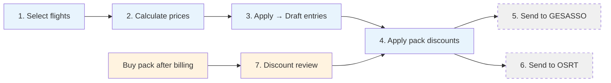
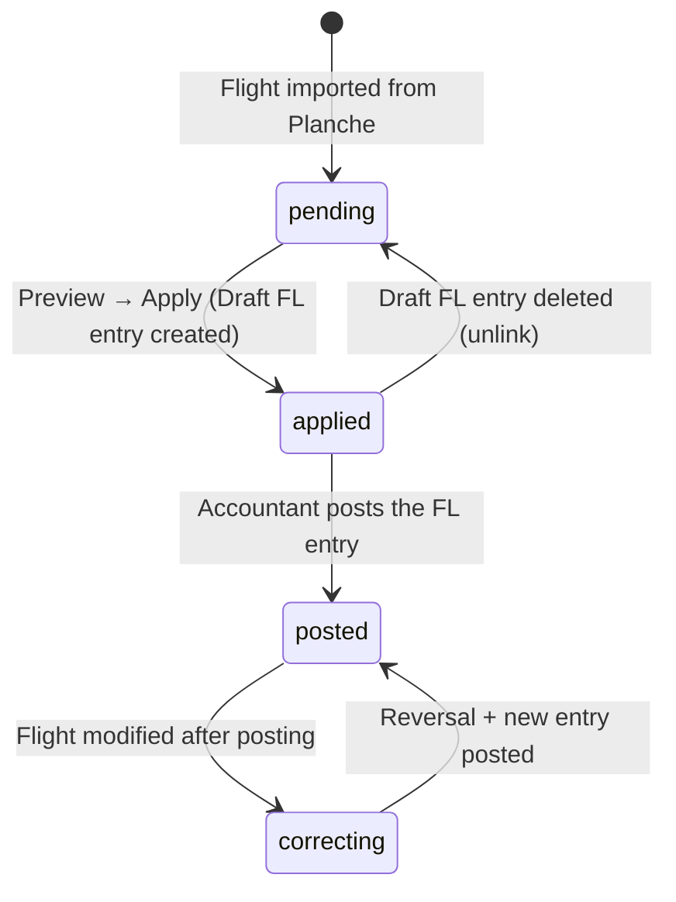

# Plan: Finalize Flights Accounting — Billing, Pack Consumption & Daily Ops Integration

## TL;DR

Add the billing **apply** step that turns previews into **Draft** accounting entries (with explicit manual posting after review), introduce a proper **pack catalog + member-owned consumable packs** system (including multiple 25h packs per pilot), and build the **flights tab** in Daily Operations as the central UI cockpit.

---

## Billing Workflow (Complete Process)



| Step | Action | Module | Tooling |
|---|---|---|---|
| **1** | Select flights to charge | Daily Ops → Flights tab | Checkboxes + filters |
| **2** | Calculate prices (preview) | Daily Ops → Flights tab | 🔍 Preview button (per flight or batch) |
| **3** | Apply — create Draft accounting entries | Daily Ops → Flights tab | 📄 Apply button |
| **4** | Apply pack discounts to newly billed flights | Daily Ops → Packs tab | 🔄 Discount review (see below) |
| **5** | Send flights to GESASSO (track pilot activities) | Separate module ⏱️ | API to create |
| **6** | Send flights to OSRT (track machine activities) | Separate module ⏱️ | API to create |

**Key rules:**
- Steps 5 & 6 can be executed **independently and later** — they are not part of the billing critical path
- Pilots can **buy packs after flights are billed** — the discount review step handles retroactive application
- A **discount review** recalculation can be launched at any time from the **Packs tab** for all pilots with active packs
- Discounts apply **only from the pack's `valid_from` date** — flights before that date are not discounted

---

## Design Decisions

| Decision | Choice |
|---|---|
| **Discount realization** | Discounts are **decoupled from flight billing**. Flights are billed at gross price in FL journal. Discounts are tracked in `member_pack_consumptions` and applied via periodic REM adjustment entries |
| **Pack model** | **Catalog + consumable packs** — define reusable pack templates (ex: `PACK_25H`) linked to pricing items via `pack_applicability` with `discounted_unit_price`. Pack purchases tracked natively in GL |
| **Pack pricing** | `pack_applicability` links a pack definition to a `pricing_item` with a `discounted_unit_price`. Discount = `base_price − discounted_unit_price` |
| **Pack tracking** | `member_pack_consumptions` operational table — one row per flight line consuming pack units. Balance computed via `vw_member_pack_balances` view crossing GL purchases with consumptions |
| **Pack scope** | Packs scoped by `pack_type` (`flight_hours` / `winch_launches` / `tow_launches` / `engine_time`); each scope discounts matching pricing items |
| **Fiscal year boundary** | Packs scoped to one fiscal year. Remaining quantities reset to 0 at year-end — no carry-over |
| **REM journal** | Dedicated journal (code `REM` / `DISC`, type = General) for discount adjustments. One Draft entry per pilot per period, updated as discounts accumulate |
| **Pack discount accounting** | Pack sale revenue stays in class 7 via `pack_sales_account_uuid`; REM discounts debit a class 6 expense account via `pack_discount_expense_account_uuid`. The pack operating result is read as class 7 pack sales minus class 6 pack discount expenses |
| **Billing configurability** | Each pack definition carries its own sales account (`pack_sales_account_uuid`) and discount expense account (`pack_discount_expense_account_uuid`, normally class 6). Operational settings (period, tolerance, journals, default accounts) live in a **dedicated `flight_billing_settings` table** with typed columns and FK constraints — one row per fiscal year. A user-friendly form UI replaces raw JSON editing |
| **Post-purchase** | Allowed — system recalculates `member_pack_consumptions` and updates the REM Draft entry |
| **Valid_from dates** | `member_pack_consumptions` rows have a `valid_from` date determining REM inclusion. Instead of freeze, the `valid_from` can be adjusted via UI to retroactively include/exclude consumptions |
| **Posting policy** | FL entries can be posted independently. REM entries remain Draft until period close (monthly/quarterly) |
| **FlightType resolution** | `asset_flight_types.launch_type` stores the Planche launch_type integer (shifted by launch_method: winch=raw, tow=+10). For launch machines, `flight.launch_method` determines the shift. If a FlightType matches, its code is used exclusively for pricing item filtering; otherwise, RMQ defaults are used as fallback |

| **Club billing — Detection** | Two detection modes: (1) `charge_to_erp_id` matches the club member's `account_id`, (2) Flight type is `initiation` and a charge account can be resolved (from `vi_type_catalog.charge_account_uuid` or settings). Detection 2 allows initiation flights to be billed without requiring the club member to be configured |
| **Club billing — Dual accounts** | `default_initiation_charge_account_uuid` = charge account for initiation flights (fallback when VI type has none); `club_charge_account_uuid` = charge account for flights explicitly billed to club (member match). Each uses a different class-6 account if desired |
| **Accounting dimensions** | 411 debit line carries `member_uuid` (who owes) + `analytical_asset_uuid` (which machine); 7xx credit line carries `analytical_asset_uuid` only (revenue by machine). No member dimension on club-billed lines |
| **VI type charge account** | Configurable via UI at VI → Types. When `vi_erp_id` is NULL on a flight, the system falls back to `settings.default_initiation_charge_account_uuid` |
| **Alerts** | Evaluate combined net of gross FL entry + REM adjustment — never gross alone |

---

## Flight Billing Lifecycle & State Management

### 1. Flight Billing Status Tracking

Each `validated_flights` row carries two billing-related fields:

| Field | Type | Purpose |
|---|---|---|
| `accounting_entry_uuid` | UUID, unique, nullable | FK → `accounting_entries.uuid`. Set when a Draft FL entry is created. The `UNIQUE` constraint **prevents double billing**: once set, no second entry can reference this flight |
| `billing_quote_state` | VARCHAR(16), default `'pending'` | Lifecycle state: `pending` → `applied` → `posted` |
| `has_discount` | BOOLEAN, default false | **NEW** — set to `true` when the billing apply step records at least one `member_pack_consumptions` row for this flight. Indicates that a pack discount was applied. Reset to `false` if consumptions are deleted |
| `erp_status` | SMALLINT, default 0 | 0=validated (draft), 1=transferred (locked), 2=modified_after_transfer |

### 2. Lifecycle States & Transitions



| State | `billing_quote_state` | `accounting_entry_uuid` | Meaning |
|---|---|---|---|
| `pending` | `'pending'` | NULL | Flight not billed yet. Shown in billable list |
| `applied` | `'applied'` | Set (Draft) | Draft FL entry exists but not yet posted |
| `posted` | `'posted'` | Set (Posted) | FL entry is posted (immutable) |
| `correcting` | `'posted'` | Set (Posted + reversal) | Posted entry has a reversal + replacement |

### 3. Duplicate Billing Prevention

**Database level:** `accounting_entry_uuid` has a `UNIQUE` constraint on `validated_flights`. Once set, any attempt to create a second entry for the same flight violates the constraint.

**Application level:**
- `GET /api/v1/flights/billable` filters `WHERE accounting_entry_uuid IS NULL` — only shows unbilled flights
- `FlightBillingApplyService.apply_flight_billing()` checks `preview.can_apply` before creating the entry
- The batch-preview endpoint also checks `include_already_billed=false` by default

**Frontend level:**
- `OpsFlightsTab` queries `/api/v1/flights/billable` which only returns unbilled flights
- Once applied, the flight disappears from the list (query auto-refreshes on success)

### 4. Delete / Reverse Accounting Entry

A dedicated function handles both cases:

```python
async def delete_or_reverse_entry(
    db, entry_uuid, fiscal_year_uuid, user_id, reason: str
) -> AccountingEntry | None:
    """
    If entry is Draft (state=1) → delete it + log reason + unl flights.
    If entry is Posted (state=2) → create a reversal entry + log reason.
    """
```

#### 4a. Draft Entry — Hard Delete + Unlink

When the entry is Draft (state=1, not yet posted):

```
POST /api/v1/accounting/entries/{entry_uuid}/delete
Body: { "reason": "Erreur de saisie : doublon" }

Backend:
  1. Verify entry.state == 1 (Draft)
  2. Find all validated_flights linked to this entry (accounting_entry_uuid)
     → NULLify accounting_entry_uuid on each flight
     → Reset billing_quote_state to 'pending'
  3. Delete all member_pack_consumptions rows linked to this entry
  4. If REM Draft entry now has zero consumptions, delete or zero it
  5. Log the deletion to audit_log (entry_uuid, reason, user_id, action='delete_draft')
  6. Delete the entry and its lines
  → Returns 204 No Content
```

**Recovery on orphaned links** (entry already deleted manually):
- Admin tool in flight detail UI: "Unlink billing" button that NULLifies `accounting_entry_uuid`
- Batch cleanup job: `SELECT * FROM validated_flights WHERE accounting_entry_uuid IS NOT NULL AND NOT EXISTS (SELECT 1 FROM accounting_entries WHERE uuid = accounting_entry_uuid)`

#### 4b. Posted Entry — Reversal + Reason

When the entry is Posted (state=2, immutable):

```
POST /api/v1/accounting/entries/{entry_uuid}/reverse
Body: { "reason": "Vol annulé par le pilote" }

Backend:
  1. Verify entry.state == 2 (Posted)
  2. Verify no existing reversal already linked (reversal_of_entry_uuid is NULL)
  3. Create a new Draft entry in the same journal with:
     - Opposite amounts (debit ↔ credit) for each line
     - Reference: "REVERSAL-{original_reference}"
     - Description: "Annulation de {original_description} — {reason}"
     - reversal_of_entry_uuid = original entry UUID
     - analytical_asset_uuid, member_uuid copied from original lines
  4. Set entry_hash on the reversal (ensures deterministic content)
  5. Post the reversal immediately (state=2)
  6. Set original entry's reversal_of_entry_uuid (prevents double reversal)
  7. If linked to validated_flights:
     → NULLify accounting_entry_uuid
     → Set erp_status = 2 (modified_after_transfer)
     → Reset billing_quote_state to 'pending'
     → Keep existing member_pack_consumptions or recalculate
  8. Log to audit_log (original_entry_uuid, reversal_entry_uuid, reason, user_id, action='reversal')
  → Returns the reversal entry
```

**Frontend UI:**
- Draft entries: "🗑️ Delete" button + confirmation dialog with reason textarea
- Posted entries: "↩️ Reverse" button + confirmation dialog with reason textarea
- Both buttons visible in the accounting entry detail panel

### 5. Dual Flight Status Model

Each `validated_flights` row has **two independent status dimensions**:

| Dimension | Field | Values | Tracks |
|---|---|---|---|
| **Planche side** | `source_status` | `active` / `updated` / `deleted` | What Planche reports about this flight |
| **ERP side** | `erp_status` | 0=validated / 1=transferred(billed) / 2=modified_after_transfer | Is the flight billed/locked in the ERP |
| **ERP billing** | `billing_quote_state` | `pending` / `applied` / `posted` | Billing lifecycle substate |
| **ERP billing** | `accounting_entry_uuid` | UUID or NULL | NULL = not billed; set = billed |

#### 5a. Planche Status Transitions

```
                    ┌──────────────────────────────────┐
                    │          Planche side             │
                    │          source_status            │
                    └──────────────────────────────────┘

     ┌──────────┐
     │  active  │───→ transferred (with erp_status=1)
     │ (created)│───→ updated (flight modified in Planche)
     │          │───→ deleted (flight removed in Planche)
     └──────────┘
          │
          │
     ┌──────────┐
     │ updated  │───→ transferred (with erp_status=1)
     │(modified)│───→ updated (re-modified)
     │          │───→ deleted
     └──────────┘
          │
          │
     ┌──────────┐
     │ deleted  │───→ transferred (re-imported after deletion)
     └──────────┘
```

**Planche status transitions from the sync API:**
- `created` → `active` (first import)
- `created` → `updated` (flight changed before first ERP billing)
- `created` → `deleted` (flight removed from Planche)
- `modified` → `active` (updated after being active)
- `modified` → `modified` (updated again)
- `modified` → `deleted` (removed after being modified)
- `deleted` → `active` (re-imported after deletion)

#### 5b. ERP Status Transitions

```
                    ┌──────────────────────────────────┐
                    │           ERP side                │
                    │        erp_status                 │
                    └──────────────────────────────────┘

     ┌─────────┐
     │    0    │───→ 1 (transferred = billing applied or posted)
     │(valid.) │───→ 2 (modified_after_transfer — Planche changed it after billing)
     └─────────┘
          │
          │
     ┌─────────┐
     │    1    │───→ 2 (Planche update detected after billing)
     │(billed) │───→ back to 0 (if billing is reversed/deleted)
     └─────────┘
          │
          │
     ┌─────────┐
     │    2    │───→ back to 1 (after reversal + rebill)
     │(modif.) │
     └─────────┘
```

**Discount tracking:** The `has_discount` boolean on `validated_flights` indicates whether pack discounts were applied:

| Value | Meaning | Set when |
|---|---|---|
| `false` | No discount — flight billed at gross price | Default — no `member_pack_consumptions` rows for this flight |
| `true` | Discount applied — at least one `member_pack_consumptions` row exists | `apply_flight_billing` records a consumption. Reset to `false` when all consumptions for this flight are deleted |

**Combined view — what the user sees:**

| source_status | erp_status | billing_quote_state | has_discount | User message |
|---|---|---|---|---|
| `active` | 0 | `pending` | false | ✅ Billable — no discount yet |
| `active` | 0 | `pending` | true | ✅ Billable — has discount from previous apply (rare) |
| `active` | 1 | `applied` | false | 📄 Draft entry — gross price only, no pack used |
| `active` | 1 | `applied` | true | 📄 Draft entry — gross with 🔵 pack discount |
| `active` | 1 | `posted` | false | 📌 Posted — gross only |
| `active` | 1 | `posted` | true | 📌 Posted — gross + 🔵 pack discount applied |
| `updated` | 0 | `pending` | false | ⚠️ Modified in Planche — review before billing |
| `updated` | 1 | `applied` | any | ⚠️ Modified after Draft — will be replaced on rebill |
| `updated` | 2 | `posted` | any | 🟠 Modified after posting — reversal needed |
| `deleted` | 0 | `pending` | any | 🗑️ Deleted in Planche — not billable |
| `deleted` | 1 | `applied/posted` | any | 🗑️ Deleted in Planche but billed — reversal recommended |

**End state target:** `source_status='active'` (or `'updated'` reconciled) + `erp_status=1` + `billing_quote_state='posted'` + `accounting_entry_uuid` set.

#### 5c. Handling Planche Changes After Billing

When the Planche sync detects changes for an already-billed flight:

1. **If billing is Draft** (`state=1`):
   - Delete the Draft entry (see 4a)
   - Update flight data from Planche
   - Set `source_status='active'` (reconciled)
   - Flight reappears in billable list

2. **If billing is Posted** (`state=2`):
   - Set `erp_status=2` (modified_after_transfer)
   - Set `source_status='updated'`
   - Warning badge in UI: "Flight modified after posting — reverse & rebill"
   - Accountant uses reversal flow (4b) then re-bills

3. **If flight is deleted in Planche after billing:**
   - Set `source_status='deleted'`
   - Warning badge: "Flight deleted in Planche — reversal recommended"
   - Accountant decides whether to reverse the entry or keep it

### 6. Billing Status Filters

The billable endpoint supports filtering by multiple criteria:

| Parameter | Values | Purpose |
|---|---|---|
| `date_from`, `date_to` | ISO dates | Date range filter |
| `type_of_flight` | 0-7 | Instruction, Solo, Initiation, etc. |
| `launch_method` | 0-3 | Winch, tow, self-launch, etc. |
| `status` | `pending`, `applied`, `posted`, `all` | **NEW** — filter by billing state. Default = `pending` |

When `status=all`, the endpoint returns flights regardless of `accounting_entry_uuid`, allowing the user to see ALL flights with their current billing state.

### 7. UX/UI: Billing & Discount Application Flow

```
┌────────────────────────────────────────────────────────────────────────┐
│  OpsFlightsTab — Daily Operations > Flights                            │
│                                                                        │
│  ┌─────────────────────────────────────────────────────────────────┐   │
│  │  [Date from] → [Date to]  [Type▼] [Launch▼]  [Status▼]  🔄    │   │
│  │                              [🔍 Preview] [📤 Apply All]         │   │
│  └─────────────────────────────────────────────────────────────────┘   │
│                                                                        │
│  ┌─────┬────────┬────────┬────────┬────────┬────────┬────────┬──────┐  │
│  │  ▸  │ Date   │ Pilot  │ Machine│ Type   │ Gross  │ Status │  ⋮   │  │
│  ├─────┼────────┼────────┼────────┼────────┼────────┼────────┼──────┤  │
│  │  ▸  │ 25/04  │ Dupont │ F-CABC │ Init   │ 111.00 │ ▶ View │ 📄📤 │  │
│  │     │        │        │        │        │        │        │      │  │
│  │  ── expanded ────────────────────────────────────────────────── │  │
│  │  │ 💬 Observations...                                         │ │  │
│  │  │ ┌── Preview Panel ──────────────────────────────────────┐ │ │  │
│  │  │ │ Payer: J.Dupont (100%)                                │ │ │  │
│  │  │ │                                                        │ │ │  │
│  │  │ │ Line          │ Qty │ Unit price │ Amount │ Pack ?    │ │ │  │
│  │  │ │───────────────┼─────┼────────────┼────────┼───────────│ │ │  │
│  │  │ │Vol F-CABC     │ 1h  │ 100.00     │ 100.00 │ 20h left  │ │ │  │
│  │  │ │Treuillage     │ 1   │  11.00     │  11.00 │   —       │ │ │  │
│  │  │ │                                                        │ │ │  │
│  │  │ │ Total: 111.00 EUR  │  [📄 Apply Draft]  [📤 Post]     │ │ │  │
│  │  │ └────────────────────────────────────────────────────────┘ │ │  │
│  │  └─────────────────────────────────────────────────────────────┘ │  │
│  └─────┴────────┴────────┴────────┴────────┴────────┴────────┴──────┘  │
│                                                                        │
│  ┌── Pack Discount Panel (when a pack is active) ──────────────────┐   │
│  │  J.Dupont — 25h pack (20h remaining)                            │   │
│  │  Activation: 01/04/2026                                         │   │
│  │  ┌──────────────────────────────────────────────────────────┐   │   │
│  │  │ Flight date │ Consumed │ Discount │ Valid from │         │   │   │
│  │  │─────────────┼──────────┼──────────┼────────────┼─────────│   │   │
│  │  │ 25/04       │ 1.0h     │ 80.00    │ 01/04/26   │ 📝 edit│   │   │
│  │  └──────────────────────────────────────────────────────────┘   │   │
│  │  Total REM discount this FY: 80.00 EUR                          │   │
│  └─────────────────────────────────────────────────────────────────┘   │
└────────────────────────────────────────────────────────────────────────┘
```

**Step-by-step flow:**

1. **Filter flights**: Date range + type + launch + status (`pending`)
2. **Preview**: Click ▶ on a flight → side-effect-free preview shows:
   - Payer(s) with their share
   - Pricing lines (machine, qty, unit price, amount)
   - Available pack balance (if member has active packs)
   - Club billing indicator (if applicable)
3. **Apply**: Click 📄 (Apply Draft) → creates Draft FL entry at gross price:
   - Sets `accounting_entry_uuid` on the flight
   - Sets `billing_quote_state = 'applied'`
   - Records `member_pack_consumptions` rows
   - Updates/creates REM Draft entry for the pilot
   - Flight disappears from billable list
4. **Post**: Click 📤 (Apply+Post) → same as Apply + immediately posts the FL entry:
   - FL entry becomes immutable
   - Flight disappears from billable list
5. **Batch operations**: Select multiple flights → 🔍 Preview batch → 📤 Apply All
6. **Pack consumption review**: In the packs tab or expanded flight view:
   - Shows each consumption line (flight, qty, discount, valid_from)
   - Admin can edit `valid_from` (📝) to retroactively include/exclude
   - REM entry updates automatically

**Error states & resolution:**

| Error | UI Indicator | Resolution |
|---|---|---|
| Pricing missing (no active version) | 🔴 Blocking badge | Configure pricing for the asset type |
| Member not found | 🔴 Blocking badge | Link the pilot ERP ID in Planche |
| Club billing target missing | 🔴 Blocking badge | Configure charge account on VI type or settings |
| Already billed (duplicate) | 🟡 Warning | Flight removed from billable list |
| Flight modified after posting | 🟠 Warning badge on flight row | Reversal + rebill |
| Pack discount applied successfully | 🔵 Info badge | Shown in preview line |

---

## Phases

### Phase 1 — Data Models & Migration ✅ DONE

**All 10 items implemented** — models, migrations, resolution order, accounting dimensions.
1. Create `pack_definitions` table (catalog model)
   - `uuid`, `code` (unique), `name`
   - `fiscal_year_uuid` (FK)
   - `pack_type` (varchar: `flight_hours`|`winch_launches`|`tow_launches`)
   - `quantity_allowance` (Numeric(10,2)) — ex: `25.0000` hours for a 25h pack
   - `quantity_unit` (varchar: `hours`|`launches`)
   - `eligible_asset_type_uuid` (FK → asset_types, nullable — restricts which asset types this pack applies to)
   - `pack_sales_account_uuid` (FK → accounting_accounts, nullable — override of default; credit side for pack purchase revenue)
   - `pack_discount_expense_account_uuid` (FK → accounting_accounts, nullable — override of default; debit side for REM pack discount expense, normally class 6)
   - `eligible_asset_type_uuid` (FK → asset_types, nullable)
   - `flights_journal_uuid` (FK → accounting_journals, nullable override)
   - `priority` (int, optional tie-breaker when multiple pack definitions match)
   - `created_at`, `updated_at`
2. Create `pack_applicability` table (link pack → pricing_item with discounted price)
   - `uuid`, `pack_definition_uuid` (FK)
   - `pricing_item_uuid` (FK → pricing_items)
   - `discounted_unit_price` (Numeric(10,4)) — the unit price with discount (e.g. €20 instead of €100)
   - unique constraint (`pack_definition_uuid`, `pricing_item_uuid`)
   - `created_at`
3. Create `member_pack_consumptions` table (operational discount tracking)
   - `uuid`, `member_uuid` (FK), `flight_uuid` (FK → validated_flights)
   - `pack_type` (varchar: `flight_hours`|`winch_launches`|`tow_launches`|`engine_time`)
   - `quantity_consumed` (Numeric(5,2)) — qty consumed from pack for this flight
   - `discount_unit_price` (Numeric(10,2)) — `base_price − pack_price`
   - `total_discount_amount` (Numeric(10,2)) — `qty × discount_unit_price`
   - `valid_from` (DateTime, NOT NULL) — Pack is applicable only to flights on or after this date; replaces freeze mechanism
   - `quantity_consumed` (Numeric(10,2)) — qty consumed from pack for this flight
   - `discount_unit_price` (Numeric(10,2)) — `base_price − pack_price`
   - `total_discount_amount` (Numeric(10,2)) — `qty × discount_unit_price`
   - `accounting_entry_uuid` (UUID, nullable, app-level integrity) — REM entry link
   - `created_at`, `updated_at`
   - Index: `(member_uuid, pack_type)`
4. Create `vw_member_pack_balances` view (not a table)
   - Crosses GL pack purchases (`accounting_lines` × `pack_definitions.pack_sales_account_uuid`) with `member_pack_consumptions`
   - Returns: `member_uuid, pack_type, total_purchased, total_consumed, units_remaining`
   - See SPEC §5.5 for the full SQL definition
5. Add `accounting_entry_uuid` to `validated_flights` (nullable FK → accounting_entries — FL entry link)
6. Ensure REM journal exists in `accounting_journals` (code `REM` or `DISC`, type = General)
7. Create dedicated `flight_billing_settings` table — one row per fiscal year, each account is paired with its posting journal:
   - `id` SERIAL PRIMARY KEY
   - `fiscal_year_uuid` UUID NOT NULL UNIQUE REFERENCES fiscal_years(uuid) ON DELETE CASCADE

   **Journal–account pairs** (each pair defines which journal posts to which account):
   - `fl_journal_uuid` UUID NOT NULL REFERENCES accounting_journals(uuid)
     — *Flight billing entries use this journal (debit side)*
   - `receivable_account_uuid` UUID NOT NULL REFERENCES accounting_accounts(uuid)
     — *Receivable account (e.g. 411) posted via the FL journal*

   - `vt_journal_uuid` UUID NOT NULL REFERENCES accounting_journals(uuid)
     — *Pack purchase entries use this journal (credit side)*
   - `default_pack_sales_account_uuid` UUID REFERENCES accounting_accounts(uuid)
     — *Pack sales revenue account (class 7) posted via the VT journal*

   - `rem_journal_uuid` UUID NOT NULL REFERENCES accounting_journals(uuid)
     — *REM discount entries use this journal (debit side)*
   - `default_pack_discount_expense_account_uuid` UUID REFERENCES accounting_accounts(uuid)
     — *Pack discount expense account (class 6) posted via the REM journal*

   - `default_initiation_charge_account_uuid` UUID REFERENCES accounting_accounts(uuid)
     — *Default charge account for initiation/VI club-billed flights (class 6 expense, e.g. 658). Used when no matching `vi_type_catalog.charge_account_uuid` is found*
   - `club_charge_account_uuid` UUID REFERENCES accounting_accounts(uuid)
     — *Charge account for flights explicitly billed to the club (charge_to_erp_id matches club member), distinct from initiation account*
   - `club_member_uuid` UUID REFERENCES members(uuid) ON DELETE SET NULL
     — *Member record representing the club entity. When `validated_flights.charge_to_erp_id` equals this member's `account_id`, the flight is club-billed*

   **Operational settings:**
   - `rem_period_days` INTEGER NOT NULL DEFAULT 30 CHECK (rem_period_days > 0)
   - `allow_post_purchase_recalculation` BOOLEAN NOT NULL DEFAULT true
   - `max_days_for_post_purchase_discount` INTEGER DEFAULT 30
   - `require_approval_for_late_discount` BOOLEAN NOT NULL DEFAULT true

   **Metadata:**
   - `created_at`, `updated_at`, `updated_by` (FK → users)
   - *Per-pack accounts (`pack_sales_account_uuid`, `pack_discount_expense_account_uuid`) on `pack_definitions` override the defaults above*

8. Add `charge_account_uuid` to `vi_type_catalog`:
   - `charge_account_uuid` UUID REFERENCES accounting_accounts(uuid), nullable
   - *Each VI type (VI, JD, STAGE...) can define its own charge account for club billing*

9. **Billing resolution order** (journal is always FL):
   1. Club-billed (initiation flight OR charge_to_erp_id matches club member):
      - **Initiation flight**: Debit `vi_type_catalog.charge_account_uuid` → fallback `settings.default_initiation_charge_account_uuid`
      - **Club-billed (member match)**: Debit `settings.club_charge_account_uuid` → fallback `settings.default_initiation_charge_account_uuid`
      - Credit `receivable_account_uuid` for the revenue account
      - No member dimension on any line
   2. Member-billed:
      - Debit `receivable_account_uuid` (member dimension + analytical asset dimension)
      - Credit `receivable_account_uuid` for the revenue account (analytical asset dimension only)

10. **Accounting dimensions**:
    - 411 debit line: `member_uuid` = payer, `analytical_asset_uuid` = machine used
    - 7xx credit line: `member_uuid` = NULL, `analytical_asset_uuid` = machine used (enables per-machine revenue tracking)
    - Club-billed: no `member_uuid` on any line

**Verification**: Migration SQL runs cleanly; new tables are empty; existing flights table migration adds nullable columns.

---

### Phase 1b — Flight Billing Settings UI (Frontend) ✅ DONE

**All steps implemented** — API hooks, settings form (3 journal-account cards + club billing + operational), BanqueSettingsPage integration, navigation link.
1. Create new typed API hooks in `frontend/src/modules/banque/api/`:
   - `useFlightBillingSettingsQuery(fiscalYearUuid)` — fetches settings for a FY
   - `useUpsertFlightBillingSettingsMutation()` — creates/updates settings
   - `useFlightBillingSettingsDefaultsQuery()` — fetches defaults for pre-fill
2. Build `frontend/src/modules/banque/components/FlightBillingSettingsForm.tsx`:
   - **Fiscal year selector** (reuses `useFiscalYearStore` or dropdown)

   **Three journal–account pair cards** (each card groups a journal selector with its account selector, making the association visually clear):

   a. **FL — Vols (facturation)** card:
      - `<Combobox>` for FL journal (populated from `useJournalsQuery()`, shows code + name)
      - `<ComboboxAccount>` for receivable account (populated from `useAccountsQuery()`, searchable by code/label, defaults to 411)
      - Helper text: *"Les écritures de vol seront postées dans ce journal au débit du compte client"*

   b. **VT — Ventes (forfaits)** card:
      - `<Combobox>` for VT journal
      - `<ComboboxAccount>` for default pack sales account (class 7)
      - Helper text: *"Les achats de forfaits seront postés dans ce journal au crédit du compte de vente"*

   c. **REM — Remises** card:
      - `<Combobox>` for REM journal
      - `<ComboboxAccount>` for default pack discount expense account (class 6)
      - Helper text: *"Les remises de forfaits seront postées dans ce journal au débit du compte de charge"*

   **Club billing section:**
   - `<ComboboxAccount>` for default initiation charge account (class 6, e.g. 658) — fallback for initiations without VI type
   - `<ComboboxAccount>` for club charge account (class 6) — for flights explicitly billed to club
   - `<ComboboxMember>` for club member record (searchable by name/account_id)
   - Helper text: *"Comptes de charge pour les vols facturés au club."*

   **Operational settings section:**
   - **REM period** — `<Input type="number">` with min=1, step=1, suffix "jours"
   - **Toggles** — `<Switch>` components for:
     - `allow_post_purchase_recalculation` (default ON)
     - `require_approval_for_late_discount` (default ON)
   - **Number input** — `max_days_for_post_purchase_discount` (min=1, visible only when recalculation is ON)

   **Save button** with loading state; validates that all required FKs exist
   **Reset to defaults** button with confirm dialog
   All text uses i18n keys in `banque` namespace under `settings.flightBilling.*`
3. Add a "Tarification" entry in the settings sidebar (`BanqueSettingsPage`):
   - New module name `flight_billing` in `SETTINGS_SECTIONS`
   - The existing `pricing` module (JSON editor) is replaced by this form
   - The form is rendered conditionally when `activeSection.moduleName === 'flight_billing'`
   - Keep other sections (`accounting`, `budget`, `integrations`) as JSON editors for now
4. Add `Navigation` link from `BankPricingPage` to the new settings page:
   - The "Réglages" button links to `/banque/settings/flight_billing`

**Verification**: Can open settings page → select FY → see pre-filled form → change a journal → save → reload → change persists → reset to defaults works → invalid account UUID shows validation error.

---

### Phase 2 — Backend Billing Configuration & Pack Management Service ✅ DONE

**All steps implemented:**
1. ✅ `backend/services/flight_billing_settings.py` — typed CRUD (get, upsert with FK validation, defaults resolver, delete) + API endpoints at `/api/v1/accounting/settings/flight-billing`
2. ✅ `backend/services/flight_packs.py` — pack definitions CRUD, applicability management, consumption recording, pack balances, REM adjustment computation + upsert, pack purchase entry (`buy_pack`, `create_pack_purchase_entry`), `update_consumption_valid_from` (replaces freeze)
3. ✅ `FlightBillingPreviewService` refactored — club billing detection (2 modes), `_resolve_charge_account` (initiation vs club accounts), `_accounting_lines_for` (member on 411, analytical_asset on both lines)
4. ✅ `charge_comment` field on `ValidatedFlight` + `charge_to_erp_id` editable via `PATCH /api/v1/flights/{uuid}/billing-fields` with UI (`EditableChargeFields` component in FlightsPage)
5. ✅ Pack purchase entries now stay Draft (state=1) — posting is a separate explicit step

---

### Phase 3 — Backend Billing Apply & REM Adjustment ✅ DONE

**All steps implemented**:
1. ✅ `FlightBillingApplyService` in `backend/services/flight_billing_apply.py`:
   - `apply_flight_billing` — loads `FlightBillingSettings` (not hardcoded), runs preview, creates Draft FL entry in configured FL journal, records pack consumptions, upserts REM entry
   - `post_flight_billing` — apply + post
   - `batch_apply` — returns `list[(flight_uuid, AccountingEntry)]` tuples
   - `close_rem_period` — posts all Draft REM entries in the REM journal for the FY
2. ✅ API endpoints:
   - `POST /api/v1/flights/{flight_uuid}/billing-apply`
   - `POST /api/v1/flights/{flight_uuid}/billing-post`
   - `POST /api/v1/flights/billing-batch-apply`
3. ✅ REM adjustment endpoints in `backend/api/routes/accounting.py`:
   - `POST /api/v1/accounting/rem-adjustments/preview`
   - `POST /api/v1/accounting/rem-adjustments/apply`
   - `POST /api/v1/accounting/rem-adjustments/close-period`

---

### Phase 4 — Daily Operations: Flights Tab (Backend) ✅ DONE

**All steps implemented**:
1. ✅ Flight endpoints (already existed in `backend/api/routes/flights.py`):
   - `GET /api/v1/flights/billable` — list flights ready for billing
   - `GET /api/v1/flights/billing-summary` — aggregate stats
2. ✅ Pack endpoints in `backend/api/routes/flight_packs.py`:
   - `POST /api/v1/packs/purchase/{member_uuid}` — buy a pack (creates posted VT entry via `buy_pack()` → `create_pack_purchase_entry()`)
   - `GET /api/v1/packs/balances/{member_uuid}` — list pack balances (from `vw_member_pack_balances`)
   - `GET /api/v1/packs/consumptions/by-member/{member_uuid}` — consumption detail
3. ✅ `valid_from` replaces freeze:
   - `PATCH /api/v1/packs/consumptions/{consumption_uuid}/valid-from` — modify applicability date
   - Freeze/unfreeze endpoints removed — adjustment via UI on `valid_from` instead
   - `update_consumption_valid_from()` service function in `flight_packs.py`

---

### Phase 5 — Daily Operations: Flights Tab (Frontend) ✅ DONE

**All steps implemented:**
1. ✅ `OpsFlightsTab.tsx` with:
   - **Header**: date range picker + filters (type_of_flight, launch_method, status) + Preview + Apply All buttons
   - **Flights list**: table with columns: checkbox (selection), expand, date, pilot, second/charge, machine, type, total, discount badge 🔵, status, actions
   - **Row expand**: click for full preview panel (payers, lines, accounting lines)
   - **Individual actions**: Apply (Draft) + Apply+Post per flight row
   - **Batch actions**: Preview batch + Apply All
   - **Discount badge**: shows 🔵 "Pack" when `has_discount=true`
   - **Selection**: checkboxes with select-all, highlighted rows
   - **Status filter**: pending/applied/posted/all with backend query support
2. ✅ Integrated into `BanqueDailyOpsPage.tsx`
3. ✅ `has_discount` column added to `validated_flights` model (migration 043)
4. ✅ `BillableFlightItem` backend schema + frontend type updated with `has_discount`
5. ✅ `status` query parameter on `GET /api/v1/flights/billable` endpoint

**Alert trigger safety**: Combined net of FL entry + REM adjustment — never gross alone.

---

### Phase 6 — Post-Purchase, Discount Review & External Sync

**Steps** (depends on Phase 3, parallel with Phase 4-5):
1. Backend: `recalculate_pack_consumptions(flight_uuid, fiscal_year_uuid, user_id)`:
   - Deletes existing `member_pack_consumptions` rows for this flight (if any)
   - Re-runs discount eligibility against current `vw_member_pack_balances`
   - Only applies discount if `valid_from <= flight.jour` (pack activation date)
   - Inserts new `member_pack_consumptions` rows
   - Updates `validated_flights.has_discount = true/false`
   - Calls `upsert_rem_entry()` to update the pilot's REM Draft entry with the new total
   - *The FL entry is untouched — only the REM adjustment is updated*
2. Backend: `batch_recalculate(flight_uuids, fiscal_year_uuid, user_id)`:
   - Same logic as single recalc but in a transaction
3. **Discount Review** (triggered from Packs tab):
   - `POST /api/v1/packs/discount-review` — recalculates discounts for ALL billed flights
   - Identifies all members with active packs (positive balance in `vw_member_pack_balances`)
   - For each member, finds all flights where:
     - `accounting_entry_uuid IS NOT NULL` (billed)
     - Flight date >= pack's `valid_from`
     - Has eligible pricing items matching pack type
   - Calls `recalculate_pack_consumptions()` for each eligible flight
   - Returns summary: `{ members_affected: N, flights_recalculated: M, total_discount: X }`
4. Backend: `handle_post_purchase_pack(member_uuid, pack_type, fiscal_year_uuid, user_id)`:
   - After a pack purchase is recorded in the GL, identifies all already-billed flights for that member in the same FY eligible for this `pack_type`
   - Calls `recalculate_pack_consumptions()` for each eligible flight
   - Updates the REM Draft entry for the pilot
5. **GESASSO sync** (separate module):
   - `POST /api/v1/integrations/gesasso/sync-flights` — sends billed flights to GESASSO
   - Tracks pilot activities (flight hours, types, dates)
   - Can be executed independently at any time
6. **OSRT sync** (separate module):
   - `POST /api/v1/integrations/osrt/sync-flights` — sends billed flights to OSRT
   - Tracks machine activities (hours, landings, maintenance triggers)
   - Can be executed independently at any time
7. UI — **Packs tab discount review**:
   - "🔄 Apply discounts to all billed flights" button
   - Shows preview of affected members and flights before applying
   - Progress indicator during batch recalc
   - Results summary after completion

**Verification**: 
- Flight with 1h glider at gross €100, member buys 25h pack → recalculate → verify `member_pack_consumptions` row with `discount_unit_price=80`
- Flight before pack date → no discount applied
- Flight after pack date → discount applied
- Discount review recalculates all eligible billed flights
- REM Draft entry updated correctly after batch recalculate

---

### Phase 7 — Valid_from Management (replaces Freeze/Exclude)

**Steps** (depends on Phase 4):
1. ✅ Backend: `update_consumption_valid_from(consumption_uuid, valid_from)` — updates the `valid_from` date; triggers REM Draft update via `upsert_rem_entry()`
2. Frontend: In the consumption list UI, add an editable date picker for `valid_from` on each `member_pack_consumptions` row
3. Backend: `update_rem_after_valid_from_change(member_uuid, fiscal_year_uuid)` — recomputes the pilot's total discount and upserts the REM Draft entry after a `valid_from` change
4. UI: Inline date edit in flight detail panel or member pack consumption view
5. UI: Show "Consumption excluded" when `valid_from` is after the flight date (consumption not applicable)

**Verification**: Change valid_from to after the flight date → verify consumption excluded from REM → change back → verify reincluded.

---

### Phase 8 — Member External Access (Self-Service Portal) ✅ DONE

**All steps implemented** — full backend API + frontend module with login, flights, account, expenses, deposits, packs.

**Context**: The ERP already has a token-based `expense_access` mechanism on `MemberSheet`. This phase extends that concept into a full self-service view where members can manage their account without needing an ERP user account.

1. **Backend — Public/Token-authenticated endpoints** (new router `backend/api/routes/member_portal.py`, no capability guard, uses token auth):
   - `POST /api/v1/member-portal/login` — Accepts a member identifier + expense access token, returns a short-lived JWT
   - `GET /api/v1/member-portal/flights` — List the member's flights with billing status and amounts (date, glider, type, total charged, pack consumption if any)
   - `GET /api/v1/member-portal/flights/{flight_uuid}/billing` — Detail of one flight billing (applied lines, accounting lines, pack consumptions)
   - `GET /api/v1/member-portal/account` — Account summary (current balance, active packs per type, pending/posted entries)
   - `GET /api/v1/member-portal/account/entries` — List accounting entries where the member appears (filterable by year, state)
   - `GET /api/v1/member-portal/account/packs` — List active packs with remaining quantities
   - `GET /api/v1/member-portal/expenses` — List expense declarations for the member
   - `POST /api/v1/member-portal/expenses` — Declare an expense for the club (user submits amount + reason)
   - `POST /api/v1/member-portal/deposit` — Record a deposit on the member's account (money put on account)
   - `GET /api/v1/member-portal/tax-expenses` — List volunteer expenses for tax declaration purposes
2. **Backend — Expense access token management** (enhance existing `expense_access`):
   - Add `member_portal_enabled` flag alongside `expense_access_enabled` (or reuse the existing one)
   - Token can be regenerated (existing endpoint) and distributed to the member via email/print
3. **Frontend — Standalone member portal app** (new route group outside the shell, no auth guard):
   - `frontend/src/modules/member-portal/` — new module
   - Login page: member identifier + token input → obtain JWT → store in session-only storage
   - **Dashboard view**: active packs with remaining quantities, last 5 flights, account balance
   - **Flights tab**: paginated table with billing detail expand, discount info, pack consumption
   - **Account tab**: ledger view of posted entries, current balance, deposit form
   - **Expenses tab**: 
     - "Declare expense for club" form (amount, reason, receipt photo upload)
     - "Volunteer expenses" page (used to generate tax forms) — lists volunteer missions with declarable amounts
   - **Deposit tab**: form to record money put on account (payment method, amount)
   - Uses the same `decimal.js` and formatting utilities as the main app
   - Styled with Tailwind + shadcn, mobile-friendly (members may use phones)
4. **Security rules**:
   - Token is hashed in DB (existing `_hash_token` pattern), never stored in plain text
   - JWT expires in 2 hours; refresh requires re-login
   - Deposit and expense declarations are read-write mutations, restricted to own account
   - Rate-limited: max 30 requests/minute per token

**Accounting visibility rule**:
- Member portal must display each billed flight with its **gross** FL entry and the associated `member_pack_consumptions` rows.
- A separate "Discounts" section shows the current period's REM adjustment and the net balance after discounts.
- `vw_member_pack_balances` is exposed so members can see remaining pack units per type.

**Verification**:
- Enable expense access for a member → generate token → log in via portal → see flights, billing, account, packs
- Declare an expense → appears in expense list
- Record a deposit → account balance updates
- Volunteer expenses page shows correct data for tax forms
- Invalid token → 401
- Expired token → 401 with clear message
- Flights from other members → not visible

---

### Phase 9 — Machine Financial Dashboard

**Steps** (depends on Phase 3 & 5, can start after billing apply works):

1. **Backend — Aggregation endpoint**:
    - `GET /api/v1/assets/{asset_uuid}/financial-summary?fiscal_year_uuid=...`:
       - `total_debit` — sum of debit lines where `analytical_asset_uuid = asset`
       - `total_credit` — sum of credit lines where `analytical_asset_uuid = asset`
       - `pack_purchases_total` — sum of pack purchase amounts linked to this asset type
       - `pack_consumed_quantity_total` — total quantity consumed from packs for this asset's flights
       - `flight_count` — number of billed flights using this asset
    - `GET /api/v1/assets/{asset_uuid}/financial-detail?fiscal_year_uuid=...`:
       - Returns paginated list of accounting entries where `analytical_asset_uuid = asset`
       - Each entry: entry date, description, sequence number, debit, credit, member, flight UUID
    - `GET /api/v1/assets/financial-summary?fiscal_year_uuid=...` — aggregated for **all** machines:
       - Returns a list: `[{asset_code, asset_name, total_debit, total_credit, pack_purchases, pack_consumed_quantity, flight_count}, ...]`
       - Sorted by asset code, filterable by asset type
2. **Frontend — Dashboard view** in the accounting section:
   - New component: `frontend/src/modules/banque/components/MachineFinancialDashboard.tsx`
   - **Summary table**: rows = machines, columns = code, name, total debit, total credit, pack purchases, pack consumed qty, net, flight count
   - **Sparkline/bar**: mini visual comparison of debit vs credit per machine
   - **Click-to-drill-down**: clicking a row navigates to a detail view:
     - Detail table: list of accounting entries with analytical dimension = this machine
     - Each row: date, entry ref, description, debit, credit, member
     - Links to the original accounting entry and to the flight
   - **Fiscal year selector** (reuses existing `useFiscalYearStore`)
   - **Export**: CSV export of the summary table
3. **Navigation**:
   - Add a "Machines" entry in the accounting sidebar/navigation
   - Or place it as a dedicated tab within the Daily Ops dashboard

**Verification**:
- After billing a few flights for different machines, the dashboard shows correct totals per machine
- Drill-down shows the correct accounting entries
- CSV export contains expected data
- Pack purchases and consumed quantities are correctly attributed

---

### Phase 10 — Scheduled Accounting Operations

**Steps** (depends on Phase 3, parallel with Phase 6-9):

**Context**: Many accounting tasks are repetitive — monthly membership fee entries, quarterly REM period closures, VAT declarations, depreciation runs, fiscal year closing entries. Instead of relying on the accountant to remember each task, the system should automate them: define reusable entry templates with recurrence schedules, generate draft entries automatically, and remind the user before critical deadlines.

1. **Backend — Recurring entry templates** (new service `backend/services/scheduled_entries.py`):
   - `JournalEntryTemplate` model already exists in `models.py` with `recurrence_type` (Monthly/Quarterly/Yearly), `next_scheduled_date`, `template_config`
   - Build CRUD service: create/list/update/delete templates
   - Template fields: `journal_uuid`, `fiscal_year_uuid`, `label`, `recurrence_type`, `cron_expression` (optional override), `template_lines` (array of `{account_uuid, debit_formula, credit_formula, analytical_dimensions}`)
   - Formulas support: fixed amount, percentage of another line, previous period value
   - `generate_entry(template_uuid, target_date)` — creates a Draft accounting entry from the template, applying formulas to compute line amounts
   - `generate_due_entries(fiscal_year_uuid)` — finds all templates where `next_scheduled_date <= target_date` and generates draft entries, advancing `next_scheduled_date`

2. **Backend — Scheduler integration**:
   - Integrate APScheduler (preferred, no extra infra) or Celery beat
   - Daily job: `check_due_entries()` — runs `generate_due_entries()` and creates draft entries
   - Daily job: `check_rem_period_deadline()` — alerts when REM period is near closing
   - Weekly job: `check_pending_approvals()` — flags entries awaiting posting for >7 days

3. **Backend — Task & reminder system**:
   - New model `accounting_tasks` (uuid, fiscal_year_uuid, assigned_to_uuid, task_type, description, due_date, status, related_entry_uuid)
   - `POST /api/v1/accounting/tasks` — create a manual task
   - `GET /api/v1/accounting/tasks?status=pending&due_before=` — list tasks
   - `PATCH /api/v1/accounting/tasks/{uuid}` — update status (complete/defer)
   - Automated task generation on triggers: "REM period closes in 3 days", "Fiscal year end in 30 days", "Draft entry pending > 7 days"

4. **Backend — API endpoints**:
   - `GET /api/v1/accounting/templates` — list recurring entry templates
   - `POST /api/v1/accounting/templates` — create template
   - `PATCH /api/v1/accounting/templates/{uuid}` — update template
   - `DELETE /api/v1/accounting/templates/{uuid}` — delete template
   - `POST /api/v1/accounting/templates/{uuid}/generate` — manually trigger generation
   - `GET /api/v1/accounting/tasks` — list tasks with filters
   - `POST /api/v1/accounting/tasks` — create a reminder/task
   - `PATCH /api/v1/accounting/tasks/{uuid}` — update task status

5. **Frontend — Template management UI**:
   - New component: `frontend/src/modules/banque/components/RecurringEntryTemplatesPage.tsx`
   - Table of templates with next scheduled date, recurrence, last generated
   - Create/edit dialog: select journal, define lines with account picker, set recurrence pattern, set formula type
   - "Generate now" button on each template
   - **Navigation**: link from accounting settings sidebar

6. **Frontend — Task dashboard panel**:
   - New component: `frontend/src/modules/banque/components/AccountingTasksPanel.tsx`
   - Widget showing pending tasks count, sorted by due date
   - Expandable list with mark-complete, defer, snooze actions
   - Integrate into `BanqueDailyOpsPage.tsx` as a sidebar panel or tab
   - Badge on navigation icon when tasks are overdue

7. **Seed data**:
   - Pre-populate common templates: monthly membership fee, quarterly VAT, annual fiscal year closing
   - Pre-populate recurring tasks: monthly bank reconciliation, quarterly financial review

**Verification**:
- Create a monthly template → "Generate now" → Draft entry created in correct journal with correct amounts
- Template generates entry on schedule (APScheduler job runs)
- Task appears when REM period is 3 days from closing
- Task dashboard shows pending tasks, marking complete updates status
- Overdue tasks show visual badge

---

### Phase 11 — Bank Reconciliation & Alignment

**Steps** (depends on Phase 3, can start after billing apply works):

**Context**: The club's bank account must be reconciled with the ERP ledger periodically. Currently this is done manually outside the ERP. This phase adds structured bank statement import, automated matching of bank transactions to accounting entries, discrepancy detection, and a reconciliation workspace.

1. **Backend — Bank statement import** (new service `backend/services/bank_reconciliation.py`):
   - Support CSV import with configurable column mapping (user maps CSV columns to: date, description, amount, reference, counterparty)
   - Support OFX/QIF/MT940 formats via a parsing abstraction layer
   - Store imported statements in `bank_statements` table:
     - `uuid`, `fiscal_year_uuid`, `account_uuid` (FK → accounting_accounts, the bank GL account)
     - `import_date`, `statement_period_start`, `statement_period_end`, `closing_balance`, `currency`
     - `source_format` (csv/ofx/qif/mt940), `raw_filename`
     - `status` (imported / matched / reconciled / flagged)
   - Store individual lines in `bank_statement_lines`:
     - `uuid`, `statement_uuid`, `line_date`, `description`, `amount` (positive=debit, negative=credit), `reference`, `counterparty`
     - `match_status` (unmatched / auto_matched / manually_matched / excluded)
     - `matched_entry_uuid` (FK → accounting_entries, nullable)

2. **Backend — Matching engine**:
   - `match_statements(fiscal_year_uuid, account_uuid)` — automated matching pass:
     1. **Exact match**: bank line amount = accounting line amount AND reference matches entry reference
     2. **Fuzzy date match**: amount matches AND bank line date ±3 days of entry date
     3. **Amount-only match**: amount matches but no reference — flags for manual review
     4. **Negative match**: bank line with no corresponding entry → potential missing entry
   - Scoring system: each match candidate gets a confidence score (0.0–1.0)
   - Auto-accept matches above threshold (configurable, default 0.95); flag lower scores for manual review
   - `POST /api/v1/accounting/reconciliation/match` — run matching pass
   - `POST /api/v1/accounting/reconciliation/manual-match` — user confirms a match
   - `POST /api/v1/accounting/reconciliation/unmatch` — user breaks an incorrect match

3. **Backend — Discrepancy handling**:
   - `GET /api/v1/accounting/reconciliation/discrepancies` — list unmatched/flagged lines
   - Discrepancy types:
     - **Missing entry** — bank line with no matching entry (amount mismatch or orphan)
     - **Amount variance** — matched but amounts differ → suggest correction entry
     - **Timing difference** — bank date vs entry date > 7 days → flag as timing
     - **Duplicate** — two bank lines matching one entry → flag for review
   - `POST /api/v1/accounting/reconciliation/resolve-discrepancy` — user action: create correcting entry, exclude line, accept timing difference
   - Auto-suggest correction entry for amount variances (debit/credit the difference on a configurable adjustment account)

4. **Backend — Reconciliation report**:
   - `GET /api/v1/accounting/reconciliation/report?fiscal_year_uuid=&account_uuid=` — full report:
     - Statement period, opening balance, closing balance
     - Total debits matched, total credits matched, unmatched total
     - Discrepancy list with suggested actions
     - Reconciled balance (GL balance + timing differences - missing entries)
   - `POST /api/v1/accounting/reconciliation/close-period` — lock reconciliation for a period (prevents re-matching closed periods)

5. **Backend — API endpoints**:
   - `POST /api/v1/accounting/reconciliation/import` — upload statement file
   - `GET /api/v1/accounting/reconciliation/statements` — list imported statements
   - `GET /api/v1/accounting/reconciliation/statements/{uuid}` — statement detail with lines
   - `DELETE /api/v1/accounting/reconciliation/statements/{uuid}` — remove a statement
   - `POST /api/v1/accounting/reconciliation/match` — run automated matching
   - `POST /api/v1/accounting/reconciliation/manual-match` — confirm a manual match
   - `POST /api/v1/accounting/reconciliation/unmatch` — break a match
   - `GET /api/v1/accounting/reconciliation/discrepancies` — list discrepancies
   - `POST /api/v1/accounting/reconciliation/resolve-discrepancy` — resolve a discrepancy
   - `GET /api/v1/accounting/reconciliation/report` — reconciliation report
   - `POST /api/v1/accounting/reconciliation/close-period` — lock a period

6. **Frontend — Reconciliation workspace**:
   - New module: `frontend/src/modules/reconciliation/`
   - **Statement import page**: drag-and-drop file upload, column mapping wizard for CSV, format detection
   - **Statement list**: table of imported statements with period, status, match progress bar
   - **Reconciliation workspace** (main view):
     - Split panel: left = bank statement lines, right = matched accounting entries
     - Color coding: green (matched), yellow (low confidence), red (unmatched), blue (manually matched)
     - Click a bank line → show suggested matches from GL entries
     - Confirm/match button to link
     - Filter: show all / unmatched / flagged / matched
   - **Discrepancy panel**: list of discrepancies with suggested resolution actions
   - **Reconciliation report view**: printable summary with balance confirmation
   - **Period close button**: with confirmation dialog, locks the period
   - **Navigation**: add "Reconciliation" entry in the accounting/navigation sidebar
   - i18n: all labels in `reconciliation` namespace

7. **Notifications**:
   - Dashboard widget: "Bank reconciliation overdue (last: DD/MM/YYYY)" when no reconciliation in >30 days
   - Badge on reconciliation nav icon when discrepancies exist

**Verification**:
- Import a CSV bank statement → lines appear in workspace with correct amounts
- Run automated matching → some lines auto-match (green), some flagged (yellow)
- Manually match an unmatched line → status changes to blue
- Create a discrepancy → appears in discrepancy panel
- Resolve a discrepancy → correction entry draft created
- Reconciliation report shows correct totals and matched/unmatched counts
- Close period → new imports for that period are rejected
- Overdue reconciliation shows dashboard warning

---

## Migrations

| File | Description |
|---|---|
| `docs/migrations/041_flight_billing_packs_settings.sql` | Phase 1: pack_definitions, member_pack_consumptions, vw_member_pack_balances, validated_flights billing columns, REM journal seed, flight_billing_settings, vi_type_catalog.charge_account_uuid |
| `docs/migrations/042_club_charge_account.sql` | Phase 2: add `club_charge_account_uuid` to `flight_billing_settings` |
| `docs/migrations/044_launch_type_mappings.sql` | Phase 5: add `launch_type` INTEGER UNIQUE to `asset_flight_types` for Planche launch_type → FlightType resolution (tow: +10, winch: raw) |

## Relevant Files (Current Status)

### Backend — Models (`backend/models.py`)
- ✅ `PackDefinition`, `PackApplicability`, `MemberPackConsumption` — created
- ✅ `FlightBillingSettings` — with `club_charge_account_uuid`, `default_initiation_charge_account_uuid`, `club_member_uuid`
- ✅ `ValidatedFlight` — with `charge_comment`, `accounting_entry_uuid`, `billing_quote_state`
- ✅ `ViTypeCatalog` — with `charge_account_uuid`, `charge_account_code` (property)
- ✅ `FlightType` — added `launch_type` INTEGER UNIQUE column for Planche launch_type → FlightType mapping (tow: +10 shift, winch: raw)

### Backend — Services
| File | Status |
|---|---|
| `backend/services/flight_billing.py` | ✅ Club billing detection (2 modes), `_resolve_charge_account()`, correct accounting dimensions, **FlightType resolution via `launch_type` mapping** (`launch_method`-based shift: winch raw, tow +10) |
| `backend/services/flight_billing_settings.py` | ✅ Typed CRUD with FK validation, defaults resolver |
| `backend/services/flight_billing_apply.py` | ✅ Uses `FlightBillingSettings`, `close_rem_period()`, `batch_apply` with flight tracking |
| `backend/services/flight_packs.py` | ✅ Pack CRUD, applicabilité, consommations, soldes, REM, achat forfait, `update_consumption_valid_from()` |

### Backend — API Routes
| File | Status |
|---|---|
| `backend/api/routes/flights.py` | ✅ Preview (single+batch), apply, post, batch-apply, billable list, summary |
| `backend/api/routes/accounting.py` | ✅ Settings CRUD, REM preview/apply/close-period |
| `backend/api/routes/flight_packs.py` | ✅ Pack definitions CRUD, applicabilité, consommations, soldes, achat forfait, valid-from patch |
| `backend/api/routes/vi.py` | ✅ VI types CRUD with `charge_account_uuid` |

### Frontend
| File | Status |
|---|---|
| `frontend/src/modules/banque/api/index.ts` | ✅ Settings hooks, preview hooks (pass `fiscal_year_uuid`), account/journal queries |
| `frontend/src/modules/banque/components/FlightBillingSettingsForm.tsx` | ✅ Form with 3 journal-account cards, club billing (initiation + club + member), operational settings |
| `frontend/src/modules/banque/components/OpsFlightsTab.tsx` | ✅ Flights billing cockpit with preview panel, batch operations |
| `frontend/src/modules/assets/components/AssetTypesPage.tsx` | ✅ Flight type management with `launch_type` field (Planche mapping), `launchType` edit in flight type form |
| `frontend/src/modules/vi/components/ViTypesPage.tsx` | ✅ VI type management with `charge_account_uuid` selector |
| `frontend/src/modules/banque/i18n/` | Add translations for flight billing settings + flights ops + REM |
| `packages/i18n/src/resources/fr.ts` | Add `banque.settings.flightBilling.*` keys |
| `packages/i18n/src/resources/en.ts` | Add `banque.settings.flightBilling.*` keys |
### Future Phases (Not Yet Started)

| File | Phase | Description |
|---|---|---|
| `backend/services/flight_billing.py` | Phase 6 | Add `recalculate_pack_consumptions()`, `batch_recalculate()`, `handle_post_purchase_pack()`, `discount_review()` |
| `backend/services/flight_packs.py` | Phase 6 | Add `discount_review(fiscal_year_uuid)`, `update_rem_after_valid_from_change()` |
| `backend/api/routes/packs.py` | Phase 6 | Add `POST /api/v1/packs/discount-review` endpoint |
| `backend/api/routes/integrations.py` | Phase 6 | Add GESASSO and OSRT sync endpoints (stubs) |
| `frontend/src/modules/members/components/` | Phase 7 | Editable date picker for `valid_from` in consumption views |
| `frontend/src/modules/members/components/` | Phase 7 | Inline date edit in flight detail panel |
| `frontend/src/modules/members/components/` | Phase 7 | Show "Consumption excluded" when `valid_from` is after flight date |
| `frontend/src/modules/banque/components/MachineFinancialDashboard.tsx` | Phase 9 | Per-machine financial summary with drill-down |
| _New_ | Phase 10 | Scheduled Accounting Operations (recurring entries, reminders, task generation) |
| _New_ | Phase 10 | Backend scheduler service + celery/apscheduler integration |
| _New_ | Phase 10 | Frontend recurring entry templates UI |
| _New_ | Phase 11 | Bank Reconciliation & Alignment (statement matching, discrepancy handling) |
| _New_ | Phase 11 | Backend reconciliation engine + frontend reconciliation workspace |

---

## Verification Plan

1. **Unit tests**: pack definition CRUD, pack_applicability CRUD, consumption recording, REM adjustment computation, REM upsert
2. **Unit tests**: flight billing settings CRUD — create, read, update, reset to defaults, FK validation, club_charge_account_uuid
3. **Integration test**: full cycle — Planche sync → preview (gross) → apply → verify FL entry at gross price → verify `member_pack_consumptions` rows → verify REM Draft entry upserted → close period → verify REM entry posted
3. **UI manual test — Settings form**: Open settings → select flight_billing section → select FY → form loads with current values → change journal/accounts → save → reload → change persists → verify FK drop-downs show correct options → reset to defaults
4. **UI manual test — Club billing**: Configure initiation charge account and club charge account → preview initiation flight without vi_erp_id → verify fallback account used → preview club-billed flight (charge_to_erp_id = club member) → verify separate club account used
5. **UI manual test — Daily Ops**: Flights tab → select flights → preview (gross) → apply → verify REM panel updates → buy pack → verify GL entry created
6. **UI manual test — Machine dashboard**: After billing flights for multiple machines, dashboard shows correct aggregates → drill-down → entries match
5. **UI manual test — Member portal**: Enable expense access → login with token → see own gross flights + discount detail + pack balances
6. **Edge cases**: shared flight (partage) with pack for one pilot only; post-purchase covering an already-billed flight; freeze then unfreeze; fiscal year rollover (pack balances reset to 0)
7. **REM period boundary**: close period → verify entries posted → new period opens with zero balance → new flights create new Draft REM entries

---

## Scope Boundaries

**Accounting Control Note**:
- Costs advanced by members must go through the expense-report (`note de frais`) workflow before reimbursement. Direct bank reimbursement is out of scope and should be refused, especially when the supplier invoice is not issued to the club or clearly to the reimbursed member.

**Included**:
- Pack catalog with `pack_definitions` + `pack_applicability` (link to pricing items with discounted price)
- Pack purchase accounting (411 → pack_sales_account) and discount expense (6xx → pack_discount_expense_account) — both configured per pack definition
- Gross billing in FL journal, discount tracked via `member_pack_consumptions` operational table
- REM journal for periodic discount adjustment entries (one Draft per pilot per period, upserted)
- `vw_member_pack_balances` view for live pack balance computation
- Launch method packs: winch and tow launches tracked separately from flight hours
- Fiscal year scoping: packs expire at year-end, balances reset to 0
- Post-purchase recalculation and batch recalculation
- Freeze/exclude individual consumption rows
- Daily ops flights tab as central UI hub (gross entries + REM panel)
- Billing configuration UI per fiscal year
- Member self-service portal (token-based, read-only: flights, discounts, account)
- Machine financial dashboard (credit/debit per asset, pack purchases, consumed quantities, drill-down)
- Scheduled accounting operations (recurring entry templates, APScheduler integration, task & reminder system)
- Bank reconciliation & alignment (statement import, automated matching engine, discrepancy handling, reconciliation workspace)

**Excluded** (future):
- Batch pricing version management within the flights tab
- Member invoice PDF generation (separate feature)
- Integration with helloasso for pack purchase payment collection
- Cost provision rules per flight (provision for tow/glider costs)
- Pack expiration or validity windows beyond fiscal year
- Multi-factor auth for the member portal
- Push notifications for new bills or pack exhaustion
