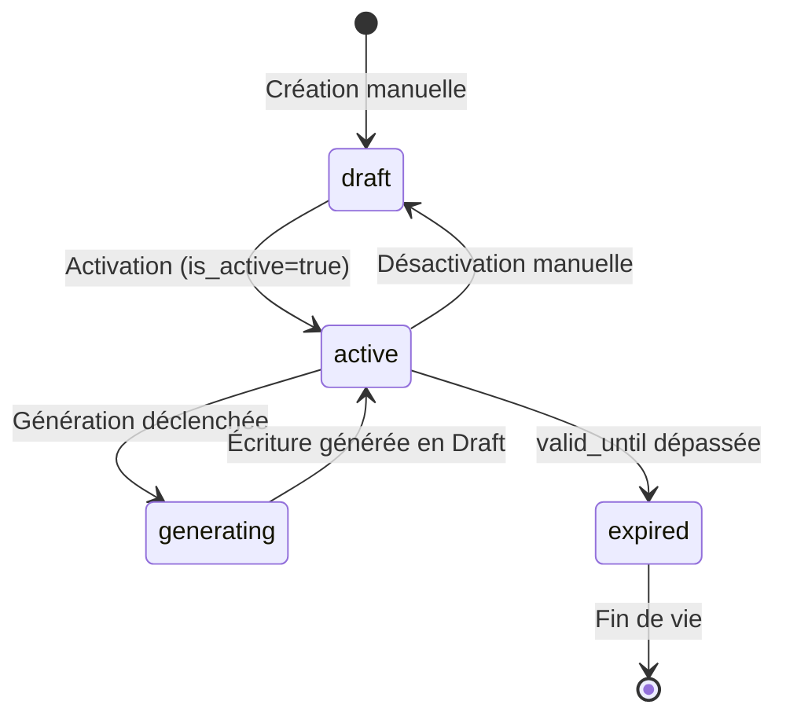

# Plan: Gestion des Écritures Comptables Récurrentes

## TL;DR

Ajouter au modèle `AccountingEntryTemplate` existant les champs de pilotage (exercice fiscal, dates validité, prochaine échéance, formules de calcul), créer le service de génération automatique d'écritures, intégrer le planificateur APScheduler, et construire l'interface de préparation/validation avec tableau de bord des tâches.

---

## État des Lieux — Ce qui Existe Déjà

### Modèle `AccountingEntryTemplate` (`backend/models.py`)

| Champ | Type | Statut |
|---|---|---|
| `uuid` | PK UUID | ✅ Existe |
| `code` | String(32), UNIQUE | ✅ Existe |
| `name` | String(120) | ✅ Existe |
| `journal_uuid` | FK → `accounting_journals` | ✅ Existe |
| `description` | String(255), nullable | ✅ Existe |
| `default_reference` | String(255), nullable | ✅ Existe |
| `recurrence_type` | SmallInt (1=Manuel, 2=Mensuel, 3=Trim., 4=Annuel) | ✅ Existe |
| `is_active` | Boolean | ✅ Existe |
| `created_by` | FK → users | ✅ Existe |
| **`fiscal_year_uuid`** | FK → `fiscal_years` | ❌ Manquant |
| **`next_scheduled_date`** | DATE, nullable | ❌ Manquant |
| **`cron_expression`** | VARCHAR(64), nullable | ❌ Manquant |
| **`valid_from`** | DATE, nullable | ❌ Manquant |
| **`valid_until`** | DATE, nullable | ❌ Manquant |
| **`last_generated_at`** | TIMESTAMPTZ, nullable | ❌ Manquant |
| **`last_generated_entry_uuid`** | FK → `accounting_entries`, nullable | ❌ Manquant |
| **`template_config`** | JSONB, nullable | ❌ Manquant |

### Modèle `AccountingEntryTemplateLine` (`backend/models.py`)

| Champ | Type | Statut |
|---|---|---|
| `uuid` | PK UUID | ✅ Existe |
| `template_uuid` | FK → template | ✅ Existe |
| `account_uuid` | FK → `accounting_accounts` | ✅ Existe |
| `sort_order` | SmallInt | ✅ Existe |
| `debit` | Numeric(10,4) | ✅ Existe |
| `credit` | Numeric(10,4) | ✅ Existe |
| `description` | String(255), nullable | ✅ Existe |
| `member_uuid` | UUID, nullable | ✅ Existe — dimension analytique membre |
| `analytical_asset_uuid` | UUID, nullable | ✅ Existe — dimension analytique machine |
| **`formula_type`** | VARCHAR(16) | ❌ Manquant |
| **`formula_params`** | JSONB, nullable | ❌ Manquant |

### Services & API

- ✅ CRUD complet : `backend/services/accounting.py` — `list_/get_/create_/update_/delete_accounting_entry_template()`
- ✅ 5 endpoints REST : `GET/POST/PATCH/DELETE /api/v1/accounting/entry-models`
- ✅ Schémas Pydantic : `backend/schemas/accounting.py`
- ✅ Frontend : `frontend/src/modules/banque/components/JournalTemplatesScreen.tsx` — éditeur complet avec `LineEditor`
- ✅ Hooks API : `frontend/src/modules/banque/api/index.ts`
- ✅ i18n : clés `banque.recurring.*` dans `fr.ts` / `en.ts`

---

## Design & Architecture

### Flux de Génération

```mermaid
flowchart TD
    A[Définir un modèle<br/>d'écriture récurrente] --> B[Définir les lignes<br/>comptes, montants, formules]
    B --> C[Configurer récurrence & validité]
    C --> D{Mode de génération}
    D -->|Manuel| E[Cliquer "Générer maintenant"]
    D -->|Automatique| F[APScheduler<br/>vérifie chaque jour à 6h]
    
    E --> G[Création écriture<br/>en BROUILLON state=1]
    F -->|next_scheduled_date ≤ today| G
    
    G --> H[Vérifier & valider<br/>dans le journal]
    H --> I[POSTER l'écriture]
    
    I --> J[Mise à jour<br/>next_scheduled_date]
    J --> F
    
    K[Tâche générée<br/>automatiquement] --> L[Tableau de bord<br/>tâches en attente]
```

### Types de Formules

| `formula_type` | Description | `formula_params` |
|---|---|---|
| `fixed` | Montant fixe — utilise `debit`/`credit` directement | `{}` |
| `percentage` | Pourcentage d'une autre ligne du template | `{"percentage": 20, "source_line_index": 0, "rounding_strategy": "auto"}` |
| `previous_period` | Montant de la période précédente (même template, dernière génération) | `{"fallback_amount": 100}` |
| `rounding_adjustment` | Ajustement d'arrondi pour équilibrer l'écriture — calculé automatiquement | `{}` |

### Cycle de Vie d'un Template



---

## Phases

### Phase A — Extension du Modèle de Données

**Fichier** : `docs/migrations/045_recurring_entries_scheduling.sql`

#### A1. Migration SQL

```sql
-- ============================================================
-- Ajouter les colonnes de pilotage à accounting_entry_templates
-- ============================================================
ALTER TABLE accounting_entry_templates
  ADD COLUMN fiscal_year_uuid UUID NOT NULL REFERENCES accounting_fiscal_years(uuid),
  ADD COLUMN next_scheduled_date DATE,
  ADD COLUMN cron_expression VARCHAR(64),
  ADD COLUMN valid_from DATE,
  ADD COLUMN valid_until DATE,
  ADD COLUMN last_generated_at TIMESTAMPTZ,
  ADD COLUMN last_generated_entry_uuid UUID REFERENCES accounting_entries(uuid) ON DELETE SET NULL,
  ADD COLUMN template_config JSONB;

CREATE INDEX idx_entry_templates_fiscal_year ON accounting_entry_templates(fiscal_year_uuid);
CREATE INDEX idx_entry_templates_scheduled ON accounting_entry_templates(next_scheduled_date)
  WHERE is_active = true AND next_scheduled_date IS NOT NULL;

-- ============================================================
-- Ajouter les colonnes de formule à accounting_entry_template_lines
-- ============================================================
ALTER TABLE accounting_entry_template_lines
  ADD COLUMN formula_type VARCHAR(16) NOT NULL DEFAULT 'fixed',
  ADD COLUMN formula_params JSONB;

ALTER TABLE accounting_entry_template_lines
  ADD CONSTRAINT chk_template_line_formula_type
  CHECK (formula_type IN ('fixed', 'percentage', 'previous_period', 'rounding_adjustment'));

-- ============================================================
-- Nouvelle table : accounting_tasks
-- ============================================================
CREATE TABLE accounting_tasks (
    uuid UUID PRIMARY KEY DEFAULT gen_random_uuid(),
    fiscal_year_uuid UUID NOT NULL REFERENCES accounting_fiscal_years(uuid) ON DELETE CASCADE,
    assigned_to_uuid INTEGER REFERENCES users(id) ON DELETE SET NULL,
    task_type VARCHAR(32) NOT NULL,
    description TEXT NOT NULL,
    due_date DATE NOT NULL,
    priority SMALLINT NOT NULL DEFAULT 0,
    status VARCHAR(16) NOT NULL DEFAULT 'pending',
    related_entry_uuid UUID REFERENCES accounting_entries(uuid) ON DELETE SET NULL,
    created_at TIMESTAMPTZ NOT NULL DEFAULT now(),
    completed_at TIMESTAMPTZ,
    completed_by INTEGER REFERENCES users(id) ON DELETE SET NULL
);

CREATE INDEX idx_tasks_fiscal_year ON accounting_tasks(fiscal_year_uuid);
CREATE INDEX idx_tasks_status_due ON accounting_tasks(status, due_date);
```

#### A2. Mise à jour du modèle Python (`backend/models.py`)

- Ajouter les champs à `AccountingEntryTemplate` :
  - `fiscal_year_uuid`, `next_scheduled_date`, `cron_expression`, `valid_from`, `valid_until`, `last_generated_at`, `last_generated_entry_uuid`, `template_config`
- Ajouter les relations : `fiscal_year`, `last_generated_entry`
- Ajouter les champs à `AccountingEntryTemplateLine` :
  - `formula_type`, `formula_params`
- Nouveau modèle : `AccountingTask`

#### A3. Mise à jour des schémas (`backend/schemas/accounting.py`)

- Étendre `AccountingEntryTemplateCreateRequest` avec :
  - `fiscal_year_uuid: UUID` (required)
  - `valid_from: Optional[date]`
  - `valid_until: Optional[date]`
  - `cron_expression: Optional[str]`
  - `template_config: Optional[dict]`
- Étendre `AccountingEntryTemplateLineCreateRequest` avec :
  - `formula_type: str = 'fixed'`
  - `formula_params: Optional[dict]`
- Créer `AccountingEntryTemplateGenerateRequest` :
  - `target_date: date`
- Créer `AccountingTaskCreateRequest`, `AccountingTaskUpdateRequest`, `AccountingTaskResponse`

#### A4. CRUD étendu (`backend/services/accounting.py`)

- Modifier `create_accounting_entry_template()` pour valider et enregistrer les nouveaux champs
- Modifier `update_accounting_entry_template()` idem
- Ajouter `create_accounting_task()`, `list_accounting_tasks()`, `update_accounting_task()`

---

### Phase B — Service de Génération d'Écritures

**Fichier** : nouveau `backend/services/scheduled_entries.py`

#### B1. `generate_entry(db, template_uuid, target_date, fiscal_year_uuid, user_id) → AccountingEntry`

1. Charge le template avec ses lignes et relations
2. **Validations pré-génération** :
   - `template.is_active = True`
   - `valid_from <= target_date <= valid_until` (si renseignés)
   - `fiscal_year_uuid` correspond à l'exercice cible
3. **Calcul des montants par ligne** selon `formula_type` :
   - `fixed` → utilise `debit`/`credit` du modèle
   - `percentage` → `montant = source_amount * (percentage / 100)`, arrondi à 4 décimales
   - `previous_period` → cherche la dernière occurence via le template ou `last_generated_entry_uuid` → copie les montants
   - `rounding_adjustment` → ne prend pas de montant mais calcule l'écart entre débit total et crédit total pour équilibrer
4. **Création de l'écriture** :
   ```
   AccountingEntry(
       fiscal_year_uuid=fiscal_year_uuid,
       journal_uuid=template.journal_uuid,
       entry_date=target_date,
       description=f"{template.name} - {target_date.strftime('%m/%Y')}",
       reference=f"{template.code}-{target_date.strftime('%Y%m')}",
       state=1,  # Draft
       ...
   )
   ```
5. **Déduplication** : avant création, vérifier si une écriture avec la référence `{code}-{YYYYMM}` existe déjà en Draft → si oui, `raise AlreadyBilledException` ou `return existing_entry`
6. **Enregistrement des lignes** : copie `account_uuid`, `debit`, `credit`, `description`, `member_uuid`, `analytical_asset_uuid` du template
7. **Vérification d'équilibre** : `sum(debits) = sum(credits)` — si déséquilibre, utiliser la ligne `rounding_adjustment` si elle existe
8. **Mise à jour du template** : `last_generated_at = now()`, `last_generated_entry_uuid = entry.uuid`, `next_scheduled_date = compute_next_date()`
9. **Audit log** : `action='generate_recurring_entry'`
10. **Retourne** l'`AccountingEntry` créée

#### B2. `generate_due_entries(db, fiscal_year_uuid, user_id) → list[AccountingEntry]`

```sql
SELECT * FROM accounting_entry_templates
WHERE is_active = true
  AND (next_scheduled_date IS NOT NULL AND next_scheduled_date <= CURRENT_DATE)
  AND (valid_from IS NULL OR valid_from <= CURRENT_DATE)
  AND (valid_until IS NULL OR valid_until >= CURRENT_DATE)
ORDER BY next_scheduled_date ASC;
```

- Pour chaque template, appelle `generate_entry()`
- Gère les erreurs individuellement (un template en échec ne bloque pas les autres)
- Retourne la liste complète des écritures créées

#### B3. `preview_generation(db, template_uuid, target_date) → dict`

- Simule la génération sans rien persister
- Retourne : `{lines, total_debit, total_credit, description, reference, warnings[]}`

#### B4. `compute_next_date(current_date, template) → date`

| `recurrence_type` | Calcul |
|---|---|
| 2 — Monthly | `current_date + 1 month` (calendaire : 15/03 → 15/04, 31/01 → 28/02) |
| 3 — Quarterly | `current_date + 3 months` |
| 4 — Yearly | `current_date + 1 year` |
| avec `cron_expression` | Utiliser `croniter` pour trouver la prochaine occurrence après `current_date` |

---

### Phase C — Planificateur APScheduler

#### C1. Dépendances (`backend/requirements.txt`)

```
APScheduler==3.11.0
croniter==6.0.0
```

#### C2. Intégration dans `backend/main.py`

```python
from apscheduler.schedulers.asyncio import AsyncIOScheduler
from apscheduler.triggers.cron import CronTrigger

scheduler = AsyncIOScheduler()

async def check_due_entries_job():
    """Daily job: generate all due recurring entries."""
    async with async_session_factory() as db:
        try:
            fy = await get_current_fiscal_year(db)
            entries = await generate_due_entries(db, fy.uuid, SYSTEM_USER_ID)
            if entries:
                logger.info(f"Scheduler: generated {len(entries)} recurring entries")
        except Exception as e:
            logger.error(f"Scheduler error in check_due_entries: {e}")

async def check_rem_period_deadline_job():
    """Check if REM period is closing within 3 days → create task."""
    async with async_session_factory() as db:
        try:
            fy = await get_current_fiscal_year(db)
            settings = await get_flight_billing_settings(db, fy.uuid)
            if settings:
                # REM period = settings.rem_period_days
                # Alert if next closure is within 3 days
                ...
        except Exception as e:
            logger.error(f"Scheduler error in check_rem_period: {e}")

async def check_pending_approvals_job():
    """Weekly: flag entries in Draft for >7 days."""
    async with async_session_factory() as db:
        try:
            # Find AccountingEntry where state=1 AND entry_date < now() - 7 days
            # Create task for each
            ...
        except Exception as e:
            logger.error(f"Scheduler error in pending_approvals: {e}")

@app.on_event("startup")
async def start_scheduler():
    scheduler.add_job(
        check_due_entries_job,
        CronTrigger(hour=6, minute=0),
        id="generate_due_entries",
        name="Générer les écritures récurrentes échues",
        replace_existing=True,
    )
    scheduler.add_job(
        check_rem_period_deadline_job,
        CronTrigger(hour=8, minute=0),
        id="check_rem_period",
        replace_existing=True,
    )
    scheduler.add_job(
        check_pending_approvals_job,
        CronTrigger(day_of_week="mon", hour=9, minute=0),
        id="pending_approvals",
        replace_existing=True,
    )
    scheduler.start()
    logger.info("APScheduler started with 3 jobs")

@app.on_event("shutdown")
async def shutdown_scheduler():
    scheduler.shutdown()
    logger.info("APScheduler shut down")
```

---

### Phase D — API Endpoints Additionnels

**Fichier** : `backend/api/routes/accounting.py` (à étendre)

| Méthode | Endpoint | Description | Guard |
|---|---|---|---|
| `POST` | `/api/v1/accounting/entry-models/{uuid}/preview` | Prévisualiser la génération sans persister | `view_guard` |
| `POST` | `/api/v1/accounting/entry-models/{uuid}/generate` | Déclencher manuellement la génération pour une date | `post_guard` |
| `POST` | `/api/v1/accounting/entry-models/generate-due` | Lancer la génération en masse de tous les templates échus | `post_guard` |
| `GET` | `/api/v1/accounting/tasks` | Lister les tâches (filtres : status, due_before, task_type) | `view_guard` |
| `POST` | `/api/v1/accounting/tasks` | Créer une tâche manuelle | `settings_guard` |
| `PATCH` | `/api/v1/accounting/tasks/{uuid}` | Mettre à jour le status (complete/defer/cancel) | `settings_guard` |

**Détail des endpoints :**

#### `POST /api/v1/accounting/entry-models/{uuid}/preview`

```json
// Request
{ "target_date": "2026-07-01" }

// Response 200
{
  "template_code": "COTIS-MENSUELLE",
  "template_name": "Cotisation mensuelle",
  "target_date": "2026-07-01",
  "journal": { "uuid": "...", "code": "VT", "name": "Ventes" },
  "reference": "COTIS-MENSUELLE-202607",
  "description": "Cotisation mensuelle - 07/2026",
  "lines": [
    { "account": { "uuid": "...", "code": "411" }, "debit": "100.0000", "credit": "0.0000", "description": "Adhérent X" },
    { "account": { "uuid": "...", "code": "756" }, "debit": "0.0000", "credit": "100.0000", "description": "Cotisation" }
  ],
  "total_debit": "100.0000",
  "total_credit": "100.0000",
  "is_balanced": true,
  "warnings": []
}
```

#### `POST /api/v1/accounting/entry-models/{uuid}/generate`

```json
// Request
{ "target_date": "2026-07-01" }

// Response 201
{
  "entry": { "uuid": "...", "reference": "COTIS-MENSUELLE-202607", "state": 1 },
  "template_uuid": "...",
  "was_already_generated": false
}
```

#### `POST /api/v1/accounting/entry-models/generate-due`

```json
// Response 200
{
  "generated": [
    { "template_code": "COTIS-MENSUELLE", "entry_uuid": "...", "reference": "COTIS-MENSUELLE-202607" }
  ],
  "skipped": [
    { "template_code": "COTIS-MENSUELLE", "reason": "already_generated" }
  ],
  "errors": [
    { "template_code": "AMORT", "reason": "No active pricing version" }
  ],
  "total_generated": 1,
  "total_skipped": 1,
  "total_errors": 0
}
```

#### `GET /api/v1/accounting/tasks?status=pending&due_before=2026-07-01&task_type=rem_period_close`

```json
// Response 200
{
  "tasks": [
    {
      "uuid": "...",
      "task_type": "rem_period_close",
      "description": "Clôture de la période REM dans 3 jours",
      "due_date": "2026-06-18",
      "priority": 1,
      "status": "pending",
      "related_entry_uuid": null
    }
  ],
  "total": 1
}
```

---

### Phase E — Frontend : Extension du Formulaire Template

**Fichiers** : `frontend/src/modules/banque/components/JournalTemplatesScreen.tsx` + `journalShared.tsx`

#### E1. Nouveaux champs dans le formulaire du template

Ajouter dans la grille existante :

```
┌─────────────────────────────────────────────┐
│  [Code]    [Nom]                             │
│  [Journal ▼]  [Récurrence ▼]                 │
│  [Exercice fiscal ▼]                         │ ← NOUVEAU
│  [Valide du █]  [au █]                       │ ← NOUVEAU (date pickers)
│  [Expression CRON █]  (optionnel)            │ ← NOUVEAU
│  [Prochaine échéance: 01/07/2026] (lecture)  │ ← NOUVEAU (calculé)
│  [Dernière génération: 01/06/2026] (lecture) │ ← NOUVEAU
│  [✅ Actif]                                   │
│  [Description █]                             │
└─────────────────────────────────────────────┘
```

- Utiliser `<ComboboxFiscalYear>` existant (ou créer si nécessaire)
- Utiliser `<DatePicker>` pour `valid_from` / `valid_until`
- L'expression CRAN dispose d'une infobulle avec exemples : `0 6 1 * *` = 1er du mois à 6h

#### E2. Extension du `LineEditor` — Types de formules

Chaque ligne de template gagne un sélecteur de formule :

```
┌──────────────────────────────────────────────────────────────┐
│ [Compte █]  [Débit █]  [Crédit █]  [Description █]          │
│ [Formule ▼] = fixed  │  [Membre █]  [Machine █]  [× Suppr.] │
└──────────────────────────────────────────────────────────────┘
```

Quand `formula_type = percentage` :

```
┌──────────────────────────────────────────────────────────────┐
│ [Compte █]  [Débit=calculé]  [Crédit=calculé]  [Desc.]      │
│ [Formule ▼] = percentage     │ [% █]  [Ligne source ▼]      │
│ [Membre █]  [Machine █]  [× Suppr.]                         │
└──────────────────────────────────────────────────────────────┘
```

Quand `formula_type = rounding_adjustment` :

```
┌──────────────────────────────────────────────────────────────┐
│ [Compte █]  [Débit=auto]  [Crédit=auto]  [Desc: Arrondi]    │
│ [Formule ▼] = rounding_adjustment                            │
│ [× Suppr.]                                                   │
└──────────────────────────────────────────────────────────────┘
```

#### E3. Boutons d'action par template

Ajouter dans l'en-tête ou le détail de chaque template :

- **🔍 Aperçu** — ouvre un dialog de prévisualisation
- **⚡ Générer maintenant** — avec sélecteur de date cible (pré-rempli au mois courant)
- Après génération : message toast "Écriture C-202607 créée en Draft" + lien cliquable

---

### Phase F — Frontend : AccountingTasksPanel

**Fichier** : nouveau `frontend/src/modules/banque/components/AccountingTasksPanel.tsx`

Widget à intégrer dans `BanqueDailyOpsPage.tsx` :

```
┌─────────────────────────────────┐
│ 📋 Tâches comptables  (3)      │
├─────────────────────────────────┤
│ 🔴 Clôture REM dans 3 jours     │
│    Échéance: 18/06/2026         │
│    [✅ Done]  [⏸️ Reporter]     │
├─────────────────────────────────┤
│ 🟡 Écriture OD-202606 en attente│
│    depuis 8 jours               │
│    [✅ Done]  [⏸️ Reporter]     │
├─────────────────────────────────┤
│ 🔵 Rapprochement bancaire mai   │
│    Échéance: 15/06/2026         │
│    [✅ Done]  [⏸️ Reporter]     │
├─────────────────────────────────┤
│ [➕ Nouvelle tâche]             │
└─────────────────────────────────┘
```

- **Badge rouge** : tâches en retard (due_date < today)
- **Badge orange** : tâches dues dans < 3 jours
- **Tri** : par priorité puis par date d'échéance
- **Limite** : 10 tâches max affichées, "Voir tout" si plus
- UseMutation : compléter, reporter, créer

---

### Phase G — Hooks API Frontend

**Fichier** : `frontend/src/modules/banque/api/index.ts`

```typescript
// Génération
export function usePreviewEntryGeneration(templateUuid: string) { ... }
export function useGenerateEntryMutation(templateUuid: string) { ... }
export function useGenerateDueEntriesMutation() { ... }

// Tâches
export function useAccountingTasksQuery(filters: TaskFilters) { ... }
export function useCreateAccountingTaskMutation() { ... }
export function useUpdateAccountingTaskMutation() { ... }
```

---

### Phase H — i18n

**Fichiers** : `packages/i18n/src/resources/fr.ts`, `en.ts`

Namespace `banque.recurring` :

```typescript
recurring: {
  fiscalYear: 'Exercice fiscal',
  validFrom: 'Valide du',
  validUntil: 'au',
  cronExpression: 'Expression CRON',
  cronHelp: 'Optionnel. Ex: 0 6 1 * * = 1er du mois à 6h',
  nextScheduled: 'Prochaine échéance',
  lastGenerated: 'Dernière génération',
  generateNow: 'Générer maintenant',
  generateDue: 'Générer les échéances',
  preview: 'Aperçu',
  formulaType: {
    fixed: 'Montant fixe',
    percentage: 'Pourcentage',
    previousPeriod: 'Période précédente',
    rounding: 'Ajustement d\'arrondi',
  },
  generationResult: {
    success: 'Écriture {reference} créée en Draft',
    alreadyExists: 'L\'écriture {reference} existe déjà',
    skipped: 'Aucune échéance à générer',
    error: 'Erreur de génération : {message}',
  },
  tasks: {
    title: 'Tâches comptables',
    pending: 'en attente',
    overdue: 'en retard',
    markComplete: 'Marquer faite',
    defer: 'Reporter',
    deferConfirm: 'Reporter de 3 jours ?',
    newTask: 'Nouvelle tâche',
    empty: 'Aucune tâche en attente',
    type: {
      rem_period_close: 'Clôture REM',
      pending_approval: 'Approbation en attente',
      fy_close: 'Clôture exercice',
      manual: 'Tâche manuelle',
    },
  },
}
```

---

### Phase I — Navigation & Intégration

1. **Onglet "Récurrentes"** dans la navigation banque :
   - Menu latéral : `Écritures › Modèles récurrents` ou onglet dans la page des journaux
   - Lien : `/banque/settings/recurring`

2. **Intégration du tableau des tâches** dans `BanqueDailyOpsPage.tsx` :
   - Widget en haut du dashboard : "📋 X tâches en attente"
   - Badge sur l'icône de navigation quand des tâches sont en retard

3. **Lien vers l'écriture générée** : dans la liste des écritures, le champ `reference` est cliquable → redirige vers le détail de l'écriture

---

### Phase J — Données Initiales (Seed)

Créer une fonction `seed_default_templates(db, fiscal_year_uuid, user_id)` dans `backend/services/scheduled_entries.py` :

| Template | Récurrence | Journal | Lignes | Activé |
|---|---|---|---|---|
| `COTIS-MENS` — Cotisations mensuelles | Mensuelle | VT | 411(db) / 756(cr) | ❌ Non |
| `CLOT-REM` — Clôture trimestrielle REM | Trimestrielle | REM | 658(db) / 411(cr) | ❌ Non |
| `AMORT-MENS` — Amortissements mensuels | Mensuelle | OD | 681(db) / 28(cr) | ❌ Non |
| `TVA-TRIM` — Déclaration TVA | Trimestrielle | TVA | 44571(db) / 512(cr) | ❌ Non |
| `CLOT-AN` — Clôture annuelle | Annuelle | OD | 12(db) / 11(cr) | ❌ Non |

Créer des tâches initiales :
- "Rapprochement bancaire mensuel" — due le 5 de chaque mois
- "Revue financière trimestrielle" — due le 15 du mois suivant le trimestre

---

## Fichiers Modifiés / Créés

| Fichier | Action |
|---|---|
| `docs/migrations/045_recurring_entries_scheduling.sql` | **Créer** — migration complète |
| `backend/models.py` | **Modifier** — ajouter champs à `AccountingEntryTemplate`, `AccountingEntryTemplateLine`, ajouter `AccountingTask` |
| `backend/schemas/accounting.py` | **Modifier** — étendre les schémas request/response |
| `backend/services/scheduled_entries.py` | **Créer** — service de génération d'écritures |
| `backend/services/accounting.py` | **Modifier** — étendre CRUD avec nouveaux champs + tâches |
| `backend/api/routes/accounting.py` | **Modifier** — ajouter endpoints generate, tasks |
| `backend/main.py` | **Modifier** — intégration APScheduler + jobs |
| `backend/requirements.txt` | **Modifier** — ajouter APScheduler, croniter |
| `frontend/src/modules/banque/api/index.ts` | **Modifier** — ajouter hooks API |
| `frontend/src/modules/banque/components/JournalTemplatesScreen.tsx` | **Modifier** — étendre formulaire template |
| `frontend/src/modules/banque/components/journalShared.tsx` | **Modifier** — étendre types et helpers |
| `frontend/src/modules/banque/components/AccountingTasksPanel.tsx` | **Créer** — widget tableau de bord |
| `frontend/src/modules/banque/components/BanqueDailyOpsPage.tsx` | **Modifier** — intégrer tasks panel |
| `packages/i18n/src/resources/fr.ts` | **Modifier** — ajouter clés |
| `packages/i18n/src/resources/en.ts` | **Modifier** — ajouter clés |

---

## Vérification

### Tests unitaires

1. **Création template étendu** → tous les champs enregistrés correctement
2. **Génération fixe** → écriture avec montants exacts du template
3. **Génération pourcentage** → montant = source × % / 100, arrondi à 4 décimales
4. **Génération période précédente** → montants identiques à la dernière génération
5. **Déduplication** → deuxième tentative skip avec `was_already_generated=true`
6. **Ajustement d'arrondi** → ligne complémentaire équilibre l'écriture

### Tests d'intégration

7. **Cycle complet** → créer template mensuel → générer → vérifier écriture Draft dans le bon journal → vérifier `next_scheduled_date` avancé → générer à nouveau → déduplication
8. **APScheduler** → avancer `next_scheduled_date` à la veille → attendre le job (ou déclencher manuellement) → écriture créée
9. **REM period deadline** → paramétrer `rem_period_days=30` → job crée une tâche 3 jours avant

### Tests UI manuels

10. **Formulaire template** → ouvrir → sélectionner exercice → remplir code, nom, journal, récurrence → ajouter lignes → sauvegarder → recharger → données persistées
11. **Génération manuelle** → "Générer maintenant" → date picker → confirmer → toast succès → écriture visible dans le journal
12. **Génération des échéances** → "Générer les échéances" → résultat : X générées, Y ignorées
13. **Tableau des tâches** → widget visible sur dashboard → cliquer "Marquer faite" → tâche disparaît
14. **Aperçu** → "Aperçu" → dialog avec lignes calculées, total, équilibre, warnings

### Cas limites

15. **Template avec `valid_until` dépassé** → pas de génération → message clair
16. **Template sans `next_scheduled_date`** → ignoré par le scheduler
17. **Exercice fiscal clôturé** → génération refusée (vérifier via `fiscal_year.is_closed`)
18. **Template avec journal supprimé** → erreur FK explicite
19. **Génération pour un mois déjà généré** → skip avec raison

---

## Décisions Architecturales

| Décision | Choix |
|---|---|
| **Type de formules** | 4 types : `fixed`, `percentage`, `previous_period`, `rounding_adjustment` |
| **Déduplication** | Par référence `{code}-{YYYYMM}` — si l'écriture existe en Draft, on skip |
| **Scheduler** | APScheduler `AsyncIOScheduler` — pas d'infra externe (Redis/RabbitMQ), compatible asyncio |
| **Stockage des formules** | `formula_params` JSONB sur la ligne — flexible, sans table dédiée |
| **Tâches** | Table `accounting_tasks` autonome — pas de mélange avec templates ou écritures |
| **Seed templates** | Désactivés par défaut — le comptable active après vérification |
| **Arrondi** | 4 décimales partout (Numeric(10,4)), `rounding_adjustment` pour les écarts résiduels |
| **Exercice fiscal** | Champ obligatoire sur le template — pas de génération sans exercice défini |
| **Libellé généré** | `{template.name} - {MM/YYYY}` — personnalisable via `default_reference` |
