# Flights Billing Module Specification

## 1. Purpose

This document defines the target specification for the Flight Billing sub-module of the ERP.

It covers the complete lifecycle from importing validated flights from Planche through price calculation, pack-aware pricing resolution, accounting entry creation, and posting — including correction workflows, pack catalog management, member pack purchases/consumption, and per-machine financial aggregation.

---

## 2. Core Principles

1. **Billing is preview-first**: every flight billing starts as a side-effect-free preview. Apply is an explicit user action.
2. **Double-entry is mandatory**: each billing creates one balanced accounting entry in the flights journal.
3. **Pricing is asset-bound**: pricing versions are resolved per machine (glider and optionally launch) by matching `asset_family_uuid`. No global fallback.
4. **Two separate processes**: flight billing (gross) and discount application are **decoupled**. Flights are billed at gross/standard price. Discounts are computed in a dedicated operational table and applied via periodic adjustment entries.
5. **Fiscal year scoping**: packs and accounting entries belong to exactly one fiscal year. Pack validity expires at year-end.
6. **Deterministic billing hash**: every preview produces a SHA-256 hash covering selected pricing lines **and** discount consumption rows. Hash changes detect billing-impacting modifications. Computed by `FlightBillingPreviewService._billing_hash()` (`backend/services/flight_billing.py`) from a sorted JSON payload of, per applied line: `source`, `payer_member_uuid`, `pricing_item_uuid`, `asset_uuid`, `quantity`, `applied_unit_price`, `amount`, `debit_account_uuid`, `credit_account_uuid`, `discount_reason`, `pack_hours_used`. It is recomputed on every preview call and returned as `billing_hash` on the preview response (`FlightBillingPreviewResponse`, member portal preview). Currently it is an opaque fingerprint only — surfaced for display/audit in the UI — with no server-side stored-hash comparison or "hash mismatch" check on apply today.
7. **REM journal**: a dedicated journal (code `REM` or `DISC`) tracks discount adjustment entries — one Draft entry per pilot per period, updated as discounts accumulate.
8. **Alert trigger after final net**: automated balance checks (e.g., minimum balance alerts) must evaluate `sum(debit) - sum(credit)` on account 411 after both the gross flight entry **and** the REM discount adjustment are accounted for.
9. **Posted entries are immutable**: corrections use reversal + replacement, never direct editing.

---

## 3. Billing Lifecycle

```mermaid
flowchart LR
    A[Flight imported from Planche] --> B[Preview requested]
    B --> C{Pricing resolvable?}
    C -- No --> D[Blocking errors returned]
    C -- Yes --> E[Preview calculated<br/>applied_lines + accounting_lines + discount_lines]
    E --> F[User reviews preview]
    F --> G[Apply clicked]
    G --> H[Flight billed at GROSS price<br/>Draft entry in FL journal]
    H --> I[Discount computed in<br/>member_pack_consumptions]
    I --> J[REM adjustment entry upserted<br/>one Draft per pilot per period]
    J --> K[Member reviews via portal]
    K --> L[Accountant reviews & posts]
    L --> M[FL + REM entries posted]
    M --> N{Correction needed?}
    N -- Post-purchase pack --> O[Recalculate discounts]
    N -- Valid_from change --> O
    O --> P[Update REM adjustment entry<br/>or create reversal if posted]
    P --> J
```



### 3.1 Lifecycle States

| State | Meaning |
|---|---|
| `imported` | Flight received from Planche, no billing attempted |
| `previewed` | Billing preview calculated, not yet applied |
| `applied` | Draft accounting entry created (FL journal), not yet posted |
| `discount_applied` | Discount consumption recorded, REM adjustment entry exists (Draft) |
| `posted` | Both FL and REM entries are posted (immutable) |
| `correcting` | A correction is in progress (reversal created, replacement pending) |
| `corrected` | Replacement entries have been posted |


---

## 4. Pricing Resolution

### 4.1 Per-Machine Resolution

Each flight involves up to two billable machines:

- **Main machine** (glider/TMG): resolved from `flight.asset_code` or `flight.glider_erp_id` → `Asset.registration`
- **Launch machine** (tow plane / winch): resolved from `flight.launch_asset_code` or `flight.launch_machine_erp_id` → `Asset.registration`

For each machine:

1. Look up the resolved `Asset` → read `asset_family_uuid`
2. Find one active `PricingVersion` where:
   - `status = Active` (2)
   - `from_date <= flight.jour`
   - `to_date IS NULL OR to_date >= flight.jour`
   - `asset_family_uuid = machine.asset_family_uuid`
3. If no version found → blocking error (unless private aircraft with `ownership=2`, which produces a non-blocking warning)
4. If more than one version found → overlap blocking error
5. Select pricing items from the version where:
   - `flight_type_uuid IS NULL` (applies to all types) **OR**
   - `flight_type_uuid` matches the flight type resolved from the Planche data (see §4.5)
6. Revenue account (`gl_account_credit_uuid`) must be configured on each item

### 4.5 Flight Type Resolution from Planche Data

The `asset_flight_types` table (`FlightType` model) has a `launch_type` column that stores a Planche launch_type integer. This is used to resolve the flight type code for pricing item filtering.

#### 4.5.1 Launch Method Shift

The `launch_type` value is shifted by `launch_method` to avoid collisions between tow and winch types:

| Launch method | Shift | Example |
|---|---|---|
| `1` (treuil/winch) | raw `launch_type` (no shift) | `launch_type=0` → `search_type=0` (normal winch) |
| `2` (remorqueur/tow) | `launch_type + 10` | `launch_type=1` → `search_type=11` (dépannage remorqué) |

The shifted value is stored as `asset_flight_types.launch_type`:

```
Tow:
  launch_type=0 (remorquage)    → stored as 10
  launch_type=1 (dépannage)     → stored as 11
  launch_type=2 (convoyage)     → stored as 12

Winch:
  launch_type=0 (normal)        → stored as 0
  launch_type=1 (exercice)      → stored as 1
  launch_type=2 (câble cassé)   → stored as 2
```

#### 4.5.2 Resolution Algorithm

For launch machines, the algorithm in `_resolve_machine()`:

```
  if source == "launch" and flight.launch_type is not None:
    1. search_type = flight.launch_type
    2. If flight.launch_method == 2 (tow):
         search_type += 10
       (launch_method == 1 / winch → keep raw)
    3. Query FlightType WHERE launch_type == search_type
    4. If found → use ft.code as resolved_code (e.g. "RMQD")
       If not found → resolved_code = None → fall back to RMQ defaults
```

#### 4.5.3 Code Set Construction

`_flight_type_codes_for_machine()` builds the candidate set for `FlightType.code` lookup:

- **If `resolved_code` is set** (from §4.5.2): return `{resolved_code}` exclusively
- **If no `resolved_code`** (no matching FlightType found): return fallback set:
  - `{"RMQ", "rmq", "remorque", "REMORQUE"}` (tow defaults)
  - Plus the flight type label (solo, partage, instruction…)
  - *(Winch-specific TREUIL fallback removed — Planche winch flights always have a launch_type)*

The fallback FlightType UUID is the first matching row from `WHERE code IN (...)`.

#### 4.5.4 Pricing Item Filtering

Once `flight_type_uuid` is resolved, pricing items are filtered:

```python
items = [item for item in version.items 
         if item.flight_type_uuid is None 
         or item.flight_type_uuid == flight_type_uuid]
```

- `flight_type_uuid = NULL` → applies to ALL flight types (global items)
- `flight_type_uuid = <resolved UUID>` → applies only to flights matching that type

### 4.2 Quantity Calculation by Unit

| Unit | Quantity |
|---|---|
| `FlightTime(h)` (1) | Duration between takeoff and landing, in decimal hours |
| `EngineTimeMinute` (2) | `engine_time × 100 × 60`, in minutes |
| `EngineTime1_100h` (3) | `engine_time × 100`, in 1/100h |
| `FlightDuration` (4) | Same as FlightTime(h) |
| `PerFlight` (5) | `1` |
| `Fixed` (6) | `1` |
| `FixedDurationTranche` (7) | Duration in minutes; tier selection sets total price |

### 4.3 Payer Resolution

Payer allocation depends on flight type:

| Flight type | Payer rule |
|---|---|
| `solo` | Pilot pays 100% |
| `supervise` / `lacher` / `essai` | Pilot pays 100% |
| `instruction` | Pilot 100%, unless `instruction_split` → pilot 50% + second 50% |
| `partage` | Pilot 50% + second pilot 50% |
| `passager` | `charge_to` 100%, or pilot 100% if not set |
| `initiation` | **Club-billed** via one of two detection modes (see §4.4) |

### 4.4 Club Billing Detection

Club billing is detected in two ways:

1. **Explicit sentinel billing**: `flight.charge_to_erp_id` matches the sentinel member (`member_uuid`) of one of the `flight_type_billing_accounts` rows (§9.7) — club, entrainement, or essai. Each row is self-contained: its own sentinel member paired with its own analytical accounts. Applies to any flight type — **always analytical, no class-6 fallback**.
2. **Initiation fallback**: Flight type is `initiation`, `charge_to_erp_id` is **not set**, and a charge account can be resolved (from `vi_type_catalog.charge_account_uuid`/analytical accounts or `flight_billing_settings.default_initiation_charge_account_uuid`). Does not require any sentinel member to be configured. If `charge_to_erp_id` is set to some other real member (matching no row's sentinel), the flight is billed to that member directly (`D 411`), not auto-routed here.

**Billing category resolution** (Detection 1 only): a direct match — whichever `flight_type_billing_accounts` row's `member_uuid` resolves to a member whose `account_id` equals `flight.charge_to_erp_id` determines the category (there is no `type_of_flight`-based override; essai now has its own dedicated sentinel member just like club and entrainement). That row's `analytical_cost_account_uuid`/`analytical_reflection_account_uuid` (both required) drive the FL entry: `D <category cost account> tiers=asset / C <reflection account> tiers=None`. If the row is missing or incomplete, billing surfaces a `debit_account_missing` error — there is intentionally no class-6 fallback for these three categories, forcing the admin to finish configuring the row.

**Initiation fallback resolution** (Detection 2 only): if the linked `vi_type_catalog` row (via `flight.vi_erp_id`) has both `analytical_cost_account_uuid` and `analytical_reflection_account_uuid` set, the whole FL entry is posted **analytically**: `D 921 (or the configured cost account) tiers=asset / C 902 (or the configured reflection account) tiers=None`. Otherwise falls back to `vi_type_catalog.charge_account_uuid`, then `flight_billing_settings.default_initiation_charge_account_uuid` (the only remaining class-6 fallback in this whole flow, and only for genuine initiation flights).

Club-billed lines have no `member_uuid` dimension on any accounting line (the analytical debit line instead carries the asset's `tiers_uuid`, the credit reflection line carries none).

---

## 5. Pack Discount System

### 5.1 Principle

Pack discounts are **decoupled from flight billing**. Flights are always billed at the **gross/standard price** in the FL journal. Discounts are computed in a dedicated operational table (`member_pack_consumptions`) and applied via **periodic adjustment entries** in a dedicated REM journal.

| Concept | Meaning |
|---|---|
| **Pack definition** | Template that defines type, quantity allowance, and sales account |
| **Consumption tracking** | `member_pack_consumptions` table — one row per flight line consuming pack units |
| **Balance computation** | `vw_member_pack_balances` view — crosses GL pack purchases with consumptions |
| **Discount application** | Periodic REM adjustment entry — one Draft per pilot, updated as discounts accumulate |
| **Discount amount** | `discount_unit_price = base_price − pack_price`, `total_discount = qty × discount_unit_price` |

### 5.2 Pack Types

| `pack_type` | Scope | Quantity unit | Typical example |
|---|---|---|---|
| `flight_hours` | Flight-time pricing items (glider/TMG) | `hours` | 25h pack |
| `winch_launches` | Launch items where asset family = winch | `launches` | 20 launch pack |
| `tow_launches` | Launch items where asset family = tow plane | `launches` | 10 tow pack |
| `engine_time` | Engine time (centihours) | `centihours` | 10h engine pack |

A member can hold multiple purchases of the same pack type simultaneously.

### 5.3 Pack Purchase (Tracked Natively in the General Ledger)

Pack purchases are already tracked in the GL — no separate table needed.

```
Accounting entry for pack purchase (VT journal, posted):
  Debit   411 (member dimension)       purchase_amount
  Credit  pack_sales_account (7066)    purchase_amount
```

- The sales account is stored on `pack_definitions.pack_sales_account_uuid` (default: 7066 / class 7).
- The REM discount debit account is stored on `pack_definitions.pack_discount_expense_account_uuid` and should normally be a class 6 expense account. This separates pack revenue from the cost of granted discounts.
- The purchase is posted immediately (the member has paid).
- The GL entry is the source of truth for "how many units were bought".
- The purchase quantity is inferred from the accounting line quantity or from the pack definition's `quantity_allowance`.

### 5.4 `member_pack_consumptions` — Operational Discount Tracking

When a flight is eligible for a pack discount, the system records **one row** in `member_pack_consumptions`:

```sql
INSERT INTO member_pack_consumptions (
    member_uuid, flight_uuid, pack_type,
    quantity_consumed, discount_unit_price, total_discount_amount
) VALUES (
    'member_x', 'flight_uuid', 'flight_hours',
    1.5,                         -- 1h30 consumed from pack
    80.00,                       -- base€100 − pack€20
    120.00                       -- 1.5 × 80
);
```

**Key rule**: the discount amount is derived: `discount_unit_price = base_price − pack_price`. It is not stored on the pack definition as a percentage — it is computed at billing time from the pricing item's `base_price` and the pack-linked `discounted_unit_price` (from `pack_applicability`).

### 5.5 `vw_member_pack_balances` — Remaining Quantity View

Instead of a table that can desynchronise, remaining pack balances are computed by a **view** that crosses GL purchases with operational consumptions (using `valid_from` instead of the removed `is_frozen` flag):

```sql
CREATE VIEW vw_member_pack_balances AS
WITH pack_purchases AS (
    SELECT
        al.member_uuid,
        p_def.pack_type,
        SUM(p_def.quantity_allowance) as total_purchased_units
    FROM accounting_lines al
    JOIN accounting_entries ae ON al.entry_uuid = ae.uuid
    JOIN pack_definitions p_def ON al.account_uuid = p_def.pack_sales_account_uuid
    WHERE ae.state = 'posted'
    GROUP BY al.member_uuid, p_def.pack_type
),
pack_consumptions AS (
    SELECT
        member_uuid,
        pack_type,
        SUM(quantity_consumed) as total_consumed_units
    FROM member_pack_consumptions
    WHERE valid_from <= NOW()  -- only consumptions whose validity has started
    GROUP BY member_uuid, pack_type
)
SELECT
    p.member_uuid,
    p.pack_type,
    COALESCE(p.total_purchased_units, 0) as total_purchased,
    COALESCE(c.total_consumed_units, 0) as total_consumed,
    (COALESCE(p.total_purchased_units, 0) - COALESCE(c.total_consumed_units, 0)) as units_remaining
FROM pack_purchases p
LEFT JOIN pack_consumptions c ON p.member_uuid = c.member_uuid AND p.pack_type = c.pack_type;
```

### 5.6 Consumption Rules

1. A pack is eligible when `pack_type` matches the billed line's asset scope.
2. Members can buy several identical packs (e.g. three 25h packs in the same FY) — aggregate balance pools all purchases.
3. Consumption is FIFO by purchase date. This is implemented as lot-level allocation, not a pooled-balance draw: `flight_packs.py` builds one in-memory `_PackSlot` per pack-purchase GL entry (VT journal, reference `PACK-%`), each carrying an `activated_at` date and a `remaining` quantity. `activated_at` is parsed from a `VALID_FROM:YYYY-MM-DD` marker in the purchase entry's description, falling back to the entry date if absent. Slots are sorted ascending by `activated_at` (`_load_pack_context`), and consumption walks that order, decrementing `slot.remaining` per flight line (`_apply_flight_consumptions`) — skipping any slot whose `activated_at` is after the flight date. `vw_member_pack_balances` (§5.5) remains the aggregate view used for display/reporting; it is not the structure used to decide consumption order.
4. If remaining units are insufficient for a full flight line, the line is split: partial discount, remainder at full price. In the FIFO slot walk, a flight line can straddle multiple slots — the loop consumes `min(qty_to_consume, slot.remaining)` from each eligible slot in turn until the line's quantity is fully allocated or slots are exhausted.
### 5.7 Fiscal Year Boundary

- Pack definitions are scoped to one fiscal year.
- At fiscal year close, remaining quantities (from `vw_member_pack_balances`) reset to 0 — no carry-over.
- Members buy new packs for the new fiscal year.

---

## 6. Billing Apply — Accounting Entry Structure

Flight billing follows a **two-step decoupled process**:

1. **FL journal** — bill the flight at **gross/standard price** (one entry per flight)
2. **REM journal** — apply discounts via a **periodic adjustment entry** (one Draft per pilot per period)

### 6.1 Step 1 — Gross Flight Billing (FL Journal)

`FlightBillingApplyService.apply_preview()` creates one Draft entry in the FL journal at gross price:

```
Entry in journal FL (type=7):
  For each pricing line:
    Debit   411 (member dimension)    amount = quantity × base_price
    Credit  revenue_account (7062/…)  amount = quantity × base_price

  No discount adjustment here — flight is billed at full price.

  Net effect:
    Member receivable = Σ(gross amounts) — full price
    Revenue accounts = Σ(gross amounts)
    ✓ Entry is balanced: total_debit == total_credit
```

### 6.2 Step 2 — Discount Operational Tracking

After the FL entry is created, the system:
1. Checks each pricing line for eligible pack discounts (via `pack_type` + `pack_applicability`)
2. For each eligible line, inserts a row in `member_pack_consumptions`:
   - `discount_unit_price = base_price − discounted_unit_price`
   - `total_discount_amount = quantity_consumed × discount_unit_price`
3. The GL is **not modified** at this stage — only the operational table is updated

### 6.3 Step 3 — REM Adjustment Entry (Periodic, Per Pilot)

A dedicated **REM journal** (code `REM` or `DISC`, type = General) aggregates all discounts per pilot per period:

```
For each pilot in the period:
  total_discount = SUM(member_pack_consumptions.total_discount_amount)
                  WHERE valid_from <= flight.jour  -- consumption validity started
                  AND flight date IN current period

  One Draft entry in journal REM:
    Debit   6xx (Pack discount expense / Discounts granted)   total_discount
    Credit  411 (member dimension)                            total_discount

  If a Draft entry already exists for this pilot + period:
    → UPDATE its lines with the new total (overwrite, do not duplicate)
  Else:
    → CREATE a new Draft entry
```

**Net effect of the two entries combined**:

| Entry | Debit | Credit | Net on 411 |
|---|---|---|---|
| FL journal | 411 (gross flight) | 706x (revenue) | +gross |
| REM journal | 6xx (pack discount expense) | 411 (discount) | −discount |
| **Combined** | | | **gross − discount = net due** |

### 6.4 Concrete Example

**Scenario**: Member has a 25h flight-hours pack (pack price = €20/h, base = €100/h). Solo flight: 1h on glider, winch launch €11.

**Step 1 — FL journal entry (gross):**
```
  Debit  411/Member (analytical_asset=F-CABC)   100.00   Flight time F-CABC (gross)
  Credit 7062 (analytical_asset=F-CABC)         100.00   Flight time revenue
  Debit  411/Member (analytical_asset=TREUIL)    11.00   Winch launch
  Credit 7063 (analytical_asset=TREUIL)          11.00   Winch launch revenue
```

**Step 2 — `member_pack_consumptions` row:**
```
  member_uuid=..., flight_uuid=..., pack_type='flight_hours',
  quantity_consumed=1.0, discount_unit_price=80.00, total_discount_amount=80.00
```

**Step 3 — REM adjustment entry (for this pilot's period):**
```
  Debit  6xx                                    80.00   Pack discount expense
  Credit 411/Member                              80.00   Pack discount adjustment
```

**Combined net on 411:**
```
  Gross flight:   100.00 + 11.00 = 111.00  debit
  REM discount:                           80.00  credit
  Net due:                                31.00  ← what the member actually owes
```

### 6.5 Posting (Manual — After Member Review)

Posting is always a **separate, explicit step**. No entry is posted automatically.

1. The FL entry can be posted independently once the flight is accepted.
2. The REM entry remains Draft until period close (monthly/quarterly).
3. At period close, the accountant posts the REM entry — locking all discounts for that period.
4. A new Draft REM entry is created for the next period automatically.

### 6.6 Batch Apply

`batch_apply(flight_uuids, fiscal_year_uuid, user_id)`:
- Processes flights in a single transaction
- Each flight gets its own FL Draft entry + `member_pack_consumptions` rows
- The REM adjustment entry is **upserted** (created or updated) per pilot
- If any flight fails, the entire batch is rolled back

### 6.6 UI Display & Alert Trigger Guidance

**Member Portal / Flights Tab display**:
- Each flight billing is displayed as its gross FL entry.
- Pack effect is shown via a separate "Discounts" panel showing the current period's REM adjustment, with link to `member_pack_consumptions` detail.

**Alert trigger safety**:
- Automated balance/alert checks on account 411 must evaluate the **combined** net of the FL entry + the REM adjustment entry for the same period.
- **Implementation rule**: when computing a member's balance, always include both posted FL entries **and** the current Draft REM adjustment.

---

## 7. Recalculation & Correction

### 7.1 When Recalculation Occurs

| Trigger | Effect |
|---|---|
| Pack purchased after flight date | Recalculates billing for eligible flights of that member in the same FY |
| Valid_from change on a consumption | Recalculates the affected flight |
| Manual "Recalculate" button | Recalculates the selected flight |

### 7.2 Recalculation Logic

```
recalculate_billing(flight_uuid, fy_uuid, user_id):
  1. Check existing accounting_entry_uuid on the flight
  2. If entry exists and is Draft:
     - Delete the Draft entry and its consumption rows
     - Nullify accounting_entry_uuid on the flight
  3. If entry exists and is Posted:
     - Create reversal of the posted entry (new Draft)
  4. Run fresh preview with current pack quantities and valid_from dates
  5. Create new Draft entry + new consumption rows
  6. Link accounting_entry_uuid on the flight
  7. If original entry was Posted, post the new entry + post the reversal
```

### 7.3 Post-Purchase Flow

```
handle_post_purchase_pack(member_uuid, pack_uuid, fy_uuid):
  1. Identify all flights in the same FY for this member where:
    - Billing has been applied or posted
    - Pack consumption can still be applied (remaining quantity > 0)
    - Flight date ≤ pack purchase date (or configurable grace period)
  2. For each eligible flight:
    - Call recalculate_billing(flight_uuid, fy_uuid, user_id)
  3. Return list of (flight_uuid, old_status, new_status)
```

---

## 8. Valid_from Management (replaces Freeze/Exclude)

Each `member_pack_consumptions` row has a `valid_from` timestamp that determines REM inclusion.

- **Valid_from applicability**: a consumption is included in REM adjustment only when `valid_from <= flight.jour`. Changing `valid_from` to after the flight date effectively excludes it.
- **Editing**: `valid_from` can be modified via `PATCH /api/v1/packs/consumptions/{consumption_uuid}/valid-from`.
- **Auto-calculation**: when a consumption is first recorded, `valid_from` defaults to `NOW()`. An admin can later adjust it if needed.
- Changing `valid_from` triggers `recalculate_billing()` for the affected flight and updates the REM Draft entry.
- This replaces the old `is_frozen` / `frozen_at` / `frozen_reason` mechanism which has been removed from the model.

---

## 9. Data Model

### 9.1 `pack_definitions`

| Column | Type | Notes |
|---|---|---|
| `uuid` | UUID | PK |
| `fiscal_year_uuid` | UUID | FK → accounting_fiscal_years |
| `code` | varchar(32) | Unique business key (e.g. PACK_25H_GLIDER) |
| `name` | varchar(100) | Display name |
| `pack_type` | varchar(32) | `flight_hours` / `winch_launches` / `tow_launches` / `engine_time` |
| `quantity_allowance` | Numeric(10,2) | Base quantity included in one pack purchase |
| `quantity_unit` | varchar(32) | `hours` / `launches` |
| `eligible_asset_family_uuid` | UUID? | FK → asset_families (restricts eligible asset families) |
| `pack_sales_account_uuid` | UUID? | FK → accounting_accounts (overrides FY default, class 7) |
| `pack_discount_expense_account_uuid` | UUID? | FK → accounting_accounts (debit side for REM, normally class 6) |
| `flights_journal_uuid` | UUID? | FK → accounting_journals (overrides FY default, unused) |
| `priority` | int | Default 0, tie-breaker when multiple pack definitions match |
| `created_at` | timestamptz | |
| `updated_at` | timestamptz | |

### 9.2 `pack_applicability`

| Column | Type | Notes |
|---|---|---|
| `uuid` | UUID | PK |
| `pack_definition_uuid` | UUID | FK → pack_definitions |
| `pricing_item_uuid` | UUID | FK → pricing_items |
| `discounted_unit_price` | Numeric(10,4) | Unit price when billed under this pack (e.g. €20 instead of €100) |
| `created_at` | timestamptz | |

Unique: (`pack_definition_uuid`, `pricing_item_uuid`)

Business rules:
- One pack can cover multiple pricing_items (e.g. 25h pack valid on ASK21 and LS8)
- One pricing_item can be covered by multiple packs (e.g. standard rate → 25h pack, 50h pack)

### 9.3 `member_pack_consumptions`

| Column | Type | Notes |
|---|---|---|
| `uuid` | UUID | PK |
| `member_uuid` | UUID | FK → members |
| `flight_uuid` | UUID | FK → validated_flights |
| `pack_type` | varchar | `flight_hours` / `winch_launches` / `tow_launches` / `engine_time` |
| `valid_from` | timestamptz | **Replaces is_frozen**. Pack applicable only to flights on/after this date |
| `quantity_consumed` | Numeric(10,2) | Quantity consumed from pack for this flight (e.g. 1.5 for 1h30) |
| `discount_unit_price` | Numeric(10,2) | `base_price − pack_price` |
| `total_discount_amount` | Numeric(10,2) | `quantity_consumed × discount_unit_price` |
| `accounting_entry_uuid` | UUID? | Link to REM entry (app-level integrity, no FK) |
| `created_at` | timestamptz | |
| `updated_at` | timestamptz | |

Index: `(member_uuid, pack_type)` for fast balance computation.

### 9.4 `vw_member_pack_balances` (View)

Not a table — a live SQL view crossing GL pack purchases with operational consumptions (see §5.5 for full definition). Returns: `member_uuid, pack_type, total_purchased, total_consumed, units_remaining`.

### 9.5 `flight_billing_settings`

| Column | Type | Notes |
|---|---|---|
| `id` | SERIAL | PK |
| `fiscal_year_uuid` | UUID | FK → accounting_fiscal_years, unique |
| `fl_journal_uuid` | UUID | FK → accounting_journals (FL journal for flight billing) |
| `receivable_account_uuid` | UUID | FK → accounting_accounts (411) |
| `vt_journal_uuid` | UUID | FK → accounting_journals (VT journal for pack purchases) |
| `default_pack_sales_account_uuid` | UUID? | FK → accounting_accounts (class 7) |
| `rem_journal_uuid` | UUID | FK → accounting_journals (REM journal for discounts) |
| `default_pack_discount_expense_account_uuid` | UUID? | FK → accounting_accounts (class 6) |
| `default_initiation_charge_account_uuid` | UUID? | FK → accounting_accounts (class 6, last-resort fallback for initiation flights only) |
| `rem_period_days` | int | Default 30 |
| `allow_post_purchase_recalculation` | boolean | Default true |
| `max_days_for_post_purchase_discount` | int? | Default 30 |
| `require_approval_for_late_discount` | boolean | Default true |
| `created_at` | timestamptz | |
| `updated_at` | timestamptz | |
| `updated_by` | int? | FK → users |

### 9.6 `vi_type_catalog` (billing columns)

| Column | Type | Notes |
|---|---|---|
| `charge_account_uuid` | UUID? | FK → accounting_accounts. Each VI type (VI, JD, STAGE) can define its own plain charge account for club billing, overriding the settings default |
| `analytical_cost_account_uuid` | UUID? | FK → accounting_accounts (class 9, e.g. 921). When set together with `analytical_reflection_account_uuid`, replaces the plain charge account: the FL entry posts `D` here instead |
| `analytical_reflection_account_uuid` | UUID? | FK → accounting_accounts (e.g. 902). Credit side of the analytical entry when analytical mode is active |

### 9.7 `flight_type_billing_accounts`

Generalizes the VI analytical pattern (§9.6) to club-billed flights. One **self-contained** row per `(fiscal_year_uuid, billing_category)`: a sentinel member plus its own analytical accounts — `1 = club` (account `924`), `2 = entrainement` (account `922`), `3 = essai` (account `923`). A flight resolves its category by matching `charge_to_erp_id` against a row's `member_uuid` directly (see §4.4) — there is no `type_of_flight`-based override. Always analytical — there is no plain class-6 fallback column on this table.

| Column | Type | Notes |
|---|---|---|
| `uuid` | UUID | PK |
| `fiscal_year_uuid` | UUID | FK → accounting_fiscal_years |
| `billing_category` | smallint | `FlightBillingCategory` value (1/2/3, see above). `NOT NULL`, `CHECK (billing_category IN (1,2,3))`. Unique per fiscal year |
| `member_uuid` | UUID? | FK → members. Sentinel for this category — flights charged to this member (`charge_to_erp_id` = member's `account_id`) resolve here |
| `analytical_cost_account_uuid` | UUID? | FK → accounting_accounts (class 9: 924 club / 922 entrainement / 923 essai). Requires `analytical_reflection_account_uuid` too |
| `analytical_reflection_account_uuid` | UUID? | FK → accounting_accounts (e.g. 902 — typically shared across rows) |
| `created_at` / `updated_at` | timestamptz | |
| `updated_by` | int? | FK → users |

### 9.8 Tolerance Parameters

Stored in `system_settings` (module `flight_billing`):

```json
{
  "max_days_for_post_purchase_discount": 7,
  "require_approval_for_late_discount": true
}
```

---

## 10. API Surface

### 10.1 Flight Billing

| Method | Path | Query Params | Purpose |
|---|---|---|---|
| `POST` | `/api/v1/flights/{flight_uuid}/billing-preview` | `?fiscal_year_uuid=` | Preview single flight (club billing detection) |
| `POST` | `/api/v1/flights/billing-preview` | `?fiscal_year_uuid=` | Preview batch by date range |
| `POST` | `/api/v1/flights/{flight_uuid}/billing-apply` | | Apply preview → create Draft entry in FL journal |
| `POST` | `/api/v1/flights/{flight_uuid}/billing-post` | | Apply + Post in one step |
| `POST` | `/api/v1/flights/billing-batch-apply` | | Batch apply |
| `GET` | `/api/v1/flights/billable` | `?date_from=&date_to=` | List flights ready for billing |
| `GET` | `/api/v1/flights/billing-summary` | `?date_from=&date_to=` | Aggregate stats |

### 10.2 Pack Management

| Method | Path | Purpose |
|---|---|---|
| `POST` | `/api/v1/packs/purchase/{member_uuid}` | Buy a pack (creates posted VT entry) |
| `GET` | `/api/v1/packs/balances/{member_uuid}` | List pack balances from `vw_member_pack_balances` |
| `GET` | `/api/v1/packs/consumptions/by-member/{member_uuid}` | List consumption detail |
| `GET` | `/api/v1/packs/consumptions/by-flight/{flight_uuid}` | List consumptions for a flight |
| `PATCH` | `/api/v1/packs/consumptions/{consumption_uuid}/valid-from` | **Update valid_from** (replaces freeze/unfreeze) |
| `GET` | `/api/v1/packs/definitions` | List pack definitions |
| `POST` | `/api/v1/packs/definitions` | Create pack definition |

### 10.3 Recalculation

| Method | Path | Purpose |
|---|---|---|
| `POST` | `/api/v1/flights/{flight_uuid}/recalculate` | Recalculate single flight billing |
| `POST` | `/api/v1/flights/recalculate-batch` | Batch recalculate |
| `POST` | `/api/v1/members/{member_uuid}/packs/{pack_uuid}/apply-to-flights` | Apply newly purchased pack to eligible flights |

### 10.4 Billing Configuration

| Method | Path | Purpose |
|---|---|---|
| `GET` | `/api/v1/accounting/settings/flight-billing` | Get billing config for a FY |
| `PUT` | `/api/v1/accounting/settings/flight-billing` | Create or update billing config |
| `DELETE` | `/api/v1/accounting/settings/flight-billing` | Reset to defaults |
| `GET` | `/api/v1/accounting/settings/flight-billing/defaults` | Get sensible defaults for UI pre-fill |

### 10.5 REM Discount Adjustment

| Method | Path | Purpose |
|---|---|---|
| `POST` | `/api/v1/accounting/rem-adjustments/preview` | Preview the REM adjustment for a pilot/period without saving |
| `POST` | `/api/v1/accounting/rem-adjustments/apply` | Create or update the REM Draft entry for a pilot/period |
| `POST` | `/api/v1/accounting/rem-adjustments/close-period` | Post all REM Draft entries for a given period and open new ones |

### 10.6 VI Type Management

| Method | Path | Purpose |
|---|---|---|
| `GET` | `/api/v1/vi/types` | List VI types |
| `POST` | `/api/v1/vi/types` | Create VI type (with `charge_account_uuid`) |
| `PATCH` | `/api/v1/vi/types/{uuid}` | Update VI type (`charge_account_uuid`, etc.) |

---

## 11. Accounting Impact Summary

| Transaction | Debit | Credit | Amount | Journal |
|---|---|---|---|---|
| Flight charge (gross) | 411 (member) | 706x (revenue) | base_price × qty | FL |
| Pack purchase | 411 (member) | pack_sales_account | purchase_amount | VT |
| Discount adjustment (periodic) | 6xx (pack discount expense account) | 411 (member) | total_discount_amount | REM |

### Accounting Dimensions

| Line | Account | `member_uuid` | `analytical_asset_uuid` |
|---|---|---|---|
| Debit | 411 (receivable) | ✅ **Member who owes** (NULL for club-billed) | ✅ Machine UUID |
| Credit | 7xx (revenue) | ❌ NULL | ✅ Machine UUID (enables per-machine financial reporting) |

- Club-billed flights: `member_uuid` is NULL on **both** lines.
- The 411 line carries both the member dimension (who owes) and the analytical asset (which machine).
- The 7xx line carries only the analytical asset (which machine generated the revenue).
- `analytical_asset_uuid` enables per-machine financial reporting (see Phase 9).

The pack discount debit account is normally a **class 6 expense account** and is configured as `pack_discount_expense_account_uuid` on the pack definition or billing config. Pack sales remain credited to class 7, so class 7 pack revenue minus class 6 pack discount expense gives the operating result of pack activity.

---

## 12. Member Expense Reimbursement Control

Costs advanced by members must be reimbursed through the expense-report (`note de frais`) workflow. Direct bank reimbursement is not allowed for supplier invoices that are not issued to the club, and should not be used as a bypass when the invoice is not clearly issued to either the club or the reimbursed member.

## 13. Permissions & Capabilities

| Capability | Operations |
|---|---|
| `VIEW_FINANCIALS` | View previews, billing config, REM adjustments, machine dashboard |
| `POST_ACCOUNTING_ENTRIES` | Apply, post, recalculate, batch operations |
| `MANAGE_PRICES` | Configure billing config (pack sales account, REM journal, discount account, period), manage pack definitions, manage VI types |
| `MANAGE_USERS` | Enable expense access tokens for members |
| `MANAGE_VI` | Manage VI type catalog (including `charge_account_uuid`) |

The member portal uses **token-based auth** (not capabilities) — a valid expense access token grants read-only access to the member's own data.

---

## 14. Scheduled Accounting Operations

### 14.1 Purpose

Automate repetitive accounting tasks — monthly membership fees, quarterly VAT declarations, depreciation runs, fiscal year closing entries — through reusable entry templates with recurrence schedules. Reduce manual effort and prevent missed deadlines.

### 14.2 Core Concepts

| Concept | Description |
|---|---|
| **Recurring template** | Predefined journal entry with formulas for line amounts, scheduled to generate at regular intervals |
| **Recurrence type** | Monthly / Quarterly / Yearly / Custom cron |
| **Next scheduled date** | Calculated from recurrence; advanced after each successful generation |
| **Task/reminder** | A manual or auto-generated to-do item with due date, assignee, and status |
| **Scheduler** | Background job (APScheduler) that checks due templates and generates entries daily |

### 14.3 Template Model

Extends the existing `JournalEntryTemplate` model:

| Field | Type | Notes |
|---|---|---|
| `uuid` | UUID | PK |
| `fiscal_year_uuid` | UUID | FK → accounting_fiscal_years |
| `journal_uuid` | UUID | FK → accounting_journals |
| `label` | varchar(200) | Display name (e.g. "Cotisation mensuelle 2026") |
| `recurrence_type` | varchar(20) | `monthly` / `quarterly` / `yearly` / `custom` |
| `cron_expression` | varchar(50)? | Override for custom schedules (e.g. `0 8 1 * *`) |
| `next_scheduled_date` | date | When the next entry is due |
| `template_lines` | jsonb | Array of line definitions (see below) |
| `is_active` | boolean | Soft disable without deleting |
| `last_generated_date` | date? | When the last entry was generated |
| `created_at` | timestamptz | |
| `updated_at` | timestamptz | |

**Template line definition** (jsonb):

```json
{
  "account_uuid": "uuid",
  "debit_formula": { "type": "fixed", "value": "100.00" },
  "credit_formula": { "type": "fixed", "value": "0" },
  "analytical_dimensions": {
    "member_uuid": null,
    "analytical_asset_uuid": null
  }
}
```

**Formula types:**

| Type | `value` | Behavior |
|---|---|---|
| `fixed` | Decimal string | Always uses this amount |
| `previous_period` | Account UUID | Copies the total from the same account in the previous period's entry |
| `percentage_of` | `{ "account_uuid": "...", "percentage": 20 }` | Computes a percentage of another line's amount |
| `balance` | Account UUID | Uses the current balance of the account (for closing entries) |

### 14.4 Generation Flow

```
generate_entry(template_uuid, target_date):
  1. Load template + resolve all account UUIDs
  2. For each template_line:
     - Evaluate formula → compute debit and credit amounts
     - Validate account exists and is active
  3. Verify balanced entry (total_debit == total_credit)
  4. Create Draft accounting entry in the configured journal
     - Reference: "{template.label} — {target_date}"
     - Lines: computed amounts with dimensions
     - entry_hash: deterministic hash of content
  5. Advance next_scheduled_date per recurrence rule
  6. Log generation to audit_log
  → Returns the new Draft entry UUID
```

### 14.5 API Surface

| Method | Path | Purpose |
|---|---|---|
| `GET` | `/api/v1/accounting/templates` | List recurring entry templates |
| `POST` | `/api/v1/accounting/templates` | Create a template |
| `PATCH` | `/api/v1/accounting/templates/{uuid}` | Update a template |
| `DELETE` | `/api/v1/accounting/templates/{uuid}` | Delete a template |
| `POST` | `/api/v1/accounting/templates/{uuid}/generate` | Manually trigger generation |
| `POST` | `/api/v1/accounting/scheduler/run` | Run the due-entry check (manual trigger) |
| `GET` | `/api/v1/accounting/tasks` | List tasks with filters |
| `POST` | `/api/v1/accounting/tasks` | Create a manual task/reminder |
| `PATCH` | `/api/v1/accounting/tasks/{uuid}` | Update task status |

### 14.6 Task & Reminder Model

```sql
CREATE TABLE accounting_tasks (
    uuid            UUID PRIMARY KEY,
    fiscal_year_uuid UUID NOT NULL REFERENCES accounting_fiscal_years(uuid),
    assigned_to_uuid UUID REFERENCES users(uuid),
    task_type       VARCHAR(50) NOT NULL,  -- 'recurring_entry' / 'rem_period' / 'fy_close' / 'reconciliation' / 'manual'
    description     TEXT NOT NULL,
    due_date        DATE NOT NULL,
    priority        SMALLINT DEFAULT 0,     -- 0=normal, 1=high, 2=critical
    status          VARCHAR(20) DEFAULT 'pending',  -- pending / completed / deferred / cancelled
    related_entry_uuid UUID REFERENCES accounting_entries(uuid),
    created_at      TIMESTAMPTZ DEFAULT NOW(),
    completed_at    TIMESTAMPTZ
);
```

### 14.7 Scheduler Jobs

| Job | Frequency | Behavior |
|---|---|---|
| `check_due_entries` | Daily (06:00) | `generate_due_entries()` for all active templates |
| `check_rem_deadlines` | Daily (06:00) | Create tasks when REM period ≤ 3 days from closing |
| `check_pending_approvals` | Weekly (Mon 08:00) | Flag Draft entries with age > 7 days |
| `generate_task_notifications` | Daily (07:00) | Notify assigned users of upcoming/past-due tasks |

### 14.8 Permissions

| Capability | Operations |
|---|---|
| `POST_ACCOUNTING_ENTRIES` | Create/edit/delete recurring templates, manually trigger generation |
| `VIEW_FINANCIALS` | View templates, view task list |
| `MANAGE_USERS` | Assign tasks to users |

---

## 15. Bank Reconciliation & Alignment

### 15.1 Purpose

Match imported bank statements against the ERP general ledger to ensure the 411 (receivable) and bank accounts are consistent. Detect discrepancies, suggest corrections, and produce a reconciliation report for audit.

### 15.2 Core Concepts

| Concept | Description |
|---|---|
| **Bank statement** | Imported file (CSV/OFX/QIF/MT940) representing a period's bank transactions |
| **Statement line** | One row in the statement: date, description, amount, reference, counterparty |
| **Match** | A link between a bank statement line and an accounting entry (GL line) |
| **Confidence score** | 0.0–1.0 indicating match reliability; auto-accepted above threshold |
| **Discrepancy** | A bank line with no good match, or a match with amount variance |
| **Reconciliation period** | A closed date range — once locked, no re-matching allowed |

### 15.3 Data Model

#### 15.3.1 `bank_statements`

| Column | Type | Notes |
|---|---|---|
| `uuid` | UUID | PK |
| `fiscal_year_uuid` | UUID | FK → accounting_fiscal_years |
| `account_uuid` | UUID | FK → accounting_accounts (the bank GL account) |
| `import_date` | timestamptz | When the file was uploaded |
| `statement_period_start` | date | Start of the statement period |
| `statement_period_end` | date | End of the statement period |
| `opening_balance` | Numeric(10,2) | Balance at period start (from file header) |
| `closing_balance` | Numeric(10,2) | Balance at period end (from file header) |
| `currency` | varchar(3) | Default 'EUR' |
| `source_format` | varchar(10) | `csv` / `ofx` / `qif` / `mt940` |
| `raw_filename` | varchar(255) | Original uploaded filename |
| `status` | varchar(20) | `imported` / `matched` / `reconciled` / `flagged` |
| `created_at` | timestamptz | |
| `updated_at` | timestamptz | |

#### 15.3.2 `bank_statement_lines`

| Column | Type | Notes |
|---|---|---|
| `uuid` | UUID | PK |
| `statement_uuid` | UUID | FK → bank_statements |
| `line_date` | date | Transaction date |
| `description` | text | From the statement |
| `amount` | Numeric(10,2) | Positive = debit, negative = credit |
| `reference` | varchar(100)? | Check number, transfer reference, etc. |
| `counterparty` | varchar(200)? | Other party name |
| `match_status` | varchar(20) | `unmatched` / `auto_matched` / `manually_matched` / `excluded` |
| `matched_entry_uuid` | UUID? | FK → accounting_entries |
| `confidence_score` | Numeric(3,2)? | 0.00–1.00 |
| `matched_at` | timestamptz? | When the match was established |
| `matched_by` | UUID? | FK → users (who confirmed the match) |
| `created_at` | timestamptz | |

### 15.4 Matching Engine

#### 15.4.1 Matching Pass

```
match_statements(fiscal_year_uuid, account_uuid):
  For each unmatched bank_statement_line:
    1. EXACT MATCH
       - Find accounting_lines where:
         amount == bank_line.amount
         AND entry.reference == bank_line.reference
         AND entry.journal.account_uuid == account_uuid
       - Score: 1.00 → auto-match

    2. FUZZY DATE MATCH (if exact failed)
       - Find accounting_lines where:
         amount == bank_line.amount
         AND entry.date BETWEEN bank_line.date - 3d AND bank_line.date + 3d
         AND entry.journal.account_uuid == account_uuid
       - Score: 0.85 → flag for manual review (or auto-accept if threshold ≤ 0.85)

    3. AMOUNT-ONLY MATCH (if fuzzy failed)
       - Find accounting_lines where:
         amount == bank_line.amount
         AND entry.journal.account_uuid == account_uuid
       - Score: 0.60 → always flag for manual review

    4. If no match found:
       - Set match_status = 'unmatched'
       - Create discrepancy: "missing_entry"
```

#### 15.4.2 Confidence Thresholds

| Score Range | Behavior |
|---|---|
| ≥ 0.95 | Auto-match (configurable in settings) |
| 0.70 – 0.94 | Flag for manual review (yellow) |
| < 0.70 | No match / low confidence (red) |

### 15.5 Discrepancy Types

| Type | Condition | Suggested Action |
|---|---|---|
| `missing_entry` | Bank line with 0 matches | Create a correction entry or exclude the line |
| `amount_variance` | Matched but amounts differ by > 0.01 | Create adjustment entry for the difference |
| `timing_difference` | Matched but bank date vs entry date > 7 days | Accept as timing (no action) |
| `duplicate` | Two bank lines match the same entry | Flag, user decides which to keep |

### 15.6 Reconciliation Report

For a given fiscal year + bank account:

```
Reconciliation Report — 2026
Account: 512100 (Banque)
Period: 01/01/2026 – 31/03/2026

Opening balance (GL):            5,000.00 €
Opening balance (statement):     5,000.00 €  ✓

Total debits matched:           12,340.00 €
Total credits matched:           8,210.00 €
Unmatched debits:                  120.00 €  → 1 missing entry
Unmatched credits:                  50.00 €  → 1 timing difference

Closing balance (GL):            9,200.00 €
Closing balance (statement):     9,170.00 €
Difference:                         30.00 €

Discrepancies:
  • 2026-03-15  +120.00 €  Virement Dupont  →  No matching entry  [Create entry]
  • 2026-03-20   -50.00 €  Prélèvement assurance → Timing (+9d)  [Accept]

Status: ⚠️ Unresolved discrepancies (2)
```

### 15.7 API Surface

| Method | Path | Purpose |
|---|---|---|
| `POST` | `/api/v1/accounting/reconciliation/import` | Upload a statement file |
| `GET` | `/api/v1/accounting/reconciliation/statements` | List imported statements |
| `GET` | `/api/v1/accounting/reconciliation/statements/{uuid}` | Statement detail with lines |
| `DELETE` | `/api/v1/accounting/reconciliation/statements/{uuid}` | Remove a statement |
| `POST` | `/api/v1/accounting/reconciliation/match` | Run automated matching pass |
| `POST` | `/api/v1/accounting/reconciliation/manual-match` | Confirm a manual match |
| `POST` | `/api/v1/accounting/reconciliation/unmatch` | Break an incorrect match |
| `GET` | `/api/v1/accounting/reconciliation/discrepancies` | List discrepancies |
| `POST` | `/api/v1/accounting/reconciliation/resolve-discrepancy` | Resolve a discrepancy |
| `GET` | `/api/v1/accounting/reconciliation/report` | Generate reconciliation report |
| `POST` | `/api/v1/accounting/reconciliation/close-period` | Lock a reconciled period |

### 15.8 Permissions

| Capability | Operations |
|---|---|
| `VIEW_FINANCIALS` | View statements, matches, discrepancies, reports |
| `POST_ACCOUNTING_ENTRIES` | Confirm manual matches, resolve discrepancies, create correction entries |
| `MANAGE_USERS` | Configure reconciliation settings (thresholds, default accounts) |
